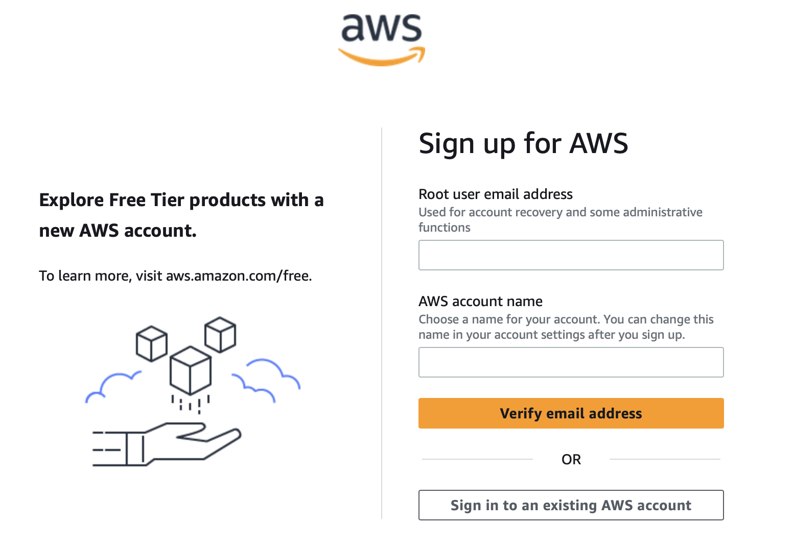
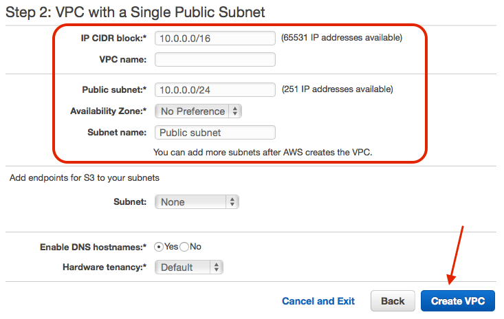
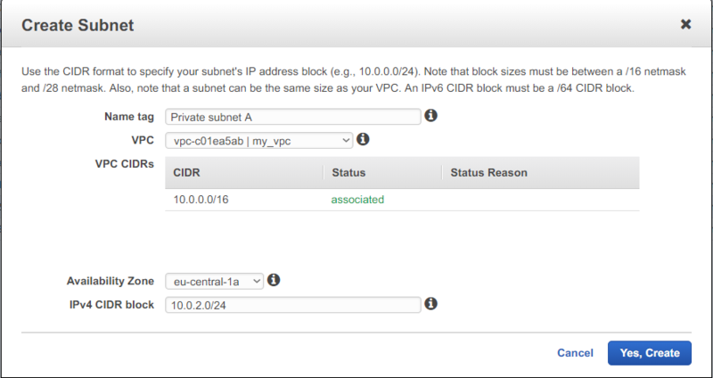
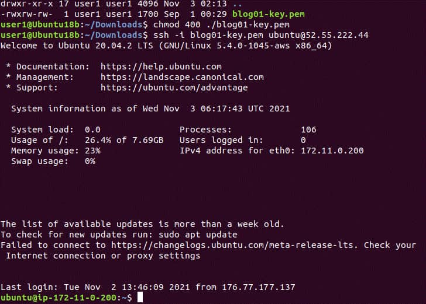
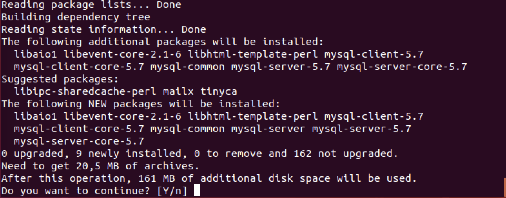

In today's digital age, data is the lifeblood of businesses. To manage and make sense of the vast amounts of data that businesses generate, they need a reliable and efficient database management system. MySQL, a popular open-source database management system, has become the go-to solution for many businesses around the world.

In this article, we will delve into the world of MySQL and explore its history, features, benefits, and real-life scenarios. We will also provide step-by-step instructions on how to set up a MySQL server, including best practices for securing your database.

Whether you are a small business owner, a developer, or an administrator, MySQL can provide the solutions you need to manage your data efficiently and effectively. With its advanced features and robust security measures, MySQL remains one of the most popular and trusted database management systems available today. So, let's dive into the world of MySQL and discover how it can benefit your business.

**Table of content**
- [Introduction to MySQL](#introduction-to-mysql)
    - [What is MySQL?](#what-is-mysql)
    - [Top 15 real life scenario to MySQL](#top-15-real-life-scenario-to-mysql)
    - [Why is MySQL important?](#why-is-mysql-important)
- [Setting up a MySQL server in AWS](#setting-up-a-mysql-server-in-aws)
- [MySQL best practices and security](#mysql-best-practices-and-security)
- [Conclusion](#conclusion)

## Introduction to MySQL

### What is MySQL

MySQL is an open-source relational database management system (RDBMS) that is widely used for web applications and other types of software. It was first released in 1995 and has since become one of the world's most popular database management systems.

MySQL is written in the C and C++ programming languages and is available under the GNU General Public License. It is developed and maintained by Oracle Corporation and a community of developers worldwide.

One of the main benefits of MySQL is its scalability, and it can handle large amounts of data and can be scaled up or down depending on the needs of the application. It is also highly flexible and can be customized to meet the specific needs of different types of applications.

MySQL is widely used in the web development industry and is the database management system of choice for many popular content management systems (CMS) such as WordPress, Drupal, and Joomla. It is also used by many e-commerce platforms such as Magento, Shopify, and WooCommerce.

MySQL is designed to be easy to use and has a relatively simple syntax for querying data. It supports SQL (Structured Query Language), a standardized language for managing relational databases. SQL creates, reads, updates, and deletes data in a MySQL database.

One of the key features of MySQL is its ability to handle multiple concurrent connections to the database. This is important for web applications that need to handle large amounts of traffic and user interactions. MySQL is also designed to be highly reliable and can be configured to provide high availability and fault tolerance.

MySQL supports various operating systems, including Windows, macOS, Linux, and UNIX. It can also be run on multiple hardware platforms, from small embedded devices to large-scale enterprise servers.

MySQL has a number of tools available for managing databases, including the MySQL Workbench graphical user interface (GUI), the MySQL command-line interface (CLI), and various third-party tools and libraries.

Many resources are also available for learning MySQL, including online tutorials, forums, and documentation. MySQL also has a large and active community of developers who contribute to developing and improving the software.

In recent years, MySQL has faced competition from other database management systems, including PostgreSQL, MongoDB, and Microsoft SQL Server. However, it remains one of the most widely used and trusted database management systems in the world, with a strong reputation for reliability, scalability, and ease of use.

### Top 15 real life scenario to MySQL

In this section, we will explore the top 15 real-life scenarios where MySQL is used, providing a brief overview of how this powerful database management system is used in various industries and applications. We will look at examples ranging from e-commerce platforms to healthcare organizations, and from social media platforms to logistics companies. Each scenario will highlight how MySQL is used to store and manage different types of data, providing a reliable and scalable solution for managing critical business information. Whether you are a developer, a business owner, or just curious about the different applications of MySQL, this section will provide you with valuable insights into the versatility and importance of this technology in real-life scenarios.

1. An e-commerce platform that uses MySQL to store and manage product listings, inventory, orders, and customer information.
2. A healthcare organization that uses MySQL to store and manage patient records, including medical history, treatment plans, and diagnoses.
3. A social media platform that uses MySQL to store and manage user accounts, profiles, posts, and messages.
4. A financial institution that uses MySQL to store and manage transaction data, account balances, and customer information.
5. A logistics company that uses MySQL to store and manage shipping and delivery data, including tracking numbers, order status, and route information.
6. A travel website that uses MySQL to store and manage flight and hotel booking information, availability, and pricing.
7. A marketing agency that uses MySQL to store and manage customer data, campaign analytics, and metrics.
8. A media company that uses MySQL to store and manage content, including articles, videos, and photos.
9. A school district that uses MySQL to store and manage student information, including grades, attendance, and class schedules.
10. A manufacturing company that uses MySQL to store and manage production data, including inventory levels, supply chain information, and quality control records. 
11. A government agency that uses MySQL to store and manage sensitive information, such as tax records and citizen data. 
12. An event planning company that uses MySQL to store and manage event details, including guest lists, schedules, and vendor information. 
13. A nonprofit organization that uses MySQL to store and manage donor information, fundraising data, and program metrics. 
14. A web application that uses MySQL to store and manage user-generated data, such as ratings, reviews, and comments. 
15. A customer service platform that uses MySQL to store and manage customer support tickets, communication history, and customer information.

### Why is MySQL important?

MySQL is important for several reasons, including its scalability, flexibility, and cost-effectiveness.

One of the key benefits of MySQL is its scalability. It is designed to handle large volumes of data and can accommodate the growing needs of an organization. This means that as the data requirements of an organization increase, MySQL can grow with them. MySQL can also be used to support a wide range of applications, from small-scale web applications to large-scale enterprise solutions.

Another important aspect of MySQL is its flexibility. MySQL is a versatile database management system that can be customized to fit the specific needs of an organization. It supports a wide range of programming languages and can be used with various software applications, making it a popular choice among developers.

In addition to its scalability and flexibility, MySQL is also cost-effective. As an open-source solution, MySQL is free to use, making it an attractive option for startups and small businesses. Moreover, MySQL is easy to install, configure, and maintain, reducing the overall cost of ownership.

MySQL is also known for its reliability and performance. It is designed to handle high traffic loads and can operate 24/7 without interruption. MySQL uses various optimization techniques, such as caching, indexing, and query optimization, to ensure that queries are executed quickly and efficiently.

MySQL also provides a wide range of advanced features and functionalities, such as replication, clustering, and partitioning. Replication allows multiple copies of the database to be created, ensuring that data is always available, even in the event of a failure. Clustering enables multiple servers to work together as a single system, providing increased performance and availability. Partitioning allows large tables to be divided into smaller, more manageable pieces, improving query performance and reducing resource usage.

## Setting up a MySQL server in AWS

detailed step-by-step guide on how to build a MySQL server in AWS online:

1. Sign up for AWS: 
Go to the [AWS website](https://portal.aws.amazon.com/billing/signup?nc2=h_ct&src=header_signup&redirect_url=https%3A%2F%2Faws.amazon.com%2Fregistration-confirmation#/start/email) and click on the "Create an AWS Account" button. Follow the prompts to create a new account.

2. Create a Virtual Private Cloud (VPC):
Once you have signed up for AWS, go to the AWS Management Console and click on the "VPC" service. Click on the "Create VPC" button and follow these steps:
- Give your VPC a name and a CIDR block. The CIDR block is the range of IP addresses that will be used by your VPC.
- Choose an Availability Zone for your VPC. An Availability Zone is a separate physical location within a region that is isolated from other Availability Zones.
- Leave the rest of the settings at their default values and click "Create VPC."

3. Create a Subnet:
After creating a VPC, you can create a subnet within the VPC. To create a subnet, click on the "Subnets" option in the VPC dashboard and then click on the "Create Subnet" button. Follow these steps:
- Give your subnet a name and choose the VPC that you created in step 2.
- Choose an Availability Zone for your subnet. This should be the same Availability Zone that you chose for your VPC.
- Enter a CIDR block for your subnet. This should be a subset of the CIDR block that you entered for your VPC.
- Leave the rest of the settings at their default values and click "Create Subnet."

4. Launch an EC2 Instance:
After creating a subnet, you can launch an EC2 instance in the subnet. To do this, click on the "EC2" service in the AWS Management Console and then click on the "Launch Instance" button. Follow these steps:
- Choose an Amazon Machine Image (AMI) for your instance. You can choose the default Amazon Linux AMI.
- Choose an instance type. The t2.micro instance type is sufficient for most use cases.
- Choose the VPC and subnet that you created in steps 2 and 3.
- Configure the instance details. You can leave the default settings for most options, but make sure to enable "Auto-assign Public IP" so that the instance can be accessed from the internet.
- Configure the storage. You can leave the default settings for this option.
- Add tags to your instance. This is optional but can be useful for organization.
- Configure the security group. You will need to create a new security group or use an existing one. Make sure to allow inbound traffic on port 22 (SSH) and port 3306 (MySQL).
- Review your settings and click "Launch."

5. Connect to the Instance:
After launching an EC2 instance, you can connect to it using SSH. To do this, select the instance in the EC2 dashboard and click on the "Connect" button. Follow these steps:
- Download the SSH key pair. This is a file that you will use to authenticate when connecting to the instance.
- Open a terminal and navigate to the directory where you saved the SSH key pair.
- Change the permissions on the SSH key pair file by running the command "chmod 400 key-pair.pem" (replace "key-pair.pem" with the name of your key pair file).
- Connect to the instance by running the command `ssh -i key-pair.pem ec2-user@<public-ip>` (replace `key-pair.pem` with the name of your key pair file and `<public-ip>` with the public IP address of your instance).

6. Install MySQL Server:
Now that you are connected to the EC2 instance, you can install the MySQL server. Follow these steps:
- Update the package index by running the command "sudo yum update".
- Install the MySQL server by running the command "sudo yum install mysql57-server".
- Start the MySQL service by running the command "sudo service mysqld start".

7. Secure the MySQL Server:
By default, the MySQL server is not secured, so you need to set a root password and remove some default settings. Follow these steps:
- Run the command "sudo mysql_secure_installation" to launch the MySQL Secure Installation Wizard.
- Follow the prompts to set a root password and remove some default settings, such as anonymous user accounts and test databases.
8. Configure the Firewall:
By default, the EC2 instance's firewall does not allow inbound traffic on port 3306, which is the port used by MySQL. Follow these steps to configure the firewall:
- Go to the EC2 dashboard and click on the "Security Groups" option.
- Find the security group that you used for your instance in step 4.
- Click on the "Inbound Rules" tab and then click on the "Edit" button.
- Add a new rule to allow inbound traffic on port 3306 from your IP address (or any IP address if you want to allow access from anywhere).
- Click "Save" to apply the new rule.
9. Test the MySQL Server:
You can now test the MySQL server to make sure that it is working properly. Follow these steps:
- Connect to the MySQL server by running the command "mysql -u root -p".
- Enter the root password that you set in step 8.
- Once you are logged in to the MySQL server, run the command "SHOW DATABASES;" to see a list of the available databases.

Congratulations! You have successfully built a MySQL server in AWS. You can now use this server for your applications or projects.

## MySQL best practices and security

MySQL security is an essential aspect of any application or project that involves sensitive data. The security of your MySQL server is crucial in safeguarding your data from unauthorized access, theft, or malicious attacks. MySQL provides several features that can help you enhance the security of your database, and there are several best practices you should follow to ensure that your MySQL server is secure.

Firstly, setting a strong root password is the first line of defense against unauthorized access. Make sure that your password is complex and includes a mix of letters, numbers, and special characters. You can also use password managers to generate and store complex passwords securely.

Secondly, limit access to the server by only granting it to those who require it. You can restrict access to the server by using firewalls or network security groups. Additionally, limit the number of users who have root access to the server. Create individual user accounts for each user with the appropriate level of access.

Thirdly, it is crucial to regularly update and patch MySQL to address any known security vulnerabilities. Keeping your MySQL server up-to-date with the latest patches and updates can ensure that any known security issues are addressed promptly. You can also subscribe to security alerts to receive notifications when new security updates become available.

Fourthly, use SSL encryption to protect data transmitted between the client and the server. SSL encryption ensures that any data transmitted between the client and the server is encrypted, protecting it from potential attacks. This is especially important when sensitive data, such as financial information or personal data, is being transmitted.

Finally, disable remote root login. Remote root login poses a significant security risk and should be disabled. Instead, use individual user accounts with appropriate permissions to access the server. This ensures that if a user account is compromised, the damage is limited to that account rather than the entire server.

## Conclusion

In conclusion, MySQL is a powerful and versatile database management system that is widely used in various industries, from small businesses to large corporations. Its popularity can be attributed to its ease of use, scalability, reliability, and cost-effectiveness. With its vast array of features and capabilities, MySQL is capable of handling a wide range of tasks, from managing small databases to handling large-scale data-intensive applications.

In this article, we have covered various aspects of MySQL, including its definition, history, features, benefits, and real-life scenarios. We have also provided step-by-step instructions on how to set up a MySQL server, including best practices for securing your database.

MySQL is an essential tool for managing data in today's fast-paced business environment. Its flexibility and scalability make it an ideal solution for businesses of all sizes, while its reliability and ease of use make it a popular choice for developers and administrators.

Overall, MySQL is an invaluable tool for managing data in a variety of settings. Whether you are a small business owner, a developer, or an administrator, MySQL can provide the solutions you need to manage your data efficiently and effectively. With its advanced features and robust security measures, MySQL remains one of the most popular and trusted database management systems available today.

---

Integrating MySQL with email services can provide businesses with a powerful tool to manage and automate their email communications. By connecting MySQL to email, businesses can streamline their workflows, improve their efficiency, and enhance their overall communication strategies. In the [next article](https://www.vanus.ai/blog/build-a-notification-pipeline-from-mysql-to-email-in-seconds/), we will explore the benefits of using MySQL with email and provide step-by-step instructions to integrade it with Vanus.

[Build a Notification Pipeline from MySQL to Email in Seconds](https://www.vanus.ai/blog/build-a-notification-pipeline-from-mysql-to-email-in-seconds/)

---