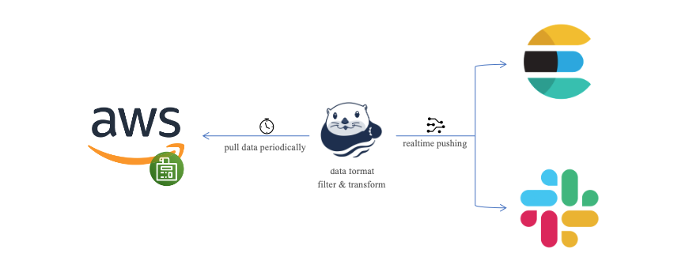
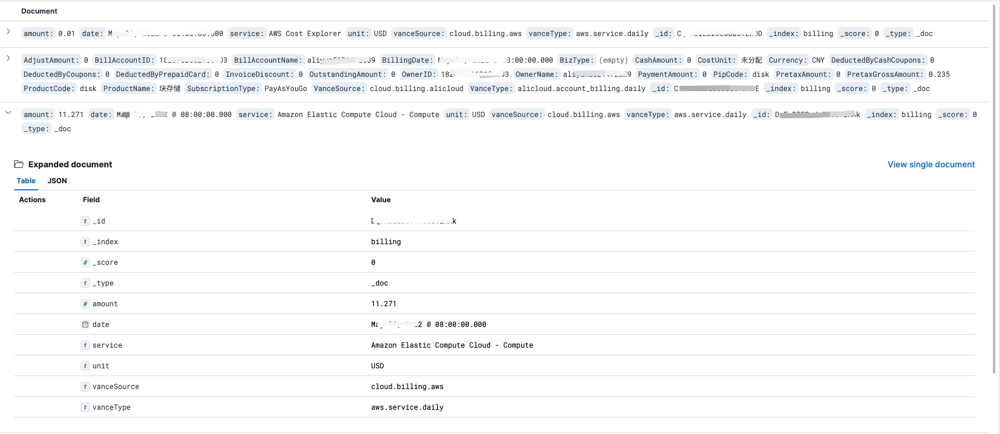

## Overview

Billings from cloud vendors allow users to observe the cost of resource. 

Vanus obtains bills by using api from various cloud vendors. It uses Elasticsearch for data storage to achieve unified management of bills. It also notifies the team of abnormal expenses via like [Slack Channel](https://www.vanus.ai/blog/how-to-receive-aws-billing-reports-on-a-slack-channel/).

In this tutorial, you will learn how to use Cloud Billing Source of Vanus to aquire the billing from Cloud Service providers like AWS, and store the data in Elasticsearch.

## AWS Billing to Elasticsearch integration

### Prerequisites

- AWS IAM [Access Key](https://docs.aws.amazon.com/IAM/latest/UserGuide/id_credentials_access-keys.html).

- AWS permissions `ce:GetCostAndUsage` for the IAM user.
- Elasticsearch and Kibana are up and running

- Go to [Vanus Playground](https://play.linkall.com/) :an online K8s environment where Vanus can be deployed.

### Step 1: Deploying Vanus

1. Login [Vanus Playground](https://play.linkall.com/).

2. Refer to the `Quick Start` document to complete the `Install Vanus` & `Install vsctl`.

3. Create an eventbus

   ```
   ~ # vsctl eventbus create --name aws-billing
   +----------------+-------------+
   |     RESULT     |   EVENTBUS  |
   +----------------+-------------+
   | Create Success | aws-billing |
   +----------------+-------------+
   ```

### Step 2: Deploy the AWS Billing Source

Use command line create [AWS Billing Source](https://docs.vanus.ai/connectors/source/source-aws-billing/)

1. Create the config file

   ```shell
   cat << EOF > config.yml
   target: http://192.168.49.2:30002/gateway/aws-billing
   secret:
     access_key_id: AKIAIOSFODNN7***MPLE
     secret_access_key: wJalrXUtnFEMI/K7MDENG/bP**iCYEXAMPLEKEY
   EOF
   ```

2. Start with Docker

   ```shell
   docker run -it --rm --network=host \
     -v ${PWD}:/vanus-connect/config \
     --name source-aws-billing public.ecr.aws/vanus/connector/source-aws-billing
   ```

### Step 3: Deploy the Elasticsearch Sink

Use the command line of Vanus create the event target: [Elasticsearch Sink](https://docs.vanus.ai/connectors/sink/sink-elasticsearch/)

1. Create a yml file named sink-es.yml in the playground with the following command:

   ```shell
   cat << EOF > sink-es.yml
   apiVersion: v1
   kind: Service
   metadata:
     name: sink-es
     namespace: vanus
   spec:
     selector:
       app: sink-es
     type: ClusterIP
     ports:
       - port: 8080
         name: sink-es
   ---
   apiVersion: v1
   kind: ConfigMap
   metadata:
     name: sink-es
     namespace: vanus
   data:
     config.yml: |-
       port: 8080
       es:
         address: "http://localhost:9200"
         index_name: "vanus_test"
         username: "elastic"
         password: "elastic"
   ---
   apiVersion: apps/v1
   kind: Deployment
   metadata:
     name: sink-es
     namespace: vanus
     labels:
       app: sink-es
   spec:
     selector:
       matchLabels:
         app: sink-es
     replicas: 1
     template:
       metadata:
         labels:
           app: sink-es
       spec:
         containers:
           - name: sink-es
             image: public.ecr.aws/vanus/connector/sink-elasticsearch
             imagePullPolicy: Always
             ports:
               - name: http
                 containerPort: 8080
             volumeMounts:
               - name: config
                 mountPath: /vanus-connect/config
         volumes:
           - name: config
             configMap:
               name: sink-es
   EOF
   ```

2. Replace the config value with yours.

   ```
   es:
     address: "http://localhost:9200"
     index_name: "vanus_test"
     username: "elastic"
     password: "elastic"
   ```

3. Run es sink in kubernetes.

   ```shell
   kubectl apply -f sink-es.yaml
   ```

### Step 4: Create Subscription

Create Subscription Event, here can do filter before deliver event to sink end, execute the following command:

```bash
vsctl subscription create \
  --eventbus aws-billing \
  --sink 'http://sink-es:8080' \
  --filters '[
    {
      "suffix": {
          "source":".billing"
      }
    }
  ]'
```

- `sink` Points to the target end of the event delivery.
- `filters` The method of filter the events. 
  - use keyword `suffix` to do the postfix match for attribute source

### Step 5: Result Checking

Check the Billing Data. Now let's connect to kibana so that we can manage data and perform data analysis.



## Summary

In this tutorial, we learned how to integrate AWS Billing Source and Elasticsearch Sink. Of course, Vanus also have connectors for bills of other cloud services , learn more about [Vanus Connect](https://github.com/vanus-labs/vanus-connect).
