--- 
hide_table_of_contents: true
hide_title: true
---

### Prerequisites

- An [**Amazon Web Services**](https://aws.amazon.com) account.
- A [**Vanus Cloud Account**](https://cloud.vanus.ai).

---

**Perform the following steps to configure your Amazon RDS MySQL Sink.**

### Step 1: Set Up a MySQL Server in AWS Using RDS

1. Log in to the [**AWS Management Console**](https://aws.amazon.com/) using your root account credentials.

2. Type **RDS**① in the search box and select **RDS**② from the results.

3. Click the **Region name**③ to open the dropdown menu and select the particular **Region**④ in which you want to create the DB instance.

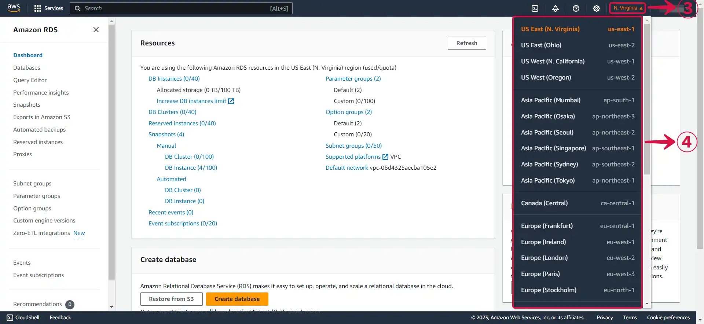

4. Click **Create database**⑤.

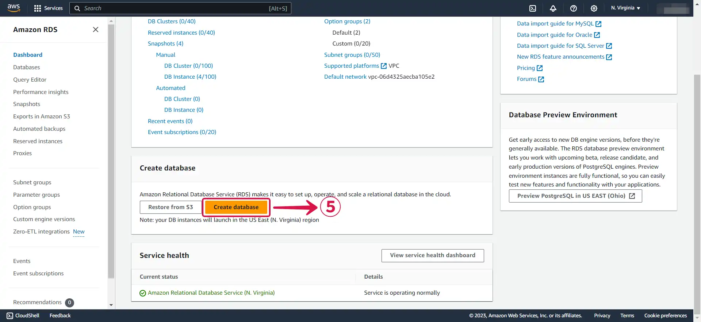

5. Select **Standard create**⑥ and choose the **MySQL**⑦ icon.

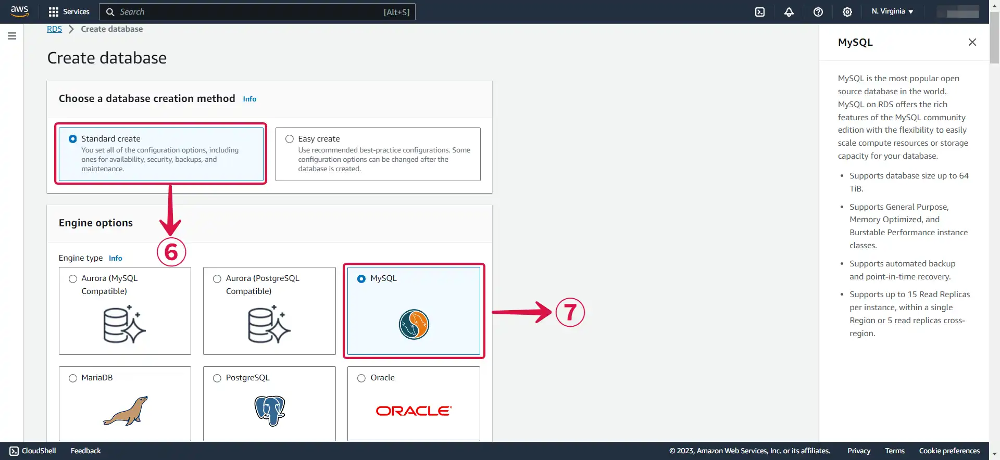

6. Select the **Free tier**⑧ Template for testing, or opt for one of the other available options based on your specific use case.

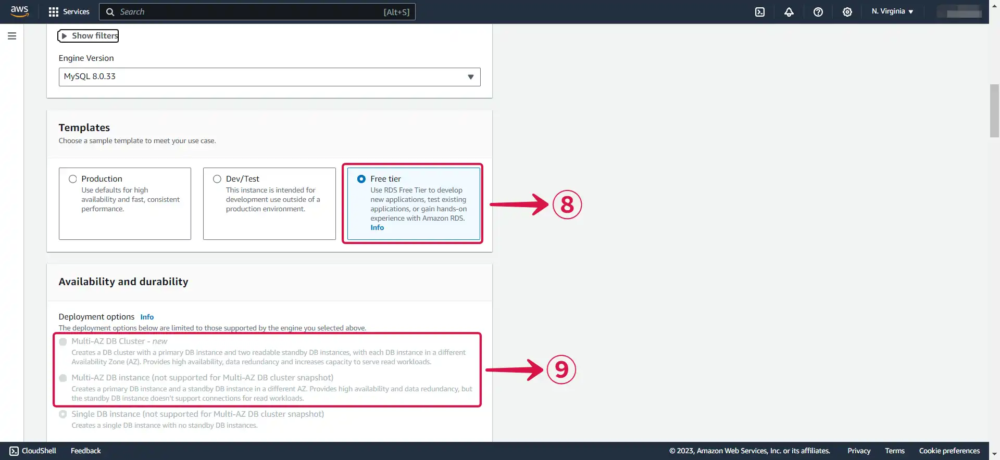

:::note
**Multi-AZ DB**⑨ deployment is only available for the paid tier. A Multi-AZ deployment automatically provisions and maintains a synchronous standby replica in a different Availability Zone.
:::

7. Enter the following information.

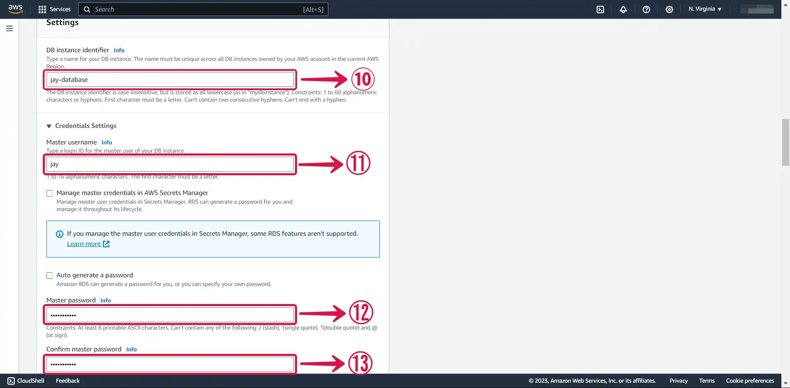

- **DB instance identifier⑩:** Give a unique name to your instance.

- **Master username⑪:** This is the username that will be used to log in to your DB instance.

- **Master password⑫:** This is the password that will be used to log in with the username.

- **Confirm master password⑬:** Write the password again.

8. Select the **General Purpose SSD (gp2)⑭** storage type. *It's efficient and cost-effective for our intended use*.

9. Enable **Public access**⑮.

:::note
This allocates an IP to your database instance and allows direct connection to the database from the internet.
:::

10. Select **Create new**⑯ to create a new VPC security group, then specify your **New VPC security group name**⑰.

11. Select **Password authentication**⑱.

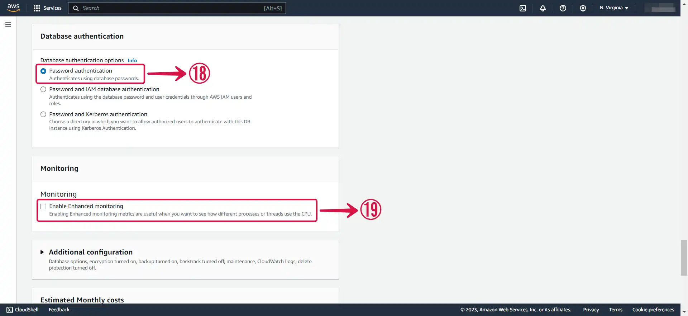

:::note
Leave **Enable Enhanced monitoring**⑲ unchecked to stay within the free tier limit.
:::

12. Input an **Initial database name**⑳, and set your preferred **Backup retention period**㉑.

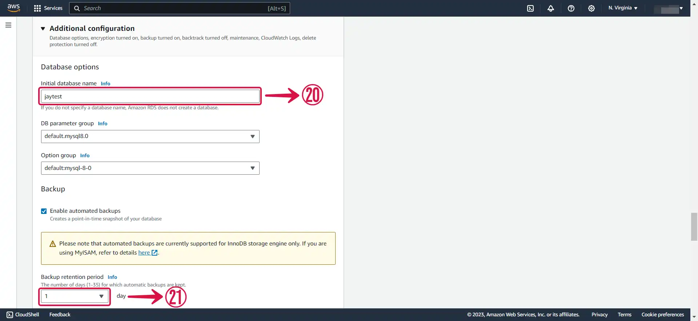

13. Click the **Create database**㉒ button to complete the process of creating your database.

### Step 2: Modify Your VPC Security Groups

1. Click on the **Database**① you just created in AWS RDS.

2. Within the **Connectivity & security**② section, click on your **VPC security group**③.

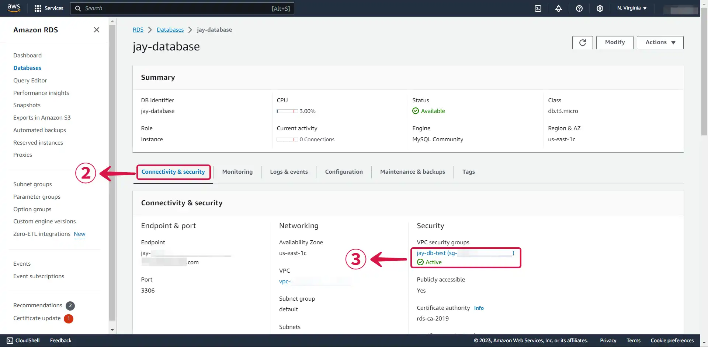

3. Within the **Inbound rules**④ section, click the **Edit inbound rules**⑤ button.

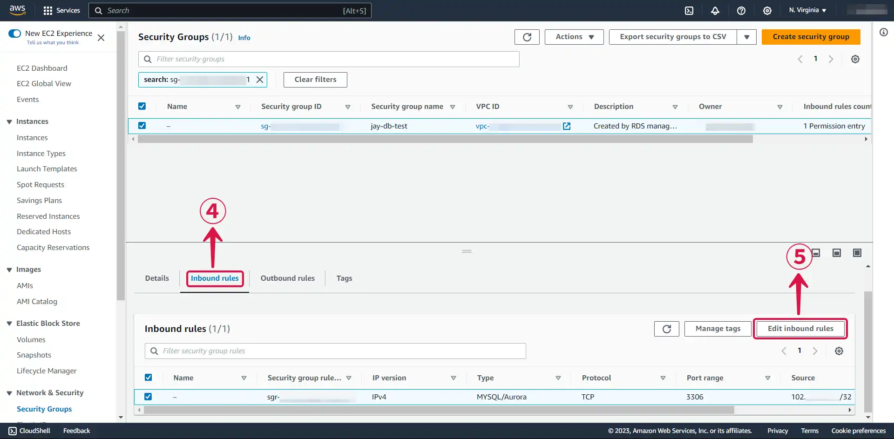

4. Click on the **source field**⑥ and choose **My IP**⑦ to allow connectivity exclusively from your IP address, then click **Save rules**⑧ to save your settings.

:::note
Alternatively, you can opt for `Anywhere-IPv4` to enable traffic from any IPv4 address.
:::

Now you can connect to your server and create a table.

---

### Step 3: Amazon RDS MySQL Connection Settings

**To set up Amazon RDS MySQL Sink in Vanus Connect:**

1. Return to the [**RDS page**](https://console.aws.amazon.com/rds/) and click on the **database**① you just created.

2. Copy your **Endpoint & port**②.

3. Navigate to the Vanus Cloud platform and fill in the following credentials.

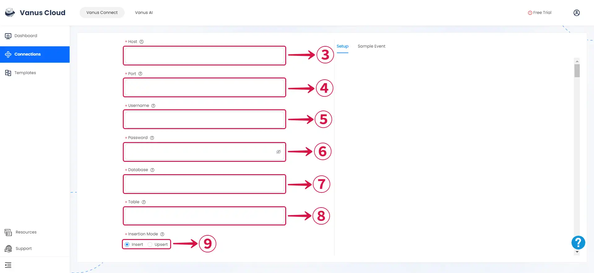

- **Host③:** This is your RDS endpoint.
- **Port④:** Enter the port number on which your MySQL server is listening. The default port for MySQL is 3306.
- **Username⑤:** Master username selected during the database creation.
- **Password⑥:** User password.
- **Database⑦:** The initial database name.
- **Table⑧:** The name of the table you want your events to be sent to.
- Choose the **Insertion Mode**⑨.

### Step 4: Personalize Event Structure

:::note
This is a general instruction on how to personalize your event structure. You can structure your events to suit your specific requirements and create connections for different scenarios.
:::

1. Click on **Display sample events**① for reference and click on **Add More**② to add events.

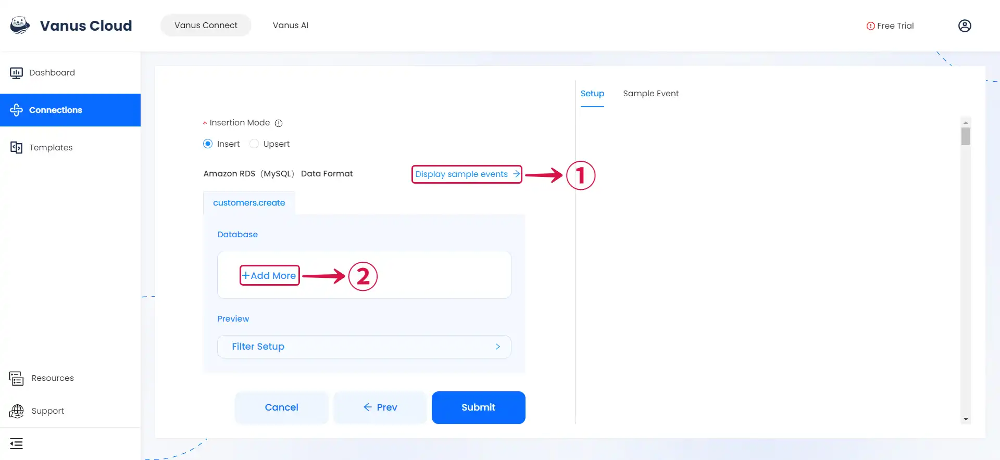

2. **Input key**③ and search for the corresponding **value**④ for the event you want.

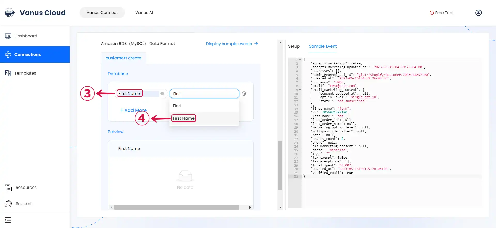

3. You can fill in as many **key-value pairs**⑤ as you wish to receive. And then click **Submit**⑥ to finish the configuration process.

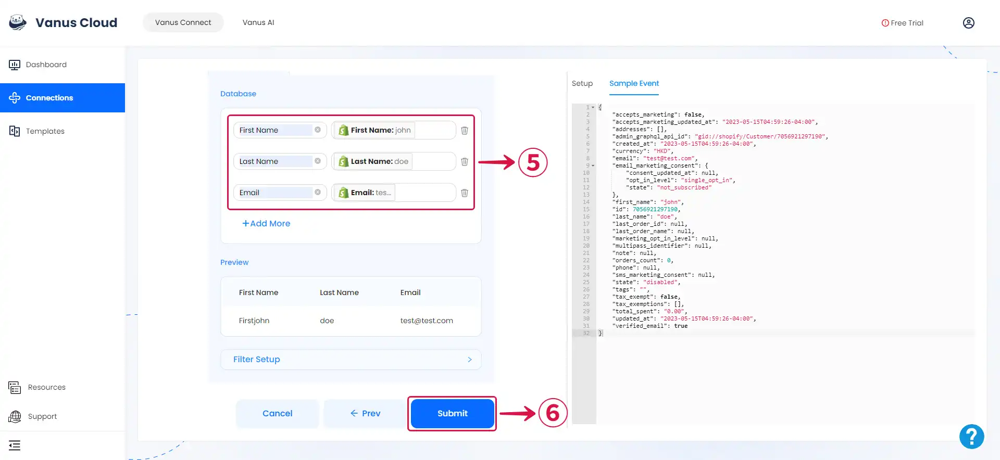

---

Learn more about Vanus and Vanus Connect in our [**documentation**](https://docs.vanus.ai).
