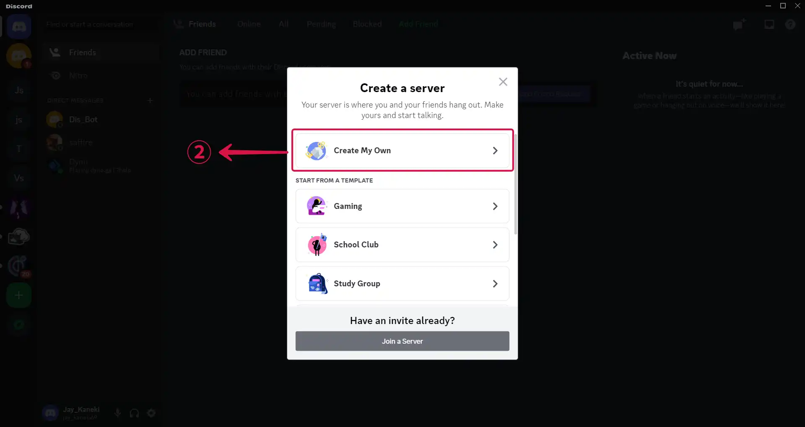
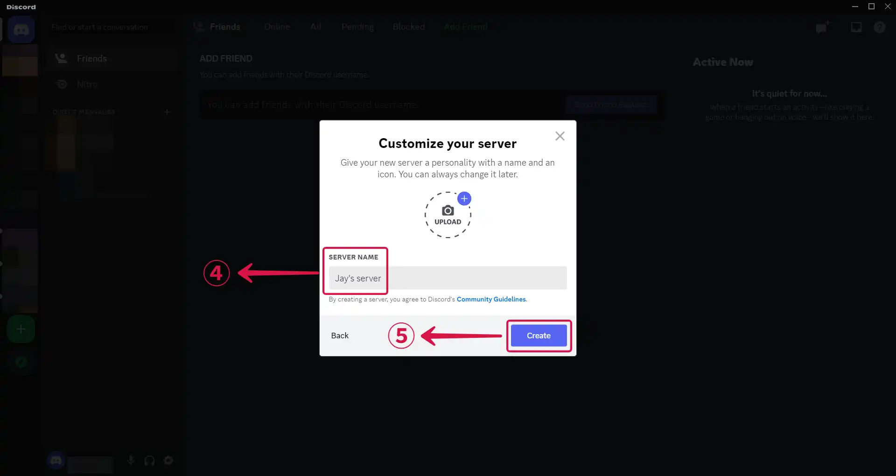

--- 
hide_table_of_contents: true
hide_title: true
---

### Prerequisites

- [**A Discord Account**](https://discord.com/)

---

**Perform the following steps to configure your discord Sink.**

### Step 1: Create a Server

1. Go to the [Discord application](https://discord.com/download).

2. Create a new server by clicking the `+`① icon.

3. Choose a template or create your own, by selecting **Create My Own**②.

4. Click on **Skip this question**③ to move to the next step of your configuration.

5. Input a **Server Name**④ and click on **Create**⑤.

### Step 2: Get a webhook URL

1. Bring out the drop down settings menu by clicking `⌄`①.

2. Select **Server Settings**②.

3. Click on **Integrations**③ in the sidebar menu under APPS.

4. Click **Create Webhook**④.

5. Click on **Spidey Bot**⑤, the webhook you just created.

6. Tap the **Copy Webhook URL**⑥ button.

---

### Step 3: Personalise Event Structure
- Go back to Vanus Connect.

- Paste your webhook URL in the **Webhook URL**① field.

:::note
This is a general instruction on how to complete event subscription and configure your connection settings in Vanus Connect, which can be applied to any source pairing.
:::

- Click on **Display sample events**② to see the events. **Select**③ the event field you like to receive on Discord.

- **Customise**④ the events as you like and the click **Submit**⑤ button.

---

Learn more about Vanus and Vanus Connect in our [documentation](https://docs.vanus.ai).
