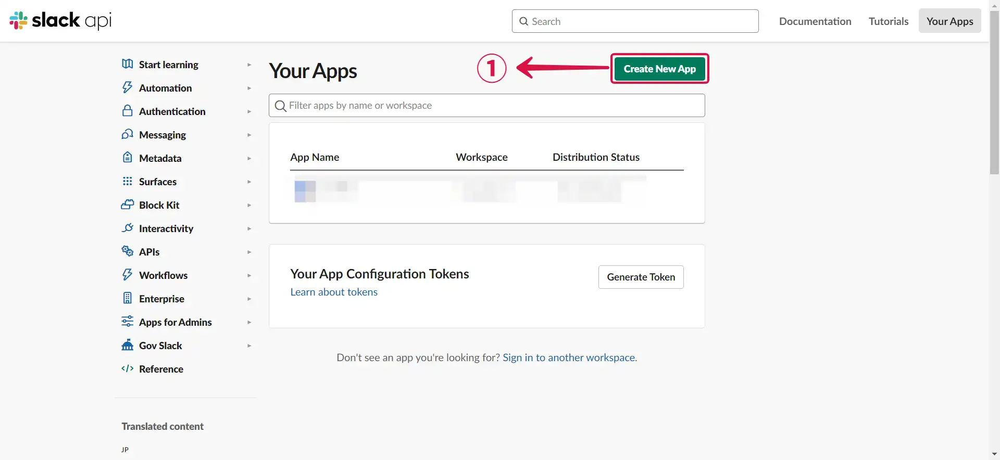
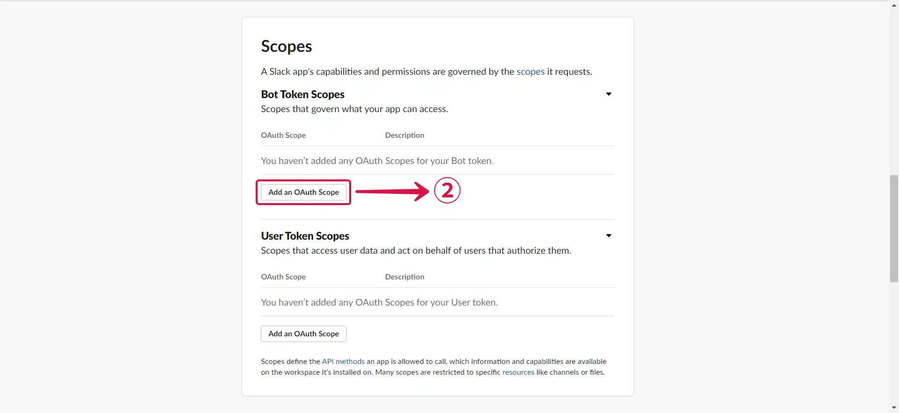
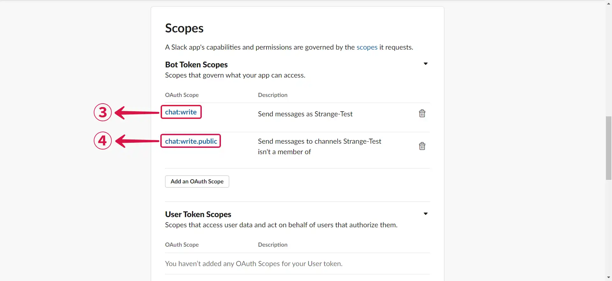
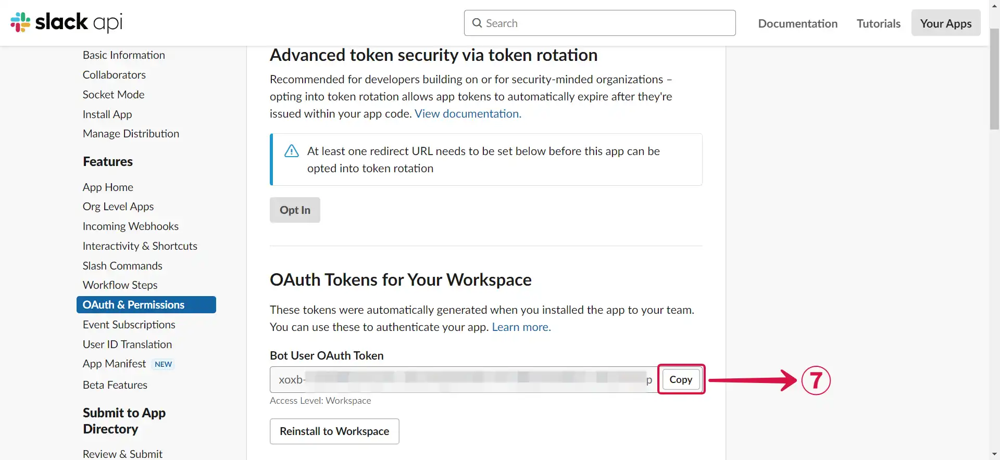

--- 
hide_table_of_contents: true
hide_title: true
---

### Prerequisites

- A [**Slack Account**](https://slack.com)
- A [**Slack Workspace**](https://slack.com/help/articles/206845317-Create-a-Slack-workspace)

---

**Perform the following steps to configure your Slack Sink.**

### Step 1: Create a Slack App

1. Go to [**Slack API**](https://api.slack.com/apps), and click **Create New App**①.

2. Select **From scratch**②.

3. Set the **App name**③ and **Workspace**④, then click **Create App**⑤.

---

### Step 2: Configure your App

1. Add the **Permissions**① feature for your app.

2. Scroll down to `Scopes/Bot Token Scopes`, and click **Add an OAuth Scope**②.

3. Add **chat:write**③ and **chat:write:public**④ permission to your app.

4. Scroll up to the top of the page, and click **Install to Workspace**⑤.

5. Click **Allow**⑥ to install the app.

6. **Copy**⑦ the Bot User OAuth Token.

---

### Step 3: Slack Connection Settings

**Complete SetUp Based On Source Connector**

import Tabs from '@theme/Tabs';
import TabItem from '@theme/TabItem';

<Tabs>

<TabItem label="Shopify" value="shopify">

1. Paste the **Bot User OAuth Token**① field, and click on **Display sample events**② for reference.

2. Compose your preferred message, then type **`$` followed by the desired event**③ to access a **list of associated event values**④, and choose the one you prefer.

3. You can structure the content as you prefer and fill in as many **values**⑤ as you wish to receive.Click **Submit**⑥ to finish the configuration process.

:::note
You can structure your events to suit your specific requirements, create connections for different scenarios, or take advantage of our pre-existing connection templates for a more organized approach to sending events.
:::

</TabItem>

<TabItem label="Stripe" value="stripe">

1. Paste the **Bot User OAuth Token**① field, and click on **Display sample events**② for reference.

2. Compose your preferred message, then type **`$` followed by the desired event③** to access a **list of associated event values**④, and choose the one you prefer.

3. You can structure the content as you prefer and fill in as many **values**⑤ as you wish to receive. Click **Submit**⑥ to finish the configuration process.

:::note
You can structure your events to suit your specific requirements, create connections for different scenarios, or take advantage of our pre-existing connection templates for a more organized approach to sending events.
:::

</TabItem>

</Tabs>

---

Learn more about Vanus and Vanus Connect in our [**documentation**](https://docs.vanus.ai).
