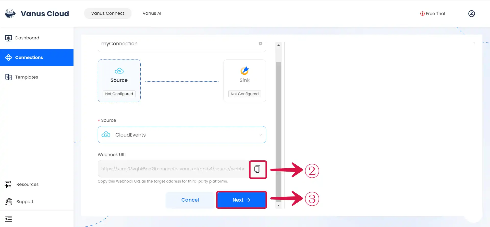

--- 
hide_table_of_contents: true
hide_title: true
---

### Prerequisites

- A CloudEvent HTTP Client.

---

**Perform the following steps to configure your CloudEvents Source.**

### CloudEvents Connection Settings

1. Write a **Name**① for your connection in Vanus Connect. 


2. Click on the **copy**② icon to copy the Webhook URL. Use the Webhook URL to receive events. Click **Next**③ and continue the configuration.



### Send CloudEvents

You can use your Webhook URL to send CloudEvents.

Here is a Example of a Curl Post Request of a CloudEvent.

```shell
curl --location --request POST 'https://YourWebHookURL.com' \
--header 'Content-Type: application/cloudevents+json' \
--data-raw '{
"id": "53d1c340-551a-11ed-96c7-8b504d95037c",
"source": "quickstart",
"specversion": "1.0",
"type": "quickstart",
"datacontenttype": "application/json",
"time": "2022-10-26T10:38:29.345Z",
"data": {
"myData": "simulation event data"
}
}'
```
---

Learn more about Vanus and Vanus Connect in our [documentation](https://docs.vanus.ai) and more about [CloudEvents](https://cloudevents.io).
