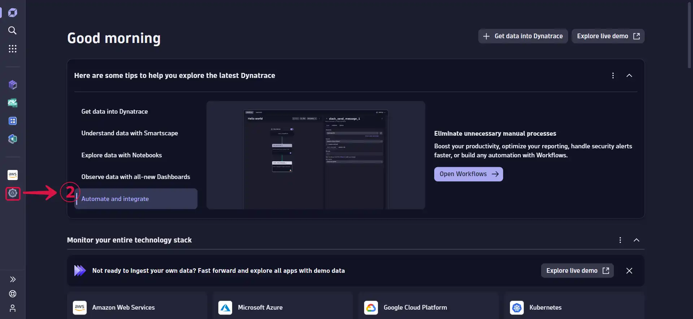
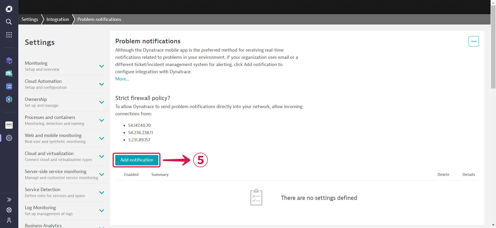
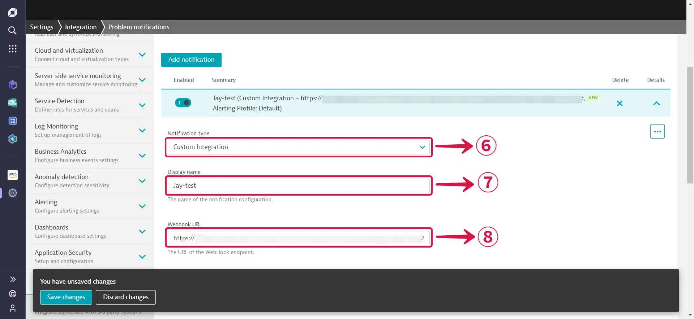
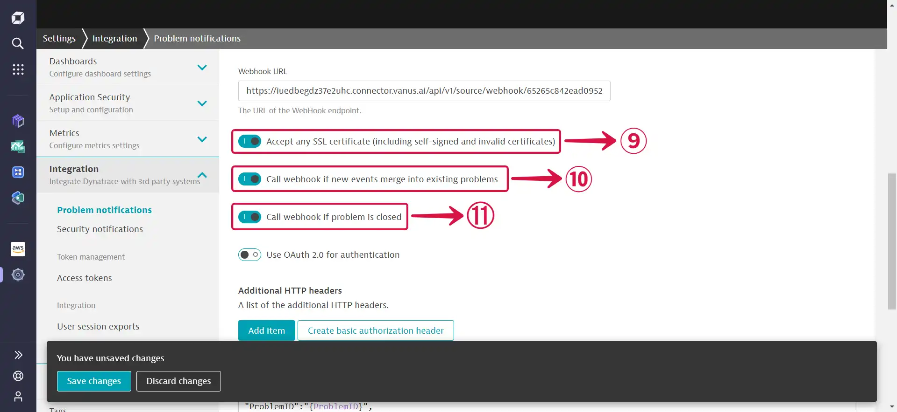
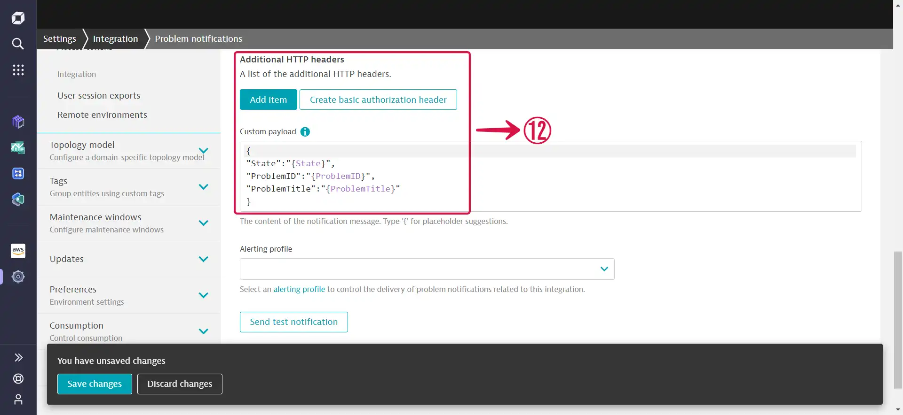
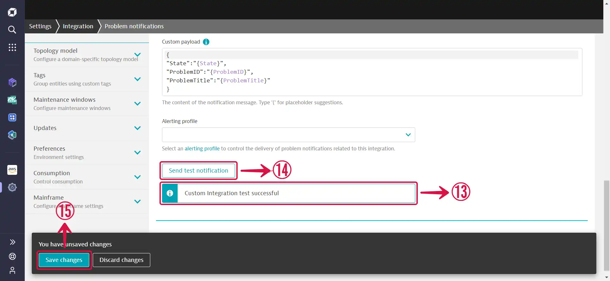
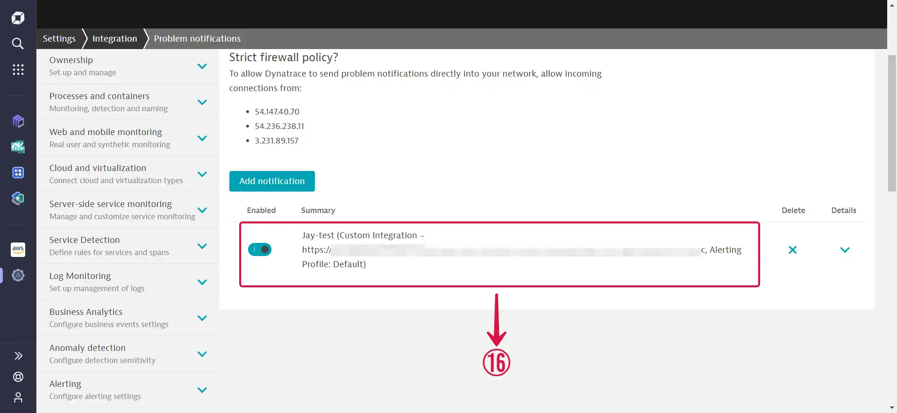
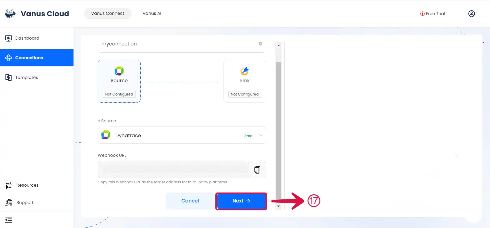

--- 
hide_table_of_contents: true
hide_title: true
---

### Prerequisites

- A Dynatrace account with administrative privileges.
- A [**Vanus Cloud account**](https://cloud.vanus.ai).

---

**Perform the following steps to configure your Dynatrace Source**

### Step 1: Create your connection in Vanus Connect

- Write a **Name**① for your connection in Vanus Connect.

## Configuring Dynatrace to Send Webhook Events 

### Step 1: Configure webhook

1. Click the **copy icon**① to copy the webhook url.

2. Log in to your [**Dynatrace account**](https://sso.dynatrace.com/).

3. Navigate to the Settings page by first clicking on the **gear icon**②.

4. Scroll downwards and click on **Integration**③ then select **Problem notifications**④.

5. Click on **Add notification**⑤.

6. Select **Custom Integration**⑥ as the Notification type, choose your preferred **Display name**⑦, and paste the Webhook URL you copied previously into the **Webhook URL**⑧ field.

7. Toggle the buttons as shown below to **Accept any SSL certificate (including self-signed and valid certificates)⑨**, **Call webhook if new events merge into existing problems**⑩ and **Call webhook if problem is closed**⑪.

8. Leave the **Additional HTTP headers**⑫ section just the way it is.

9. If the **`Custom Integration test successful`⑬** message appears after pressing the **Send test notification**⑭ button, continue by clicking the **Save changes**⑮ button to save the adjustments.

8. If successful, you should see **this**⑯.

9. Go to Vanus Connect and click **Next**⑰ to continue the configuration.

---

Learn more about Vanus and Vanus Connect in our [**documentation**](https://docs.vanus.ai).
