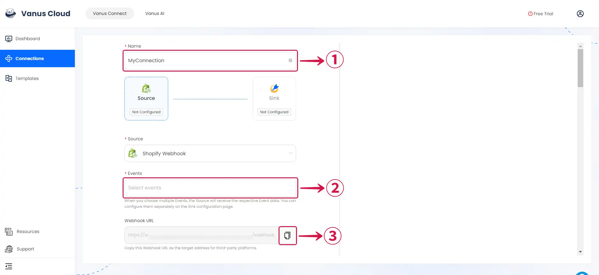
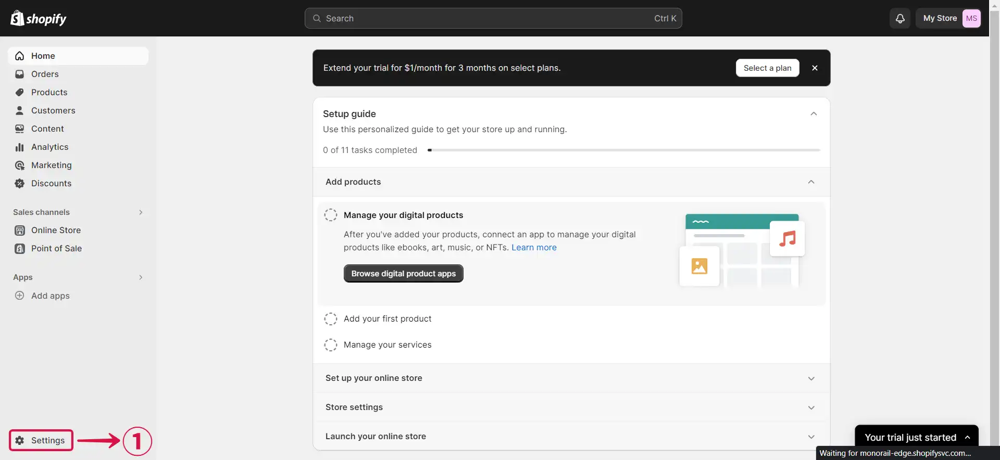
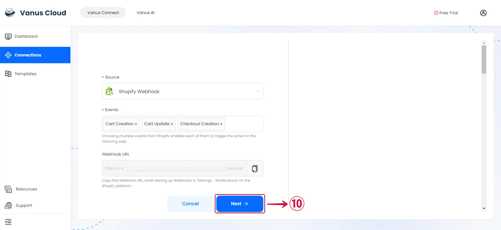

--- 
hide_table_of_contents: true
hide_title: true
---

### Prerequisites

- A [**Vanus Cloud account**](https://cloud.vanus.ai)
- A Shopify Account

---

**Perform the following steps to configure your Shopify Webhook Source.**

### Shopify Webhook Connection Settings

To obtain all Shopify Webhook events in Vanus Connect, follow these steps:

- Write a **Name**① for your connection in Vanus Connect, select the Event or **Events**② you wish to forward and click on the **copy icon**③ to copy the Webhook URL.

---

### Configuring Shopify to Send Webhook Events

1. Go to the [**Shopify**](https://shopify.com) website, sign in to your shop dashboard, and click **Settings**①.

2. From the side menu click on **Notifications**②.

3. Now scroll down to the very bottom of the page and click on **Create webhook**③.

4. Click on the **Event field**④ and select the **Event**⑤ you'd like to send to Vanus Connect.

5. Confirm that the Format is configured as **`JSON`⑥**, paste the Webhook **URL**⑦ that was initially copied from Vanus Connect, choose the **Latest Webhook API version**⑧, and then press **Save**⑨.

:::note
If you'd like to receive multiple events you can create more webhooks using the same URL.
:::

6. Return to vanus connect and click **Next**⑩ to complete the configuration.

---

Learn more about Vanus and Vanus Connect in our [**documentation**](https://docs.vanus.ai).
