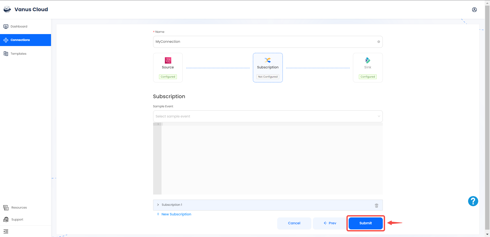

# Doris

This guide contains information to set up a Doris Sink in Vanus Cloud.

## Introduction

Doris is an open-source, distributed data management and analytics system developed by Alibaba. It provides real-time processing and analysis for large-scale data sets, supports diverse data sources, and is scalable and fault-tolerant for big data applications.

The Doris sink receive Cloudevents and insert them into your Doris database. In order to do this you need to give access to Vanus Cloud to insert rows of data.

## Prerequisites

Before forwarding events to Feishu, you must have:

- A Doris cluster.
- A [Vanus Cloud account](https://cloud.vanus.ai).

## Getting Started

**To set up Doris Sink in Vanus Cloud:** 

1. Log in to your [Vanus](cloud.vanus.ai) account and click on **connections**  
  

2. Click on **Create Connections**  
  

3. Name your connection, Choose your source and click next 
 

4. Click on **Sink** and choose **doris** 
 

5. Provide the following credentials
- **Fenodes:** Enter the comma-separated list of FQDNs or IP addresses of the nodes that make up your Doris cluster.
- **Database Name:** Enter the name of the database that you want to use for the sink.
- **Table Name:** Enter the name of the table that you want to use for the sink.
- **Username:** Enter the username that you want to use to connect to your Doris database.
- **Password:** Enter the password that corresponds to the username you entered in the previous step. 
  

6. Click `Next`  

7. Click on submit to finish the configuration. 
  

8. You've successfully created your Vanus doris sink connection.  
  

## Custom Connection

Create your template following the structure of your database, an example:

```json
{
  "title": "value",
  "date": "value",
  "ect...": "value"
}
```
