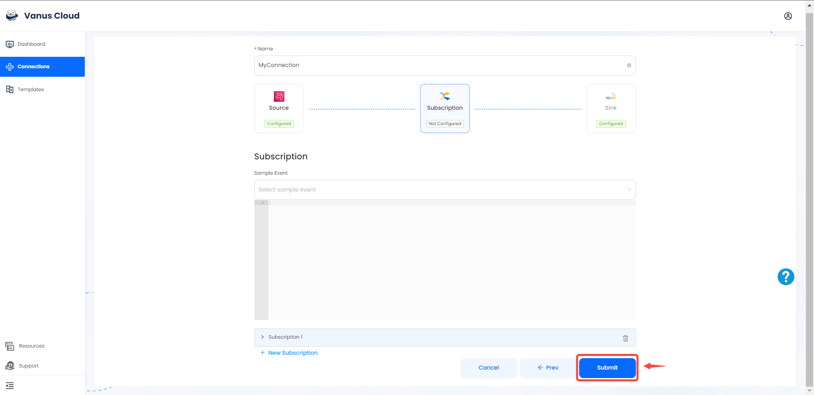
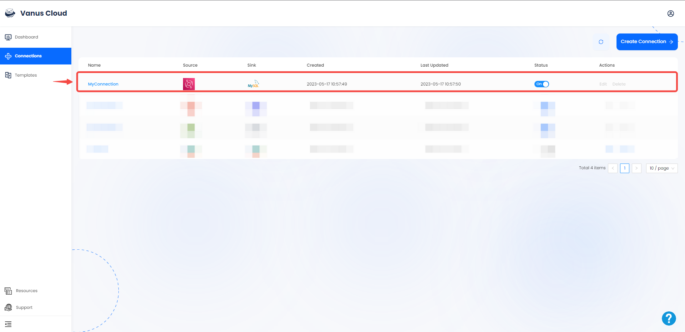

# MySQL

This guide contains information required in setting up an MySQL Sink in Vanus Cloud.  

## Introduction  

MySQL is a popular open-source relational database management system used to store, organize, and retrieve data for websites, applications, and other software.

Vanus Cloud's MySQL sink connector simplifies the process of transferring data/events from various sources to a MySQL database/table, with configurable filters and upsert/insert modes.
## Prerequisites
Before forwarding events to MySQL, you must have:

- A [Vanus Cloud account](https://cloud.vanus.ai)
- Have a running MySQL server.
- Have a Database and Table created.


### Setup your connection in Vanus Cloud 

1. Log in to your [Vanus](https://cloud.vanus.ai) account and click on **connections**  
  

2. Click on **Create Connections**  
  

3. Name your connection, Choose your source and click next 
 

4. Click on **Sink** and choose **MySQL** 
 

5. Enter all the following information in Vanus Cloud and click **Next**. 


- **Host:**  The IP address of your MySQL Server.
- **Port:** The Port of your MySQL Server default: 3306.
- **Username:** A Username with the following permissions INSERT, UPDATE, DELETE.
- **Password:** The user password.
- **Database:** The database name.
- **Table:** The table name.
- Chose the insertion mode.

6. Click on submit to finish the configuration. 
  

7. You've successfully created your Vanus MySQL sink connection.  
  

## Custom Connection

The event data must be in JSON format and created following the structure of your database, here's an example:

```json
{
  "title": "value",
  "date": "value",
  "ect...": "value"
}
```
