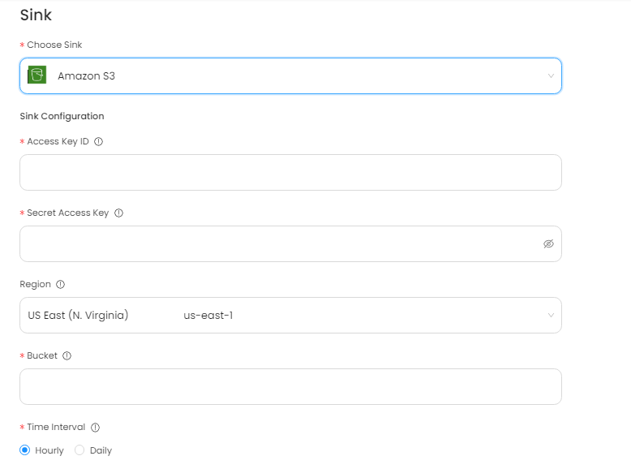

# S3

This guide contains information to set up S3 Sink in Vanus Cloud.

## Introduction

Amazon S3 (Simple Storage Service) is a highly scalable and durable object storage service provided by Amazon Web Services (AWS). It is designed to store and retrieve any amount of data from anywhere on the internet, making it ideal for a wide range of use cases such as backup and restore, disaster recovery, data archiving, content delivery, and big data analytics.

## Prerequisites

Before forwarding events to an S3 bucket, you must have:

- A [Vanus Cloud account](https://cloud.vanus.ai)
- An Amazon S3 bucket.
- AWS IAM Access Key.
- AWS permissions for the IAM user:
  - s3:PutObject

## Getting Started

**To set up S3 Sink in Vanus Cloud:**

1. In Vanus Cloud, go to "Sinks" and select "S3".
2. Provide the following credentials
   - Access Key ID
   - Secret Access Key
   - Region
   - Bucketname
     
3. Select the interval you want the files uploaded; `HOURLY` or `DAILY`
4. Click next and finish the configurations.
5. Click "Next" to continue.

## Required Data Format

The event data must be in JSON format with the following keys:

```json
{
  "data": {
    "myData": "simulation event data"
  }
}
```
