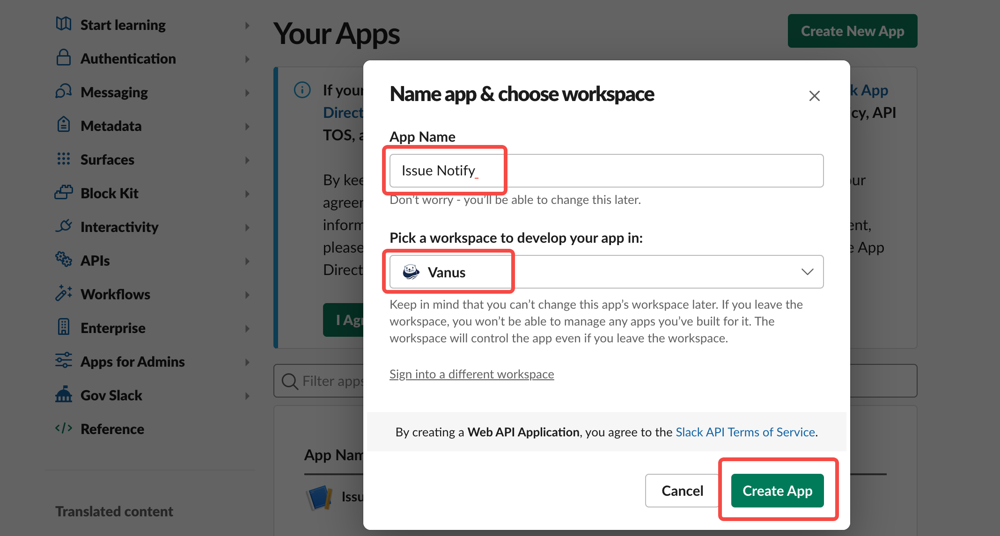
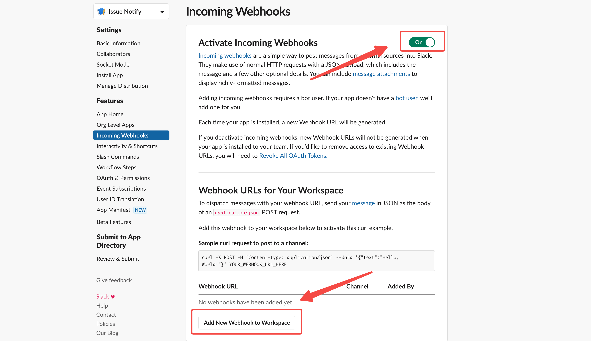
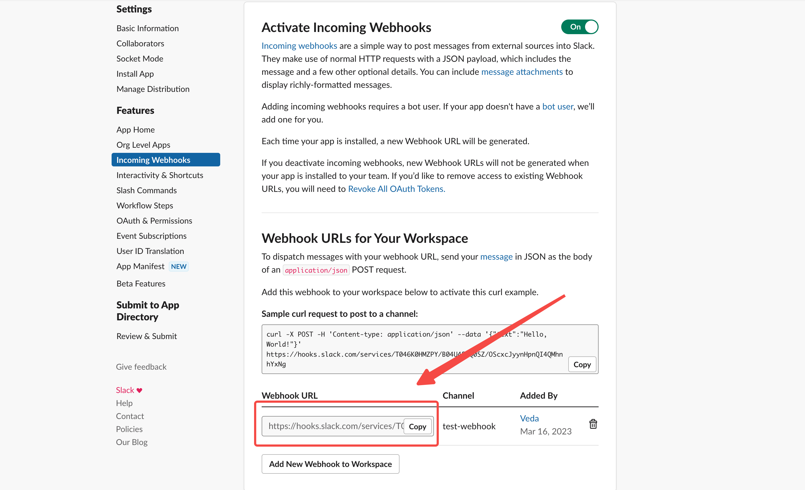
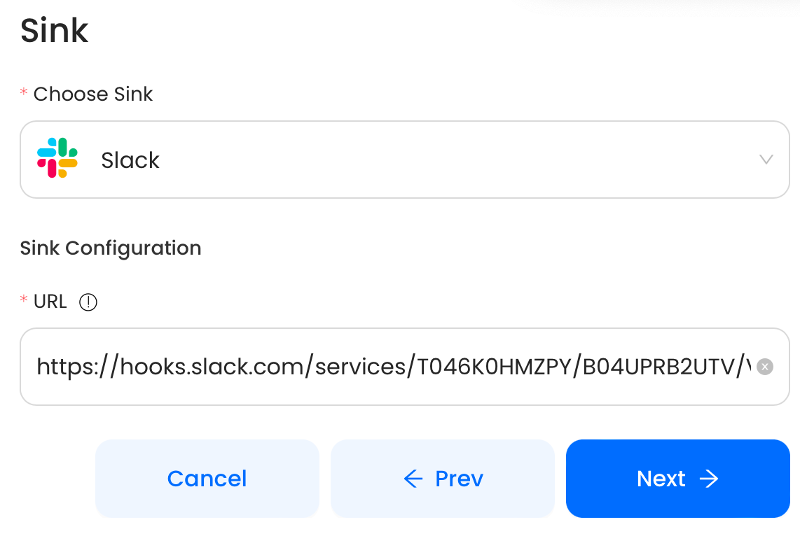

# Slack

This guide contains information to set up a Slack Sink in Vanus Cloud.

## Introduction

Slack is a cloud-based team collaboration platform that allows users to communicate, share files, and integrate with other tools and services.

With Slack Sink connector in Vanus Cloud, you can easily forward real-time updates to a Slack group chat, allowing your team to stay up-to-date on all events generated by your application.


## Prerequisites

Before forwarding events to Slack, you must have:

- A Slack Account
- A [Vanus Cloud account](https://cloud.vanus.ai)

## Getting Started

**To set up an app for receiving events in your Slack channel:**

### Step 1: Create a Slack App
1. Create an [App on Slack](https://api.slack.com/apps).
   
2. Select From Scratch.
   
3. Set the Bot name and Workspace.


### Step 2: Create a Incoming Webhook
1. select **Incoming Webhooks** in the sidebar menu.

2. Turn on Webhooks and scroll down and click **Add New Webhook to Workspace** to add new webhook.

3. Select the channel you want to send messages to 
4. Now copy the webhook URL.


Check out this detail [Article](https://www.vanus.ai/blog/get-your-slack-webhook-url/) on how to get a Slack Webhook URl.

### Step 3: Finish the connection
1. In Vanus Cloud, paste the Webhook URL into the `URL` field. 

2. Click **Next** to continue.

## Required Data Format

The event data must be JSON format, here a simple message, example:

```json
{
  "data": {
    "subject": "Test",
    "message": "Hello Slack!:wave: This is Sink Slack!"
  }
}
```
