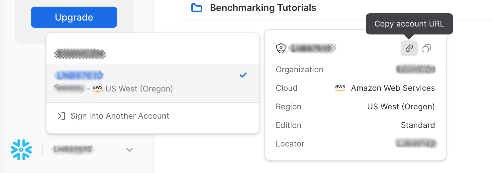
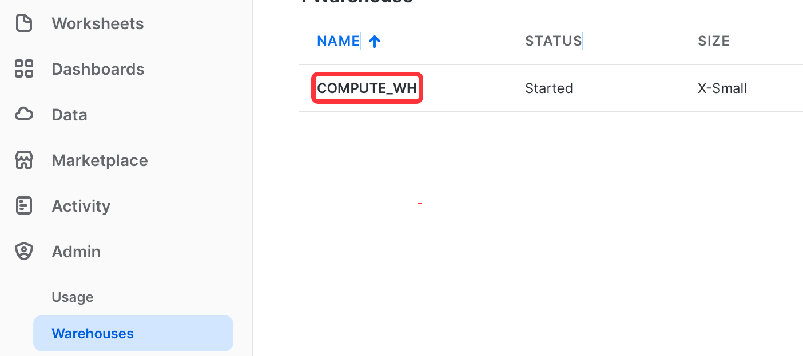

# Snowflake

This guide contains information to set up a Snowflake Sink in Vanus Cloud.

## Introduction

Snowflake is a cloud-based data warehousing platform that allows users to store, manage, and analyze large amounts of structured and semi-structured data using a SQL interface.

## Prerequisites

Before forwarding events to Snowflake, you must have:

- A [Snowflake](https://www.snowflake.com/) account with administrative privileges
- A [Vanus Cloud](https://cloud.vanus.ai) account
- A Snowflake table to which you want to send the events

You will also need the following information from your Snowflake account:

- Account URL
- Role
- Warehouse
- Database
- Schema
- Username
- Password

## Getting Started

To set up a Snowflake Sink in Vanus Cloud:

1. In Vanus Cloud, select "Snowflake" as your Sink Connector.
2. Enter the required Snowflake account details: Account URL, Role, Warehouse, Database, Schema, Username, and Password.
    - **Account URL**: This is the URL for your Snowflake account. 
   
    - **Role**: This is the name of the role that has the necessary privileges to perform operations on the Snowflake table.
   
    - **Warehouse**: This is the name of the warehouse that will execute queries for the Snowflake table.
   
    - **Database**: This is the name of the database that contains the Snowflake table. 
   
    - **Schema**: This is the name of the schema that contains the Snowflake table.
    - **Username**: This is the username for your Snowflake account.
    - **Password**: This is the password for your Snowflake account.
3. Enter the name of the table where you want to store the data.
4. Click "Next" to continue.

## Required Data Format

The event data must be in JSON format with the following keys:

```json
{
    "column1": "value1",
    "column2": "value2",
    "column3": "value3",
    "etc...": "etc..."
}