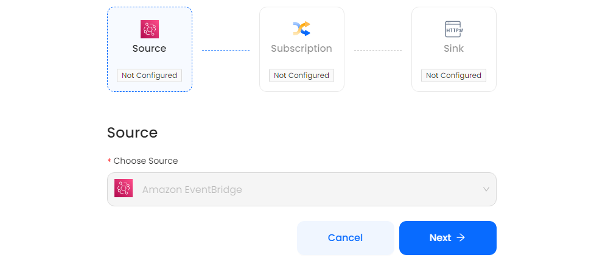
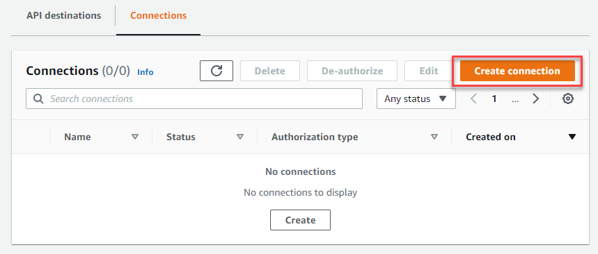

# Amazon Eventbridge

This guide contains information to set up a Amazon Eventbridge Source in Vanus Cloud.

## Introduction

Amazon EventBridge is a serverless service that uses events to connect application components together, making it easier for you to build scalable event-driven applications.

## Prerequisites

- A [Vanus Cloud account](https://cloud.vanus.ai)
- An AWS Account with Administrative Privileges

## Getting Started

To obtain all Amazon Eventbridge events using Webhook in Vanus Cloud, follow these steps:

1. Log in to your [Vanus Dashboard](https://cloud.vanus.ai/dashboard).
2. Click on the **create connection** button under connections.
3. From the list of sources, choose **Amazon Eventbridge**.
4. Click next and finish the configurations.
   
5. Select your connection and get the payload from the Amazon EventBridge information.
   

### Configuring Amazon Eventbridge to Send Webhook Events

1. Navigate to the [EventBridge console](https://console.aws.amazon.com/events/home), select API destinations from the menu.
2. Select the Connections tab and choose **Create connection**:
3. Enter a connection name, then select API Key for Authorization Type. Enter the **API key name** and paste your **secret API key** as the value. Choose Create.
   
4. Enter the name of endpoint, the API destination endpoint, and HTTP method
5. Click on Create to Create an API endpoint
   

## Supported Events

- [Create Bucket](events.md#create-bucket)

- [Delete Bucket](events.md#delete-bucket)
