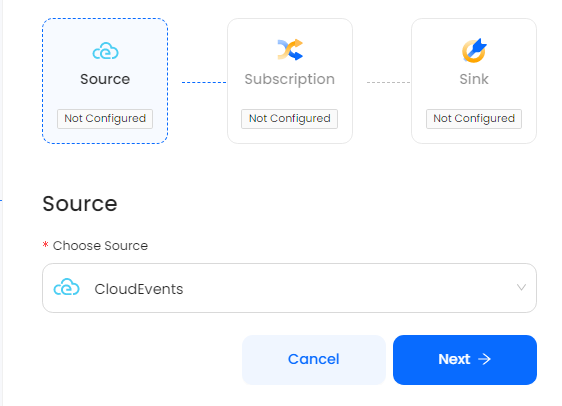

# Webhook

This guide contains information to set up a CloudEvents Source in Vanus Cloud.

## Introduction

CloudEvent is a standardized format for representing and exchanging event data between different systems and services.

The CloudEvent Source is a Webhook server design to receive CloudEvents.

## Prerequisites

Before obtaining Payload URL to receive events, you must have:

- A [Vanus Cloud account](https://cloud.vanus.ai)

## Getting Started

To set up CloudEvents Source in Vanus Cloud, follow these steps:

1. Log in to your [Vanus Dashboard](https://cloud.vanus.ai/dashboard).
2. Click on the **create Connection** button under connections.
3. From the list of sources, choose **CloudEvents**.
4. Press **Next**, complete all other configurations.
   

## Supported Events

The CloudEvents source supports different kind of events structured in the CloudEvent specification

### Cloud Events Specification

```json
{
  "specversion": "1.0",
  "id": "ace872fa-21f8-40ce-8e99-fce6fd452a98",
  "source": "vanus-http-source",
  "type": "naive-http-request",
  "datacontenttype": "application/json",
  "time": "2023-03-28T07:49:08.892354632Z",
  "data": {
    "body": {
      "test": "Hello World"
    },
    "headers": {
      "Accept": "*/*",
      "Connection": "close",
      "Content-Length": "29",
      "Content-Type": "text/plain",
      "Host": "webhook.site",
      "User-Agent": "curl/7.78.0"
    },
    "method": "POST",
    "path": "/",
    "query_args": {}
  },
  "xvhttpremoteip": "172.17.0.1",
  "xvhttpremoteaddr": "172.17.0.1:57734",
  "xvhttpbodyisjson": "true"
}
```

The body of the request is extracted from `data.body` in the cloudevent and the headers are extracted from `data.headers` in the cloudevent.

Learn more about Vanus and Vanus Cloud in our [documentation](https://docs.vanus.ai).
