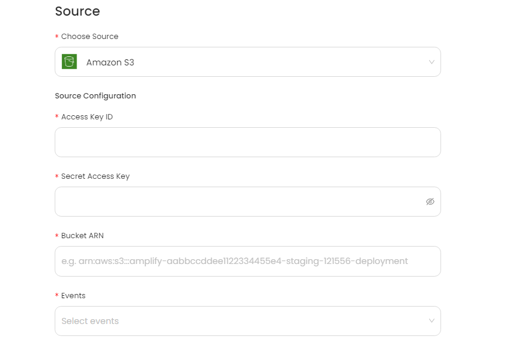

# S3

This guide contains information to set up a S3 Source in Vanus Cloud.

## Introduction

Amazon S3 (Simple Storage Service) is a highly scalable and durable object storage service provided by Amazon Web Services (AWS). It is designed to store and retrieve any amount of data from anywhere on the internet, making it ideal for a wide range of use cases such as backup and restore, disaster recovery, data archiving, content delivery, and big data analytics.

## Prerequisites

Before obtaining S3 events, you must have:

- A [Vanus Cloud account](https://cloud.vanus.ai)
- Have an AWS S3 bucket.
- AWS IAM Access Key.
- AWS permissions for the IAM user:
  - s3:PutBucketNotification
  - sqs:ListQueues
  - sqs:GetQueueUrl
  - sqs:ReceiveMessage
  - sqs:GetQueueAttributes
  - sqs:CreateQueue
  - sqs:SetQueueAttributes
  - sqs:DeleteMessage

## Getting Started

To obtain S3 Bucket events using the S3 source connector in Vanus Cloud, follow these steps:

1. Log in to your [Vanus Dashboard](https://cloud.vanus.ai/dashboard).
2. Click on the **create connection** button under connections.
3. From the list of sources, choose **S3**.
4. Provide the following credentials Access Key ID, Secret Access Key, Bucket ARN, and SQS ARN.
    - To get a new access and secret key, go to the IAM console, select your user name under Users, open the Security credentials tab, click Create access key, and then choose Show to view your new credentials.
     
5. Select the kind of event you want to receive from the list
6. Click next and finish the configurations.

## Supported Events

S3:ObjectCreated:

- S3:ObjectCreated:Put
- S3:ObjectCreated:Post
- S3:ObjectCreated:Copy
- S3:ObjectCreated:CompleteMultipartUpload

S3:ObjectRemoved:

- S3:ObjectRemoved:Delete
- S3:ObjectRemoved:DeleteMarkerCreated

S3:ObjectRestore:

- S3:ObjectRestore:Post
- S3:ObjectRestore:Complete
- S3:ObjectRestore:Delete
