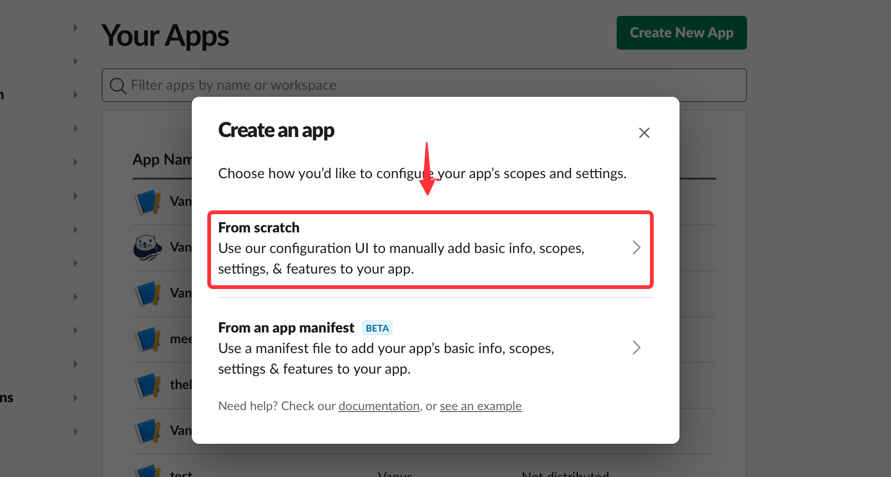
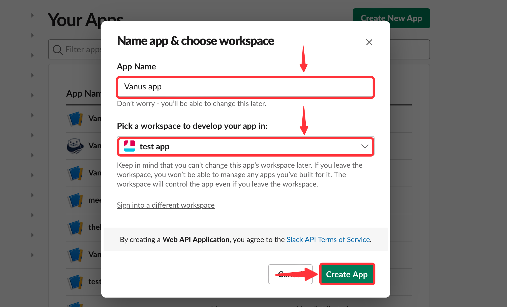
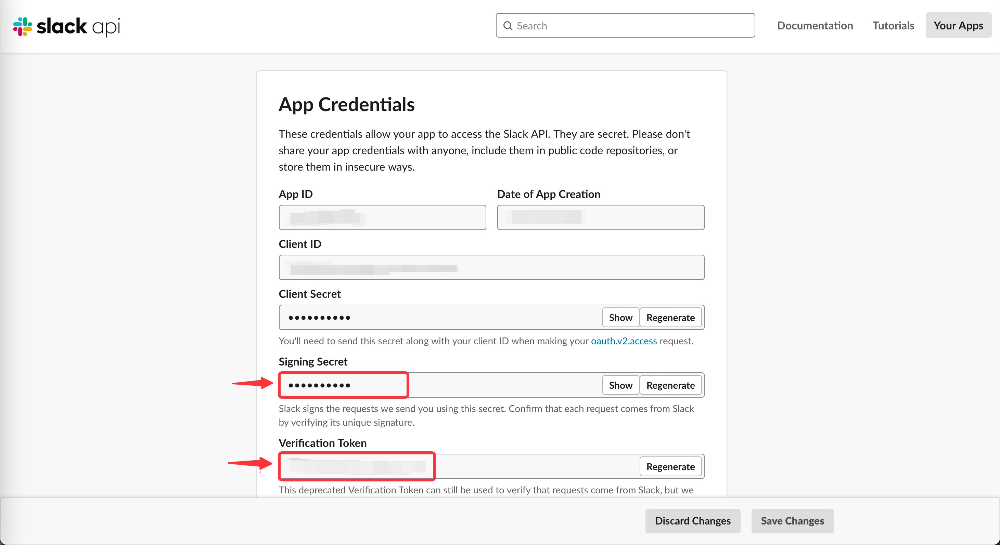
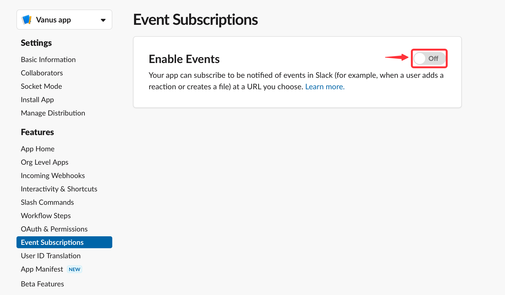
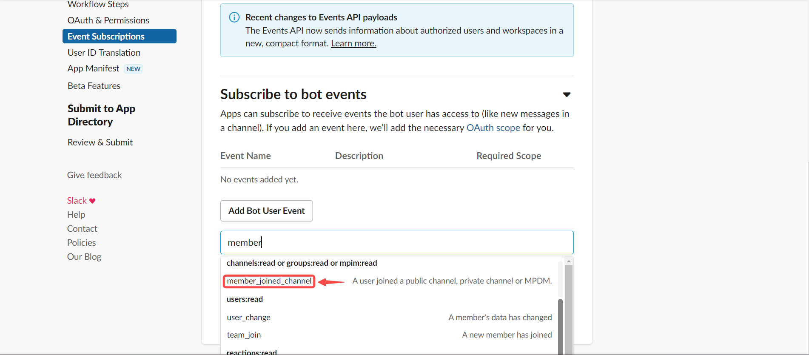
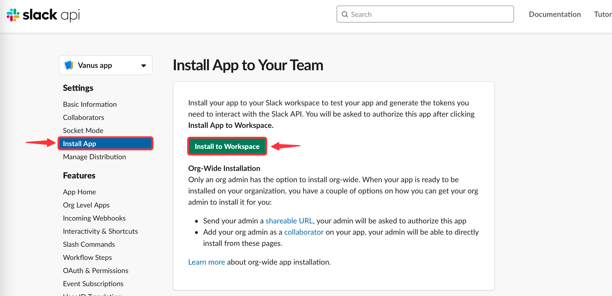
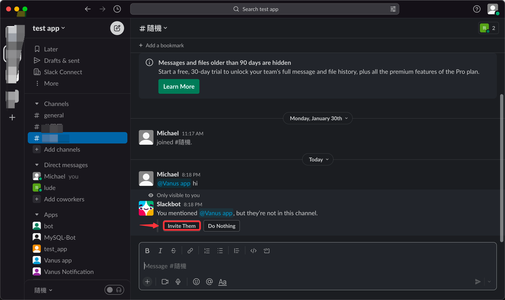
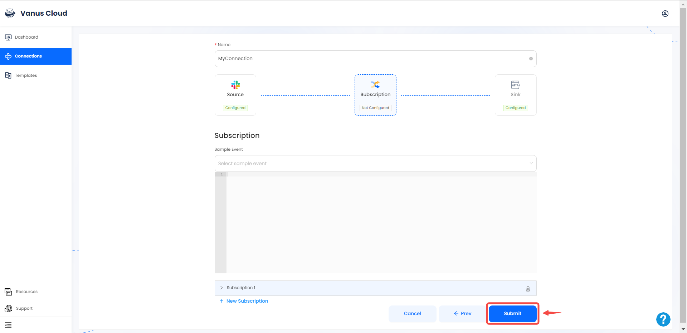
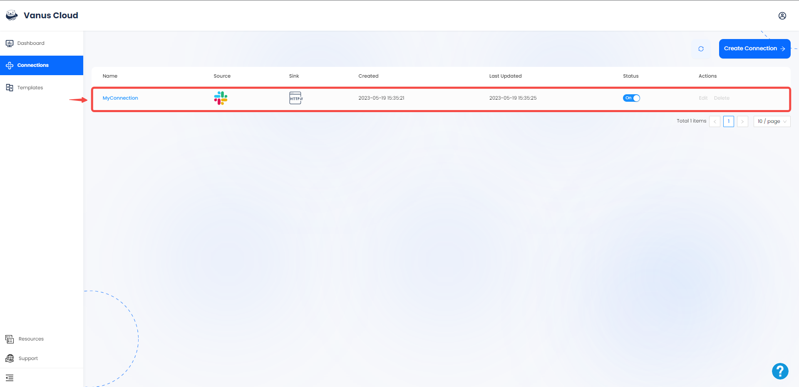

# Slack

This guide contains information to set up a Slack Source in Vanus Cloud.

## Introduction

Slack is a cloud-based team collaboration platform that allows users to communicate, share files, and integrate with other tools and services.

Our Slack Source connector, lets you receive events when users join, message, react etc... 

---
## Prerequisites

Before obtaining Slack events, you must have:
- Have a [Slack account](https://slack.com).
- A [Vanus Cloud account](https://cloud.vanus.ai).

---

## Getting Started

### Step 1: Create and Install an App in Slack

1. Go to [Slack API](https://api.slack.com/apps), and click **Create New App**.

2. Select From Scratch.

3. Set the app name and Workspace.

### Step 2: Get App Credentials

1. Go to **Basic Information**.

2. Scroll down to **App Credentials** and copy the two following credentials.
    - Verification Token
    - Signing Secret
    

3. Don't close this page but continue in Vanus Cloud

---

### Step 3: Create your connection in Vanus Cloud

1. Log in to your [Vanus](https://cloud.vanus.ai) account and click on **connections**  
  

2. Click on **Create Connections**  
  

3. Write a name for your connection and choose your source. 

4. Paste two credentials from Slack as configurations.

5. Click the **copy icon** to copy the webhook url 

---

### Step4: How to use the webhook URL of a Slack Source 

##### Configure Event Subscription  

1. Go back to **Slack API**.

2. Now click on **Event Subscriptions** in the side menu.

3. **Enable Events** by turning on the switch.

4. Use the URL we've previously copied, and paste it in **Request URL**. You should see a green `Verified` indicating our Source is verified by Slack.

   

##### Subscribe to bot events 

Generally speaking, Slack Source can subscribe any events you need from Slack.

But, if you're using some **Vanus Templates** like `Send a custom greeting message when new members join the Slack channel`, then you've to subscribe to some specific events.

| Templates                                                              | Events need to subscribe |
|------------------------------------------------------------------------|:------------------------:|
| Send a custom greeting message when new members join the Slack channel | `member_joined_channel`  |

###### How to subscribe

1. Scroll down, click **Subscribe to bot events** and after you will be able to click **Add Bot User Event**.

2. Select the events you would like to receive, for example you can select `member_joined_channel` to receive events whenever a new member joins your Slack Channel.

3. Finally you can **Save Changes** to complete your configuration.

---

##### Install the Slack App to your Slack workspace

1. Go to **Install Apps** from the side menu and click **Install to Workspace**.

2. Allow it to be installed into your workspace.

3. Mention your bot in slack and invite it to the channel.

---

### Step5: Continue your configuration in Vanus cloud 

1. Choose your sink and click **Next** 
 

2. Click on submit to finish the configuration. 
  

3. You've successfully created your Vanus source connection.  
 

Learn more about Vanus and Vanus Cloud in our [documentation](https://docs.vanus.ai).
