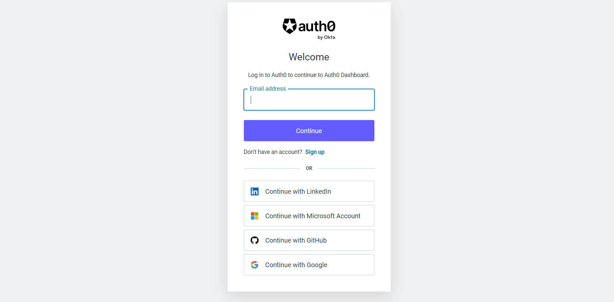
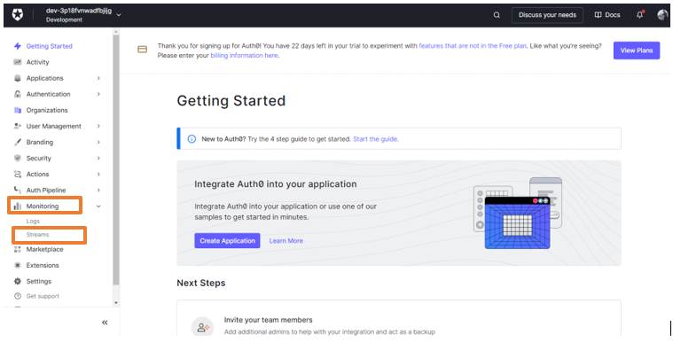
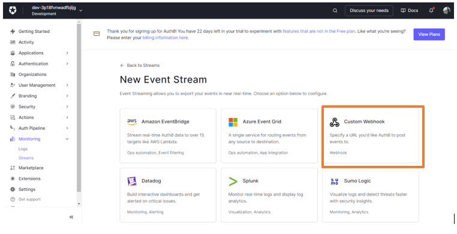
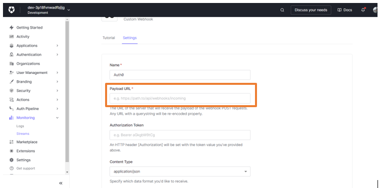
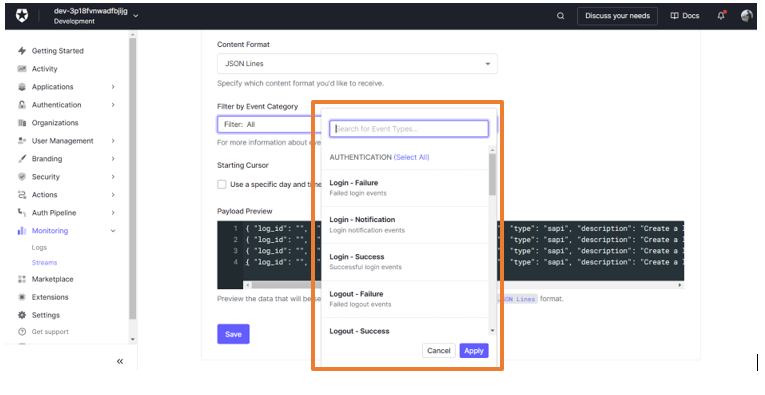

# Auth0 login event triggers a Slack message

Auth0 is one of the largest authorization service provider which helps you add authorization page in your projects

You can receive notifications when specific events occur in a your Auth0 account.

This guide will help you get a Slack notification message whenever someone login in your Auth0 setup.

<iframe width="800" height="450" src="https://www.youtube.com/embed/8nxuL7CUr_I" title="YouTube video player" frameBorder="0" allowFullScreen={true} allow="accelerometer; autoplay; clipboard-write; encrypted-media; gyroscope; picture-in-picture; web-share"></iframe>

## Get Started

### Step 1: Configure the Source

- Log in to [Vanus Cloud](https://cloud.vanus.ai/) and choose the **Auth0 login event triggers a Slack message** template.

### Step 2: Configure Sink - Get the Slack Webhook URL

- Open Slack API in your browser, create a Webhook URL and copy it

Tip: For detailed steps on how to obtain the Slack Webhook URL, refer to the blog [Get Your Slack Webhook URL - A Quick Integration Guide](https://www.vanus.ai/blog/get-your-slack-webhook-url/).

- Paste the copied URL in the "Webhook URL" in Sink Configuration and click Submit

- Your connection has been succesfully setup

### Step 3: Create a Custom Webhook in Auth0

- Open the newly created connection and copy the webhook URL

- Go to Auth0 and login with your account

- Go to Montioring on the left sidebar and click on Streams

- Click on Create Log Stream and Select the Custom Webhook option

- Give a name to your custom webhook and click Create

- Paste the copied URL in the Payload URL

- Make sure the Content Format is selected as JSON Lines

- In the Filter by Event Category, select your desired filter and click apply

- Finally, scroll down and click on Save

- Your connection will now work perfectly.
