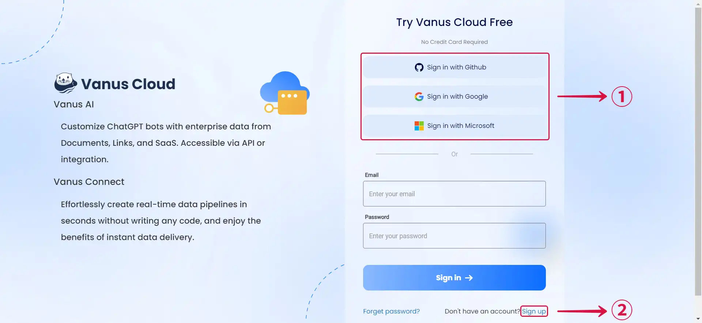
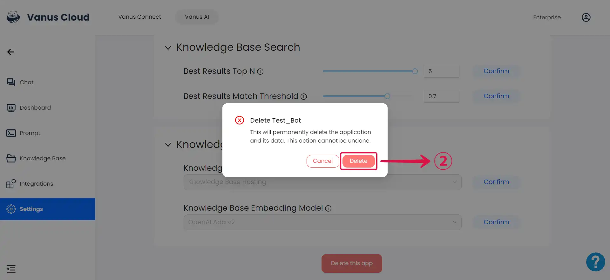

# App Settings

This documentation provides comprehensive instructions for effectively configuring your AI application and tailoring it to your preferences.

## Step 1: Create an AI application

1. Navigate to [**Vanus AI**](https://ai.vanus.ai) and sign in with **Github**, **Google**, **Microsoft Account**① or click **Sign up**②.

2. Initiate a new AI App by hitting the **Create App**③ button.

3. Input an **App Name**④, select an **App Model**⑤, upload to the **Knowledge Base**⑥, then click **Create**⑦.

## Step 2: App Settings

1. Click on the **Settings**① tab.

### General Settings

1. Click on **Change App Logo**① to update your app logo and click on **Change AI Logo**② to update your AI logo.

2. Change your **App Name**③ and click **Confirm**④ to save your settings.

3. Input your desired **App Greeting**⑤ and click **Confirm**⑥ to save your changes.

:::note
Take it step by step: Make one change at a time, enter your desired update, and click **Confirm** before proceeding to the next one. If you try to make multiple changes without confirming each one, only the first change you confirm will be accepted, and any other changes you make will be lost, requiring you to set them again.
:::

4. Type your **Quick Questions**⑦ and click **Confirm**⑧ to save them.

*The **Quick Question** section is where you type questions that you anticipate people might be interested in asking.*

6. Enabling **Chat History**⑨ means that the response is influenced by the ongoing conversation's context, making it more relevant and coherent.

### Application Setting

1. Click on the **App Model**① field to open a dropdown menu.

2. Choose the desired **App Model**② to utilize.

3. Click **Confirm**③ to save your changes.

4. **Temperature** determines how your AI Application responds throughout interactions.

*Lower value leads to more conservative and precise replies. Higher values may result in more creative responses.*

### Knowledge Base Search

- **Best Results Top N**①: The number of the most relevant pieces of information returned when retrieving content from the knowledge base.

- **Best Results Match Threshold**②: A higher threshold enhances the relevance of the returned text blocks but may reduce the total number of text blocks that can be returned.

- Type your preferred number in the **numeric input field**③ or move the **Slider**④ to change the settings.

:::note
Ensure you click **Confirm** after each change.
:::

### Delete App

- When the application is no longer needed, you can remove it by clicking **Delete this app**①.

- Click **Delete**② only if you’re certain you won’t be using this app anymore. Remember, this action can’t be undone.

