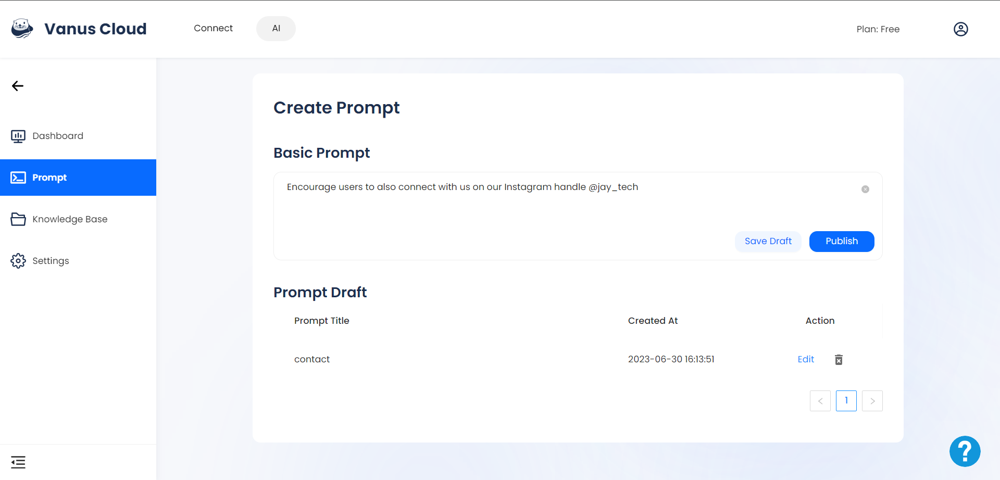

# Vanus AI Features

## Multi-Model Selection

Users can choose from various large models when building their AI application. Vanus AI currently provides users with models such as GPT-3.5, GPT 4.0 and ERNIE Bot. Other large models will be provided in the future.

## Knowledge Base

Vanus AI's knowledge base is a versatile and powerful repository that plays a vital role in training and enhancing the capabilities of your personal assistant, chatbot, or AI-powered application. It serves as a centralized hub, containing essential data and information to strengthen your AI system. 
Users can upload a wide range of file types to the knowledge base, including PDF documents, CSV, traditional text-based files, images, videos, and website URLs and the application extracts relevant information from these files.
 

 

By integrating your AI application with relevant third-party apps such as databases or business chat groups, you can ensure a continuous update of the knowledge base. Through real-time streaming, your AI application receives updates and learns from interactions with these third-party applications, enabling it to enhance its knowledge base dynamically.

## Dual Hosting Mode

The concept of dual hosting mode pertains to the location and manner in which you host your knowledge base. Vanus AI supports 2 hosting modes, namely:

- **Knowledge Base Hosting:** In this mode, the users or enterprises can fully host their data on the knowledge base and Vanus AI will maintain their data for them.

- **Cloud Database Hosting:** In this mode of hosting, users or enterprises can store their data on their preferred cloud database. This comes in handy for enterprises that want to be solely in charge of their data.

In the future, a new feature called "Data Migration" would be made available. This feature enables users to migrate data from their knowledge base to a cloud database, and vice versa.

## Real-time learning

The AI application automatically acquires new knowledge from its data source. Whenever users, as well as third-party applications and services, engage with your application, the AI application instantly learns from the newly generated data.

## Prompt

Users have the ability to incorporate predefined prompts into their AI application to align its services with their business needs. For example, a user can save a prompt such as "Encourage users to also connect with us on our Instagram handle @jay_tech" When a customer asks a question related to contacting the business, the AI application will direct them towards the Instagram handle mentioned in the saved prompt.

The utilization of this feature can vary based on the specific needs of users. Users have the flexibility to save multiple prompts for different scenarios, and the AI application will employ them appropriately during customer interactions.

## MultiCloud Deployment

Users have the freedom to select the cloud service platform on which they want to deploy their applications. Currently, Vanus AI supports deployment on Amazon Web Services (AWS) and Alibaba Cloud, with plans to include support for other popular cloud platforms in the future. Users can also choose the specific region where they want to deploy their applications, based on the specific requirements of their enterprise.

## Third-Party SAAS Integration

Customers have the capability to integrate their created AI applications with various third-party SAAS apps and services using Vanus Connect. For instance, if a customer is training their AI application to function as an investment research bot, they can connect it to a Slack investment group. This enables the AI application to learn and improve its abilities as an investment research bot by leveraging real-time events and information shared within the group.

## Plugin Mechanism

By utilizing the Vanus AI plugin, you have the ability to establish connections between your application and external services. This allows you to link your AI application with platforms like WordPress, e-commerce websites, and any other preferred external systems.
