# Discord

This documentation will teach you how to integrate your AI into Discord.

Integration is a paid user feature. Therefore, only users with professional subscriptions and above can use integrations.

## How to Setup a Discord Integration

**Prerequisites:**

- Have a [**Discord account**](https://discord.com).

- Have a [**Vanus AI account**](https://ai.vanus.ai).

### Step 1: Create an AI Application

1. Navigate to [**Vanus AI**](https://ai.vanus.ai) and sign in with **Github**, **Google**, **Microsoft Account**① or click **Sign up**②.

2. Initiate a new AI App by hitting the **Create App**③ button.

3. Input an **App Name**④, select an **App Model**⑤, upload to the **Knowledge Base**⑥, then click **Create**⑦.

If you find yourself uncertain about which app model to select, please refer to the [**Large Language Models (LLM) Documentation**](https://docs.vanus.ai/vanus-ai/beginning/large-language-models/) for clear guidance on choosing the most suitable LLM for your requirements.

:::note
In the next steps, we will go to the Discord website or Application to create our Discord Server and get the required credentials to make the connection.
:::

### Step 2: Create a Discord Server

1. Access the Discord App or Webpage at [**Discord**](https://discord.com).

2. After signing in, you can press the **`+`** button to establish a new channel①.

3. Hit **Create My Own**②.

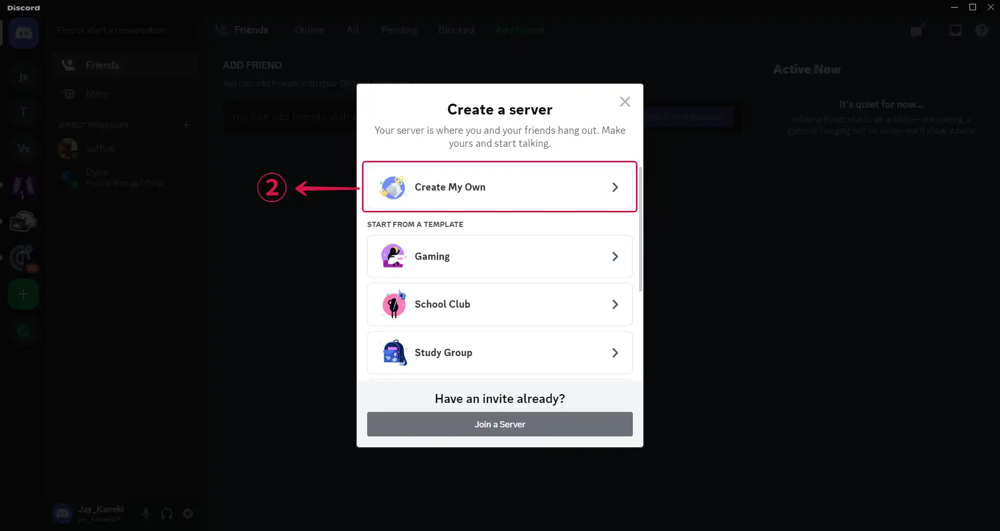

4. Select **For me and my friends**③.

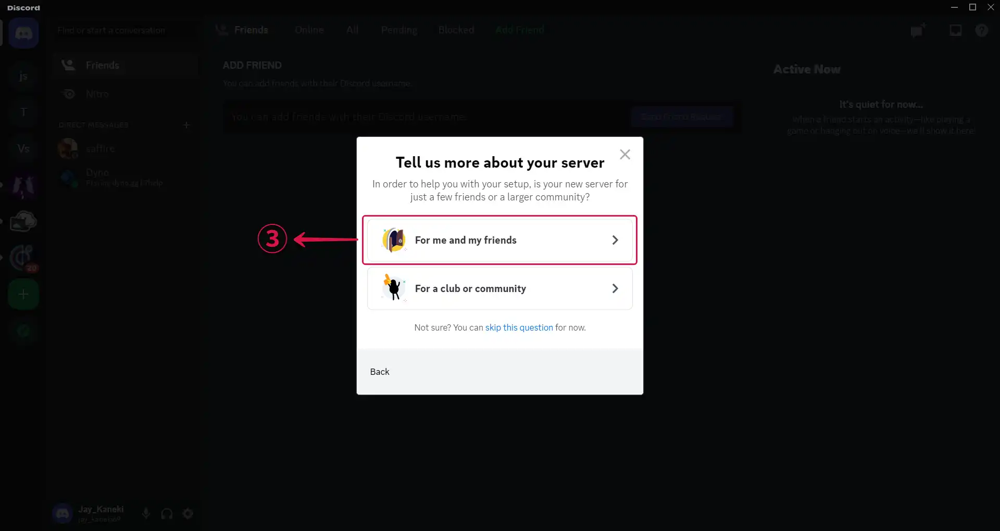

5. Input a **SERVER NAME**④ and click **Create**⑤.

### Step 3: Develop a Discord Application

1. Go to the [**Discord Developer Portal**](https://discord.com/developers/applications).

2. Press **New Application**①.

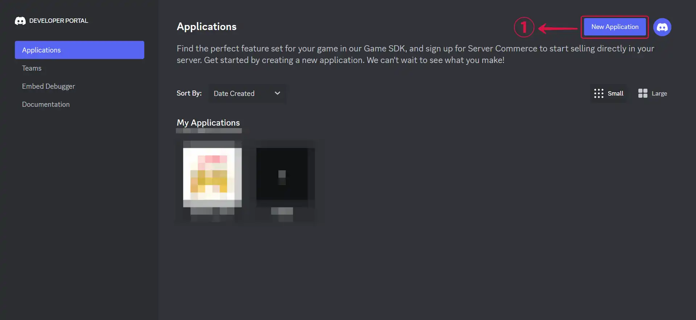

3. Assign a **NAME**② to your bot, agree to the **Developer Terms of Service and Developer Policy**③, then hit **Create**④.

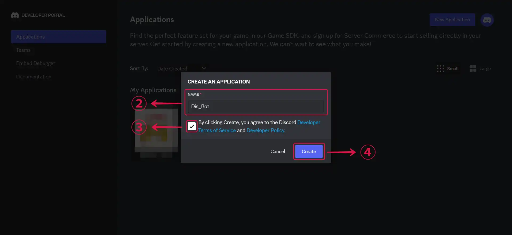

4. From the sidebar menu, select **Bot**⑤, and under Privileged Gateway Intents, enable **MESSAGE CONTENT INTENT**⑥.

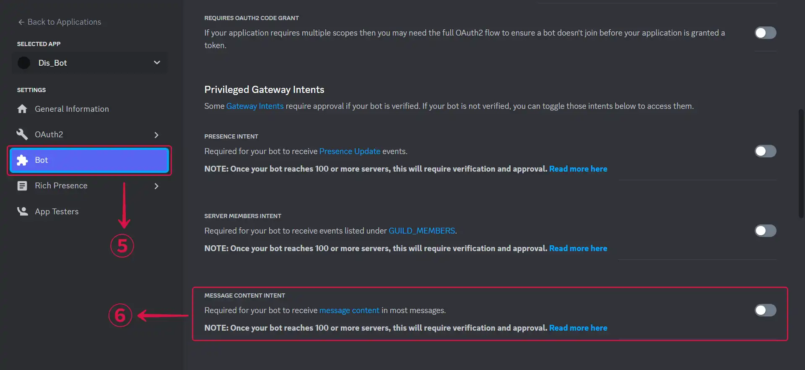

5. Click on **Save Changes**⑦.

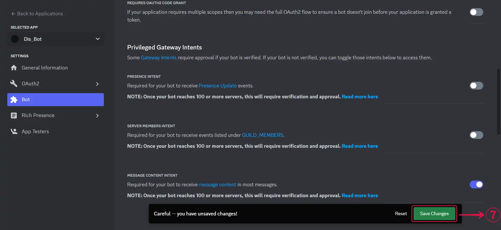

6. Press **Reset Token**⑧.

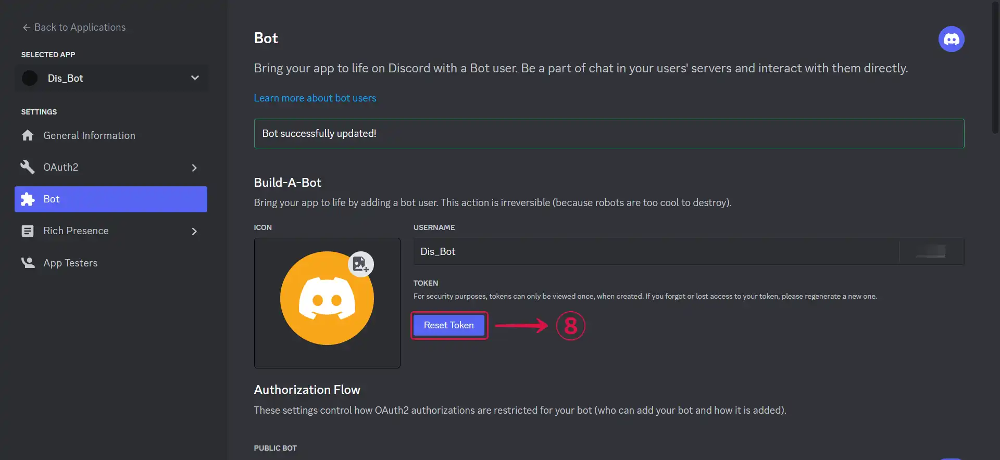

7. **Copy**⑨ the generated token.

8. Return to Vanus AI, click on the **Integrations**⑩ tab and select **Discord Integration**⑪.

9. A **dialog box**⑫ will be displayed on the screen, featuring two blank fields: for a Name and Bot Token.

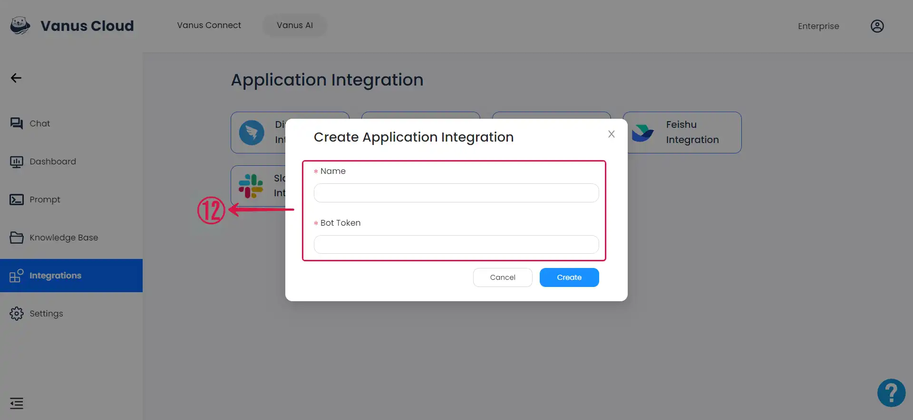

10. **Name**⑬ the integration, paste the **Bot Token**⑭, and hit **Create**⑮.

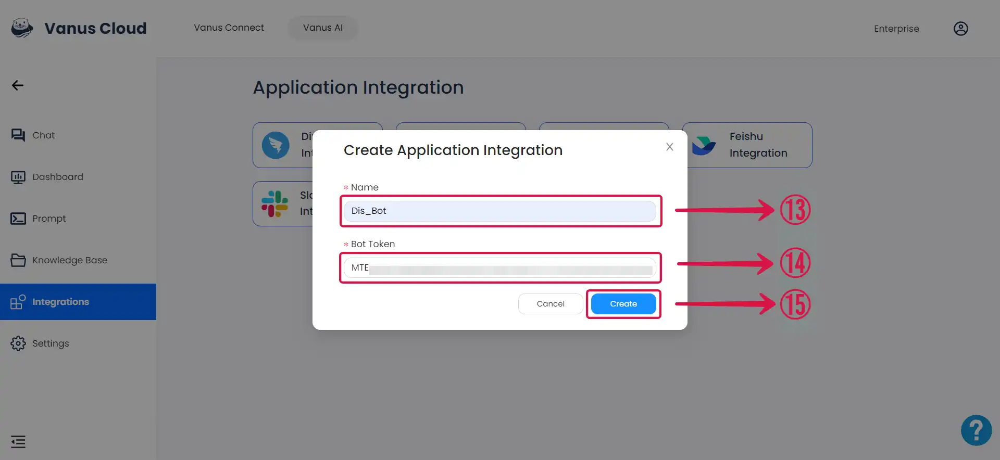

11. Your integration has been successfully created and is now **Running**⑯.

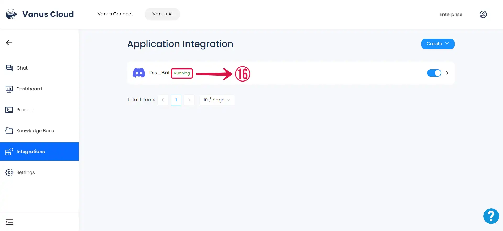

12. Finally, to add an AI bot to a channel, return to the application within the developer portal.

13. In the sidebar menu, find **OAuth2**⑰ and **URL Generator**⑱.

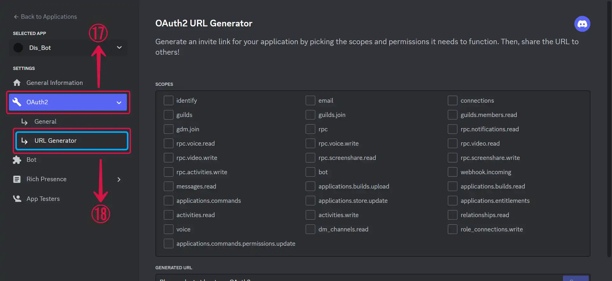

14. Choose **bot**⑲ under SCOPES.

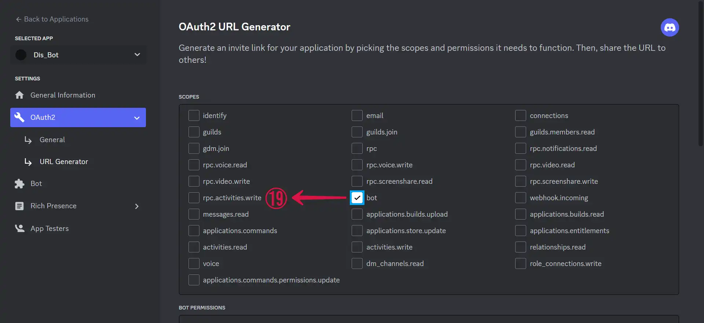

15. Under BOT PERMISSION **(ReadMessages/ViewChannel, Send Messages, Mention Everyone, Use External Emojis, Send TTS Messages, Send Messages In threads, Create public, threads Create private threads)** or Administrator.

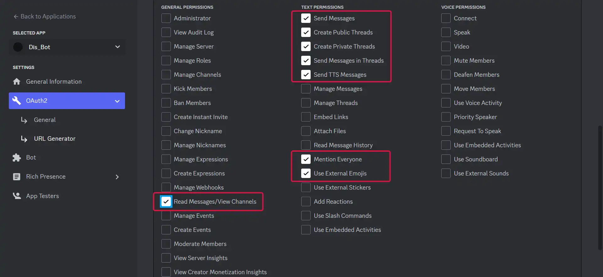

16. **Copy**⑳ the URL, and then insert it into a web browser to access the authentication page.

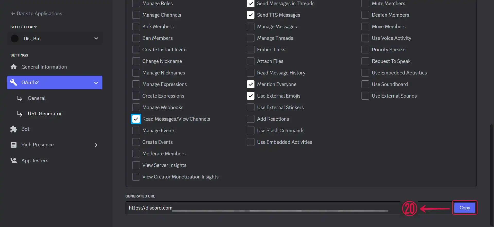

:::note
The **URL**㉑ is a website link that directs you to a page where you need to authorize your newly created bot to access a Discord server.
:::

17. Choose your **Server**㉒ and press **Continue**㉓.

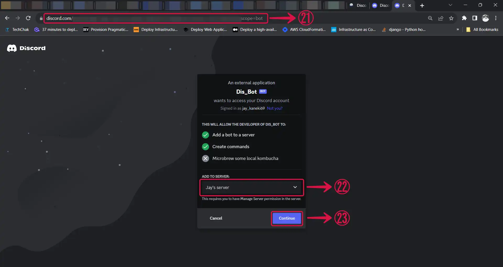

18. Click on **Authorize**㉔.

19. Your Bot has been successfully **authorized**㉕.

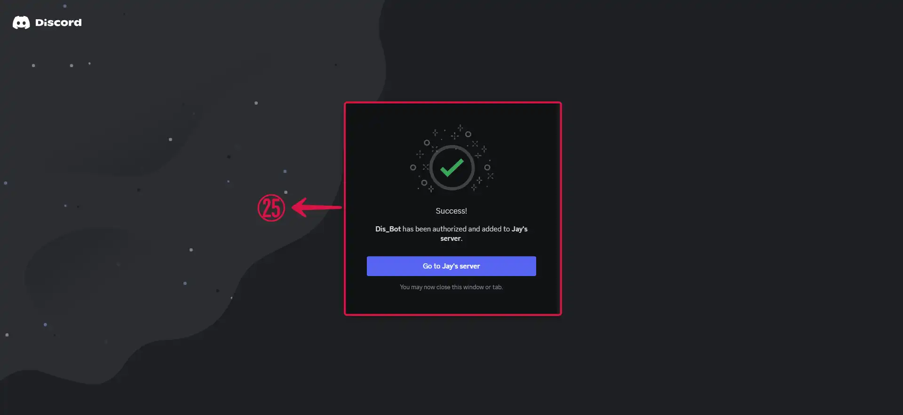

20. Return to your Discord Application or website.

### Communicate with the AI

- To Send a message in a channel, you need to **mention the AI**①.

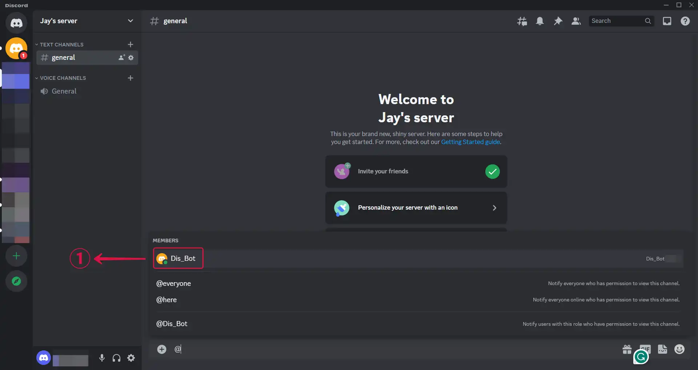

**Important:** Please be aware that each bot carries a role with a similar name, and trying to mention the role will not yield any results.

- To send a message privately, you can **click on the AI bot**②.

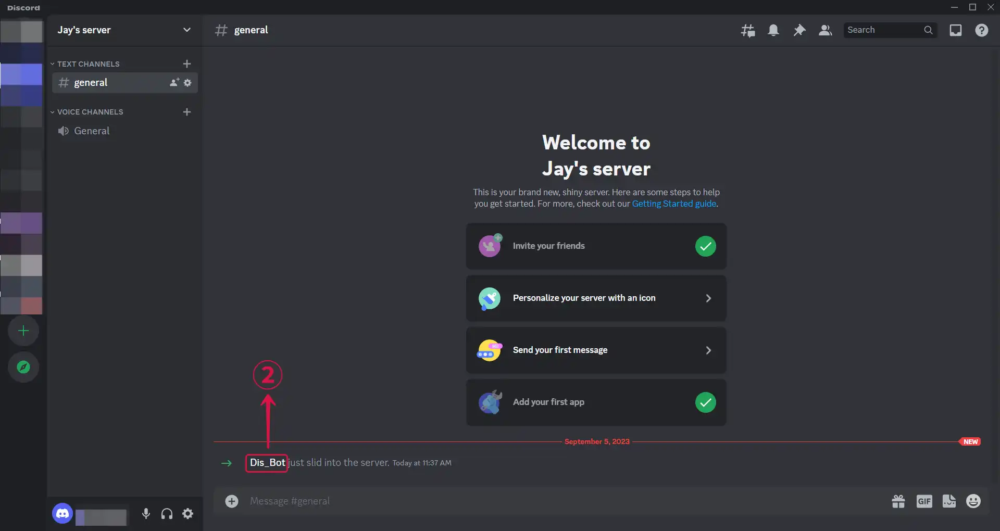

- Write and send your message.

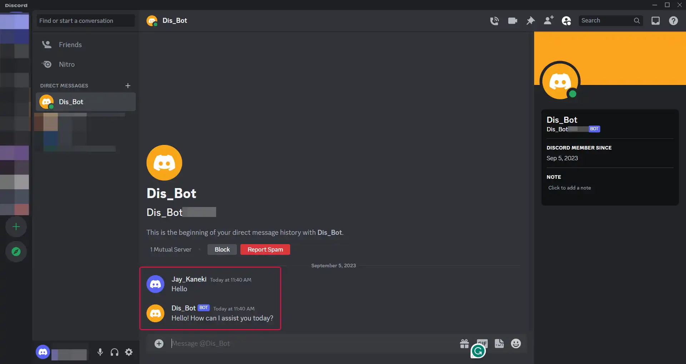
