# Slack

This documentation will teach you how to integrate your AI into Slack.

Integration is a paid user feature. Therefore, only users with professional subscriptions and above can use integrations.

## How to Integrate Vanus AI in Slack

**Prerequisites:**

- Have a **[Slack Account](https://slack.com)**.
- Have a **[Vanus AI account](https://ai.vanus.ai)**.

### Step 1: Create an AI Application
1. Navigate to **[Vanus AI](https://ai.vanus.ai)** and **Github**, **Google**, **Microsoft Account**① or click **Sign up**②.

2. Initiate a new AI App by hitting the **Create App**③ button.

3. Input an **App Name**④, select an **App Model**⑤, upload to the **Knowledge Base**⑥, then click **Create**⑦.

4. Select the **Integrations Tab**⑧ and select the **Slack Integration**⑨.

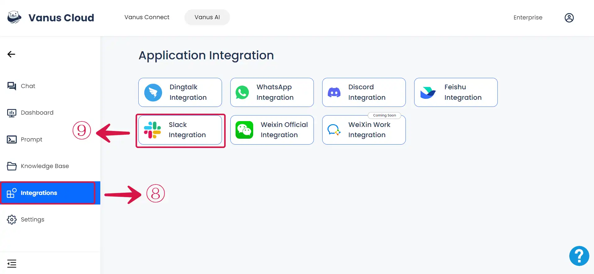

### Step 2: Create a Slack App

1. Go to **[Slack API](https://api.slack.com/apps)**, and click **Create New App**①.

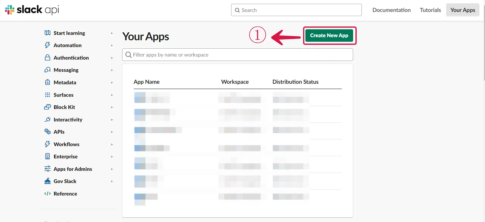

2. Select **From Scratch**②.

3. Set the **App Name**③ and **Workspace**④, then click the **Create App**⑤ button.

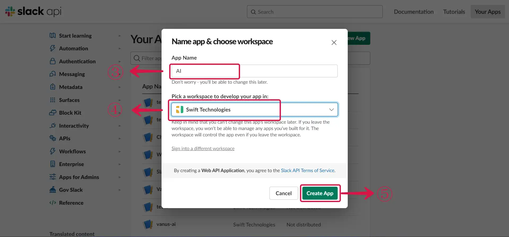

### Step 3: Configure your App

1. Add **Permissions**⑥ feature for your app.

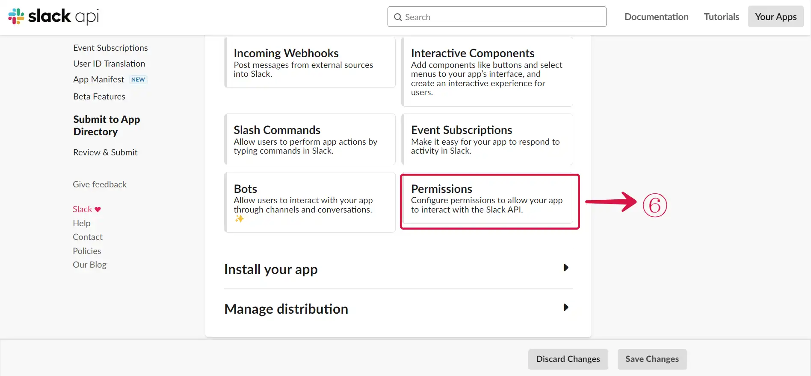

2. Scroll down to `Scopes/Bot Token Scopes`, and click **Add an OAuth Scope**⑦.

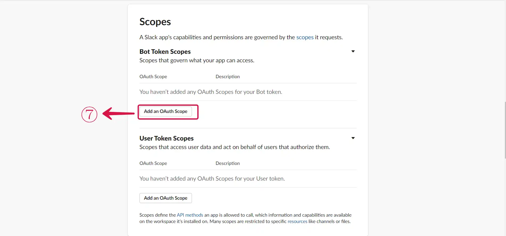

3. Search the name of the permission and click on it to add the permission. Search and add the following permissions `chat:write:public`⑧, `chat:write`⑨, `im:history`⑩, `app_mentions:read`⑪ permission to your app.

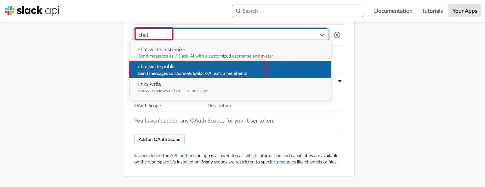

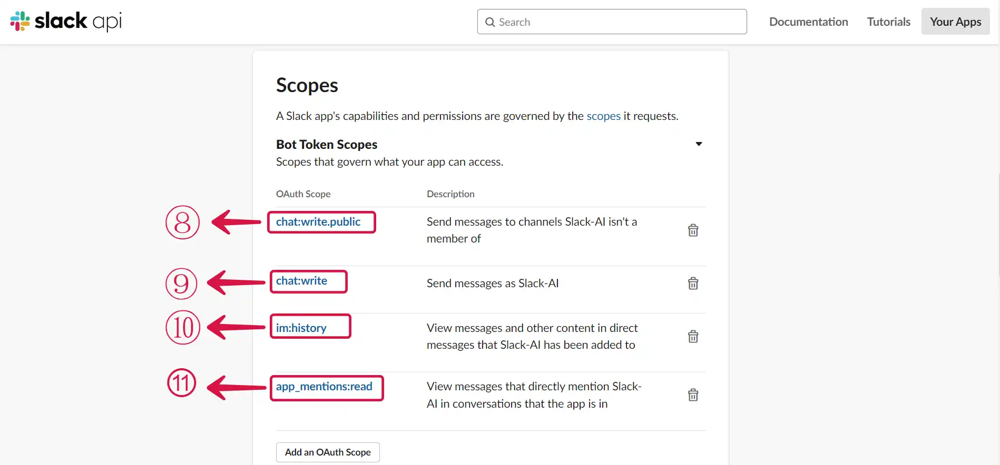

4. Scroll up to the top of the page, and click **Install to Workspace**⑫ to install your app.

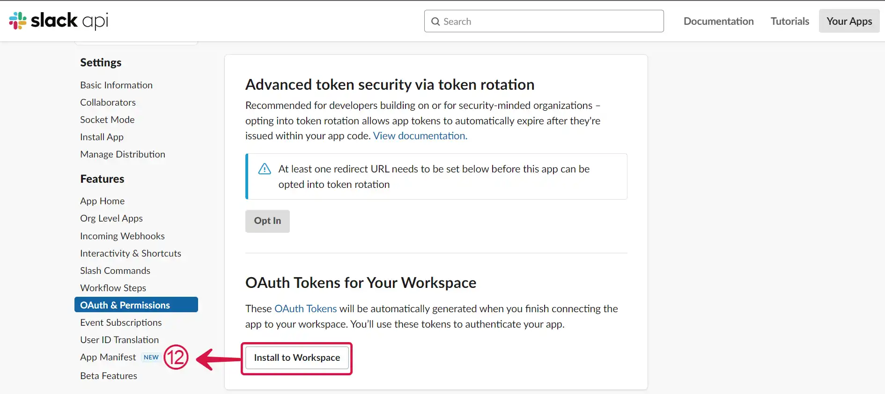

5. Click **Allow**⑬ to install the app.

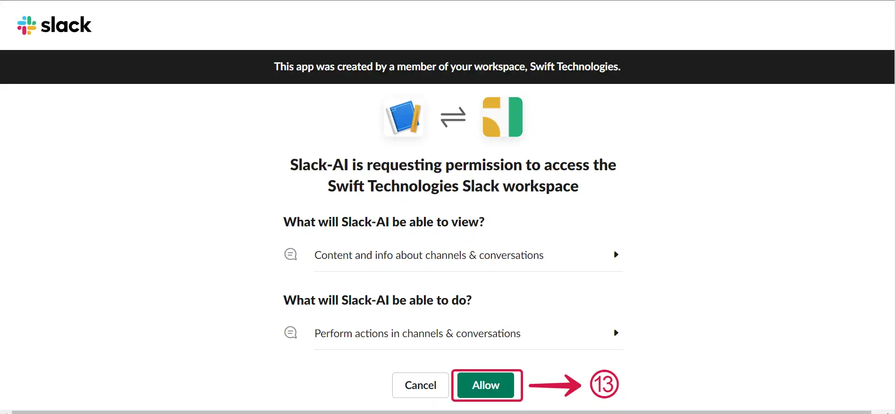

6. **Copy**⑭ the Bot User OAuth Token.

7. Paste the Bot User OAuth Token in the **Bot Token**⑮ field in Vanus AI

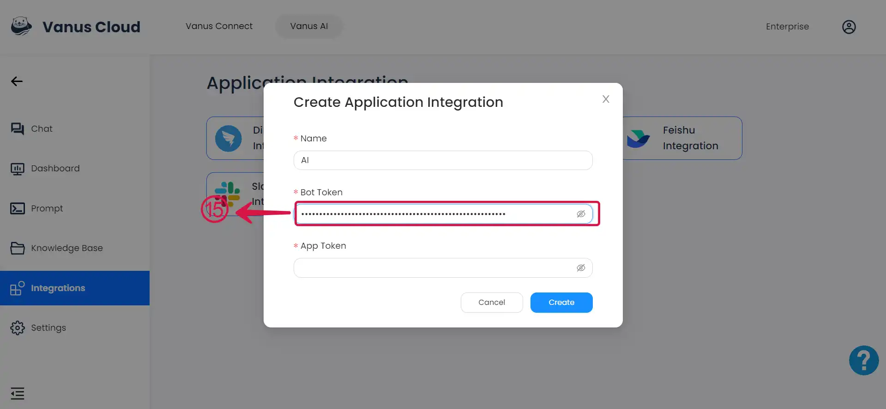

8. Click on the **Basic Information**⑯ tab, scroll down to **App-Level Tokens** and click on **Generate Tokens and Scopes**⑰.

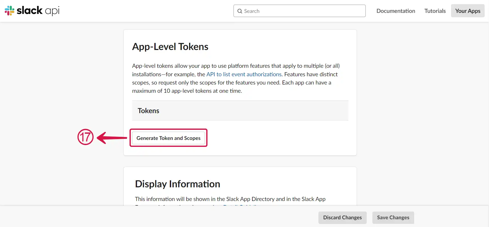

9. Write the **Token Name**⑱ and click on the **Add Scope** button, Select **connections:write**⑲ and click on the **Generate**⑳ button.

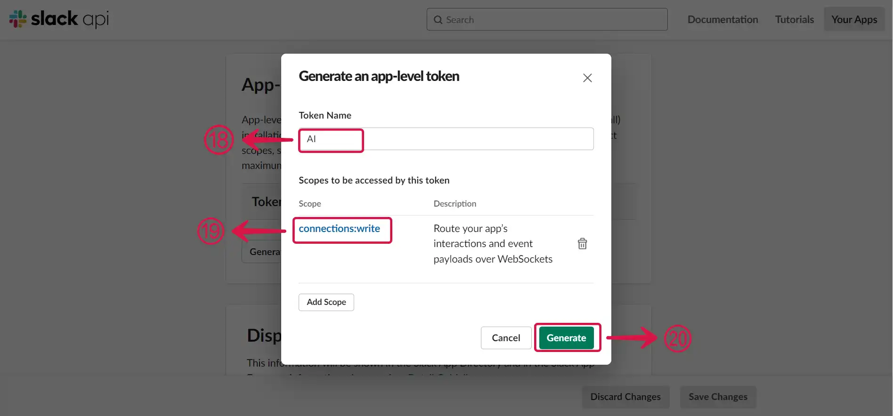

10. **Copy**㉑ the App-Level Tokens 

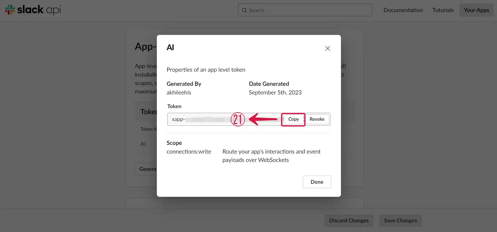

11.Give the Integration a **Name**㉒. The **Bot Token**㉓ is the same as credentials in ⑮. Paste in the **App Token**㉔ field in Vanus AI and click on the **Create**㉕ button.

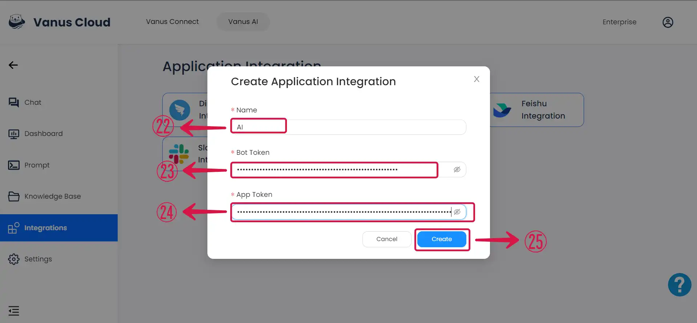

12. The connection will show the **Running**㉖ status.

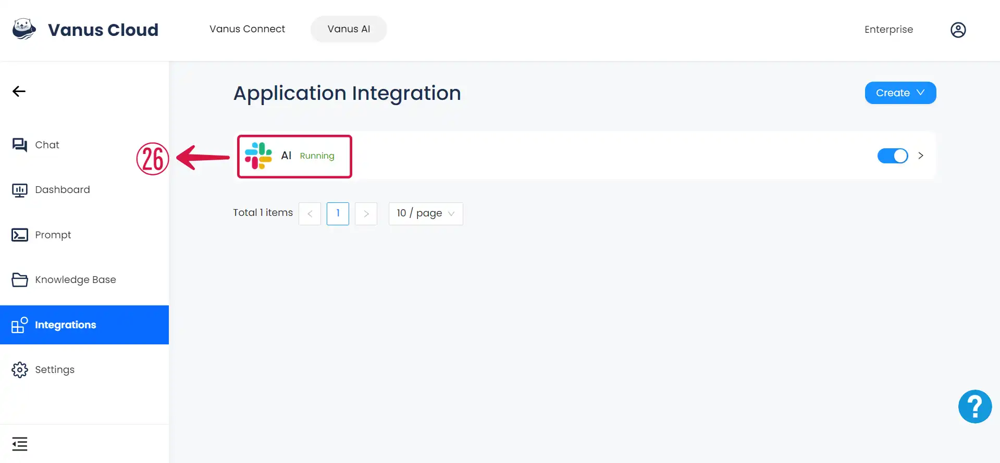

13. Scroll up to **Socket Mode**㉗ tab and **Enable**㉘ Socket Mode.

14. Scroll down to **Event Subscriptions**㉙ tab, **Enable**㉚ Event Subscription.

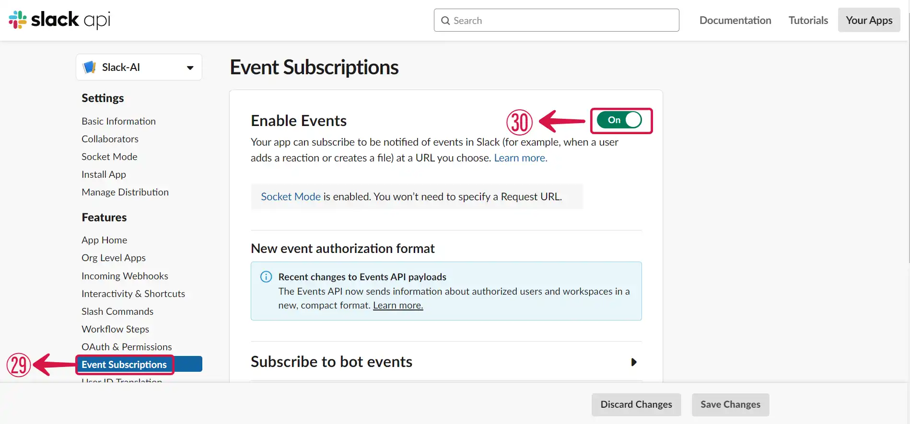

15. Click on Subscribe to bot events drop-down, click on the **Add Bot User Event**㉛.

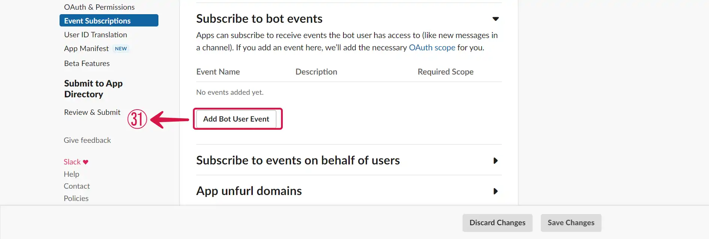

16. Add **app_mention**㉜ & **im_history_changed**㉝. Click on **Save Changes**㉞ button.

### Communicate with the AI.

To communicate with the AI in a channel, you need to mention the AI using the `@` and the AI name, then ask your question.

