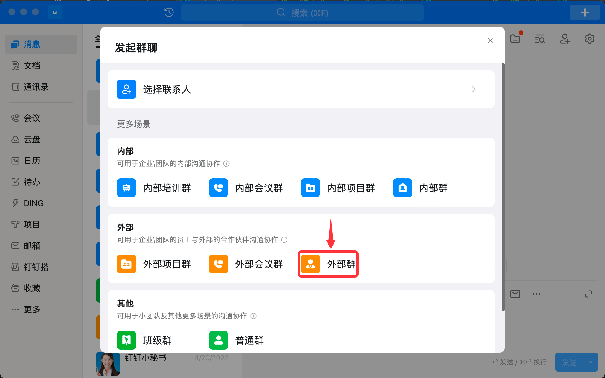
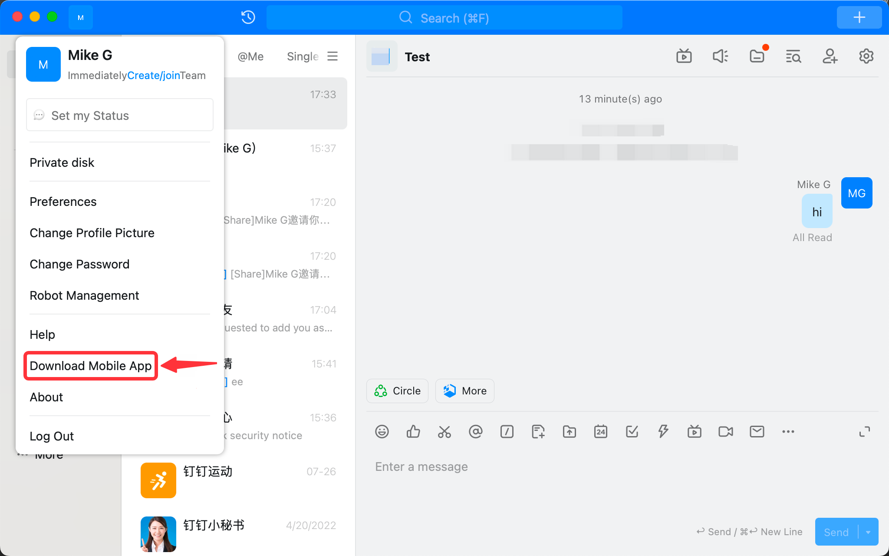
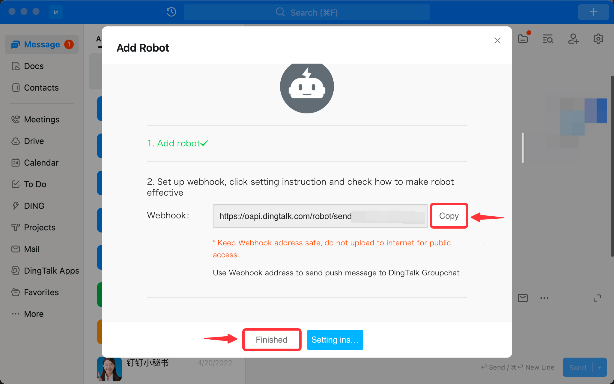
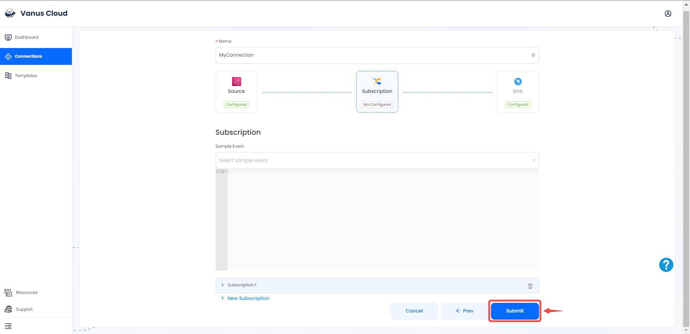
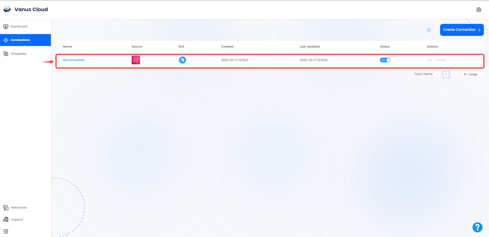

# Ding Talk

This guide contains information to set up a Ding Talk Sink in Vanus Cloud.

## Introduction

Ding Talk is a communication and collaboration platform, which provides instant messaging, video conferencing, and other communication tools for businesses and organizations.

With Ding Talk Sink connector in Vanus Cloud, you can easily forward real-time updates to a Ding Talk group chat, allowing your team to stay up-to-date on all events generated by your application.

## Prerequisites

Before forwarding events to Ding Talk, you must have:

- A [Vanus Cloud account](https://cloud.vanus.ai)
- A Ding Talk account with administrative privileges

## Getting Started

**To set up a bot for receiving events in your Ding Talk group chat:**

### Step 1: Create a Group

1. Log in to your Ding Talk account.
2. Create a **new group** go to the `+` and select **New Chat**.
   
3. Now click **发起群聊**.
   
4. Click **外部群**.
   
5. Select **minimum 2 members** of your team to create a group, set a group name and press **Ok**.
   

### Step 2: Add Bot to Ding Talk Group

1. In the top navigation pane, click **Robot Management**.

2. In the **Robot Management** page, click **Custom**.

3. In the **Robot details** page, click **Add**.

4. In the **Add Robot** dialog:

   - In the **Chatbot name** field, provide a name for the robot.
   - In the **Add to Group** field, select the target group in which the Robot will create.
   - In the **Security Settings** field, selected the **Additional Signature**, copy the signature and paste it Vanus Cloud.
   - Accept the Terms of Service.
   - Click **Finished**.
5. Now click **Copy**, keep the Webhook URL safely and click **Finished**.


### Step 3: Set up the Ding Talk Sink connector in Vanus Cloud

1. Log in to your [Vanus](https://cloud.vanus.ai) account and click on **connections**  
  

2. Click on **Create Connections**  
  

3. Name your connection, Choose your source and click next 
 

4. Click on **Sink** and choose **dingtalk** 
 

5. **Webhook URL**: The webhook address that message sent to, you can get it when you create Chat Bot. You retrieved above.
6. **Signature Verification**: The signature to sign request, you can get it when you create Chat Bot. You retrieved above.


7. Click **Next** to continue. 

8. Click on submit to finish the configuration. 
  

9. You've successfully created your Vanus dingtalk sink connection.  


## Required Data Format
The event data must be JSON format, here a simple message, example:

```json
{
    "id": "53d1c340-551a-11ed-96c7-8b504d95037c",
    "source": "sink-Dingtalk-quickstart",
    "specversion": "1.0",
    "type": "quickstart",
    "datacontenttype": "text/plain",
    "time": "2022-10-26T10:38:29.345Z",
    "xvchatgroup": "bot1",
    "xvmsgtype": "text",
    "data": "Hello dingtalk"
}
```