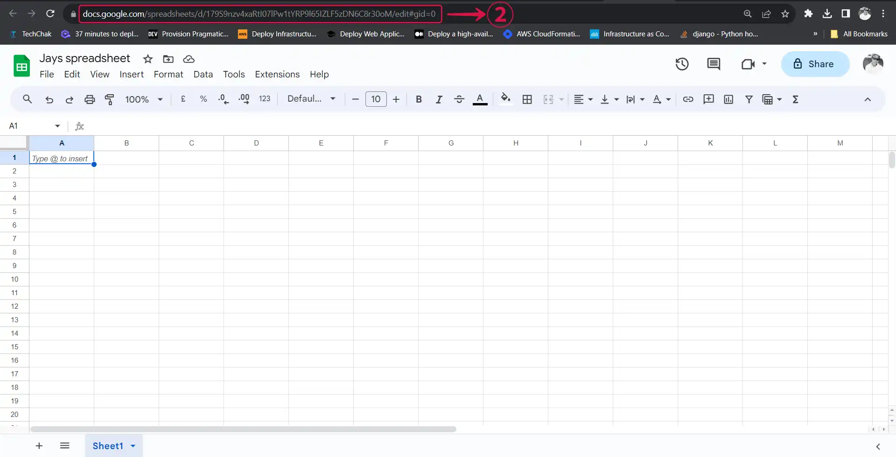
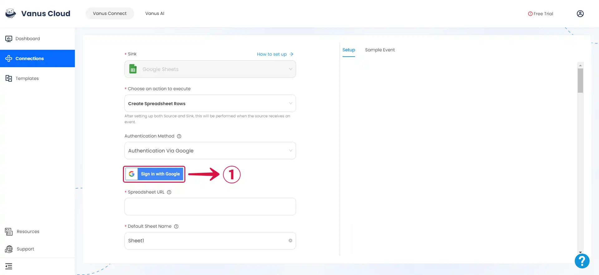
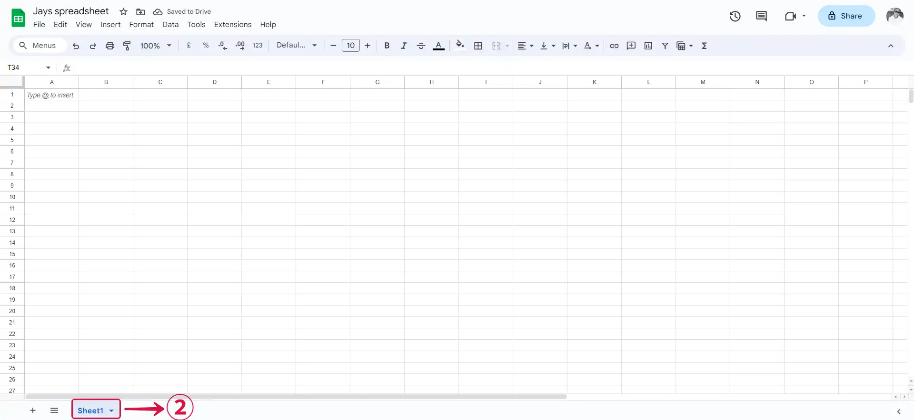
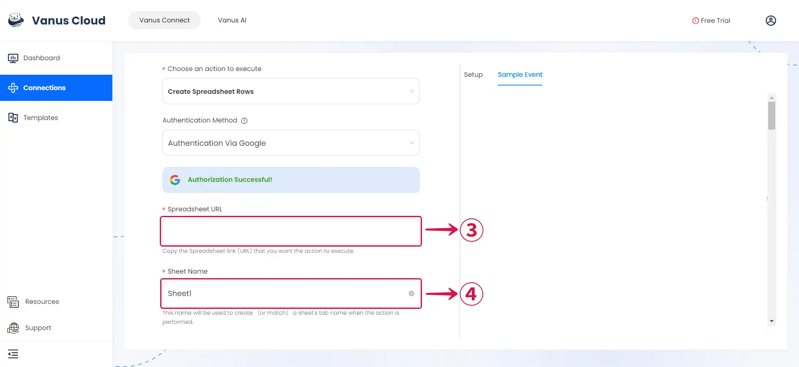
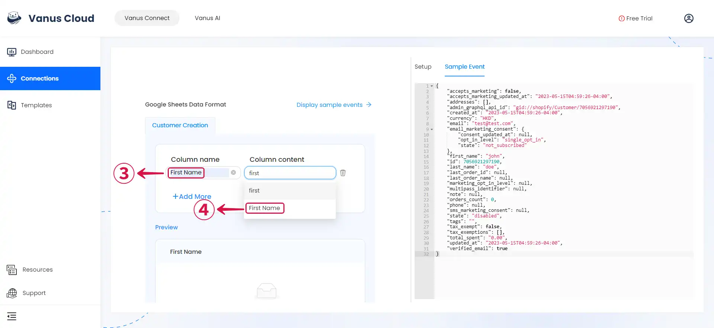
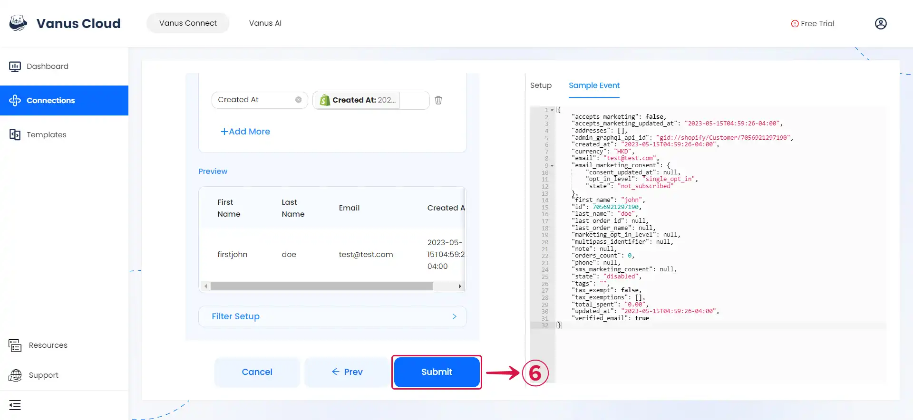

# Google Sheets

This guide contains information to set up a Google Sheets Sink in Vanus Connect.

## Introduction

Google Sheets is a powerful spreadsheet tool that can be used to store and analyze data.

With Google Sheets Sink connector in Vanus Connect, you can easily forward real-time updates to a designated sheet in your Google Sheets account, allowing you to track events generated by your application.

## Prerequisites

Before forwarding events to Google Sheets, you must have:

- A [**Vanus Cloud Account**](https://cloud.vanus.ai).
- A Google account with administrative privileges.

## Getting Started

**To set up a Google Sheets Sink in Vanus Connect:**

### Step 1: Create a Google Spreadsheet

1. Go to [**Google Sheets**](https://docs.google.com/spreadsheets/u/0/) and **Sign in**.

2. Create a new **Blank**① spreadsheet.


3. Copy the **Spreadsheet URL**②.



---

### Step 2: Google Sheets Connection Settings

1. Click on **Sign in with Google**① and follow the process to sign in to your Google account.



2. Obtain the name of the **Sheet**② at the bottom of the spreadsheet.



3. Return to Vanus Cloud and complete your configuration.

- Paste the **Spreadsheet URL**③ that was copied from Step 1.

- Paste the **Sheet Name**④: `Sheet1`.



### Step 3: Personalize Event Structure

:::note
This is a general instruction on how to personalize your event structure. You can structure your events to suit your specific requirements and create connections for different scenarios.
:::

1. Click on **Display sample events**① for reference and click on **Add More**② to add events.


2. **Input key**③ and search for the corresponding **value**④ for the event you want.



3. You can fill in as many **key-value pairs**⑤ as you wish to receive.


4. Click **Submit**⑥ to finish the configuration process.



---

## Required Data Format

The event data must be in JSON format with the following keys:

```json
{
    "Title": "value",
    "date": "value",
    "ect...": "value"
}
```
