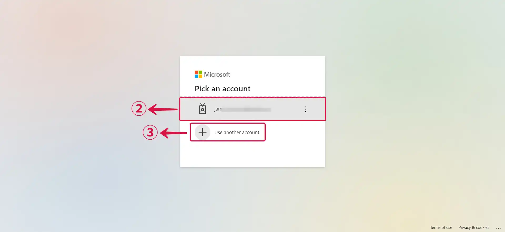
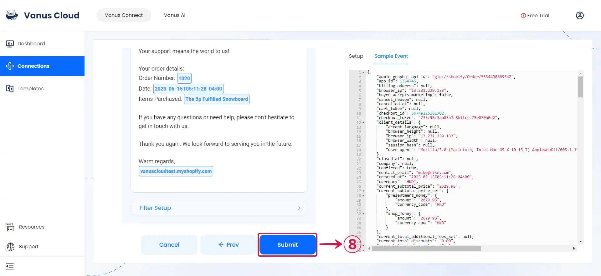

# Outlook

This guide contains information to set up an Outlook Sink in Vanus Connect.

## Introduction

Outlook is a Microsoft email application and productivity tool that helps users manage their emails and offers additional features such as calendar management, contact organization, task tracking, note-taking, and web browsing. It's widely used for efficient communication and time management in both personal and professional settings.

The Outlook Sink Connector allows you to utilize your Outlook account in sending events to external sources, and also receive events from external sources into your Outlook account.

## Prerequisites

Before forwarding events to Outlook, you must have:

- An [**Outlook Account**](https://www.microsoft.com/en-us/microsoft-365/outlook/email-and-calendar-software-microsoft-outlook?deeplink=%2fowa%2f&sdf=0)

- A [**Vanus Cloud Account**](https://cloud.vanus.ai).

---

**Perform the following steps to configure your Outlook Sink.**

### Step 1: Outlook Connection Settings

1. Click **Authorize**① to establish a connection with your Outlook account.

2. Pick an **Account**② or **Use another account**③.

3. Type in your **Password**④ and click **Sign in**⑤.

4. Click on **Accept**⑥ to grant Vanus Connect access to your Outlook account.

5. Return to Vanus Connect and complete your configuration.

### Step 2: Personalize Event Structure

:::note
This is a general instruction on how to personalize your event structure. You can structure your events to suit your specific requirements and create connections for different scenarios.
:::

1. Compose your **Subject**①, specify the recipient's email by inputting **`$` followed by the desired event**② to access a **list of corresponding event values**③, and select the one you want.

2. Click **Display sample events**④ for reference. Then **type your message and input `$` followed by the desired event⑤** to access a **list of corresponding event values**⑥.

3. You can structure the content as you prefer and fill in as many **values**⑦ as you wish to receive.

4. Click **Submit**⑧ to finish the configuration process.

---

Learn more about Vanus and Vanus Connect in our [**documentation**](https://docs.vanus.ai).
