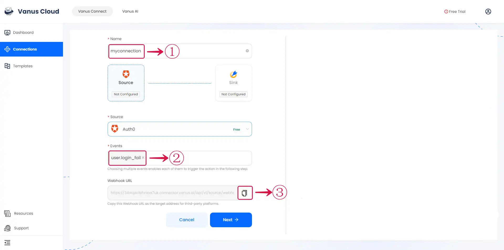
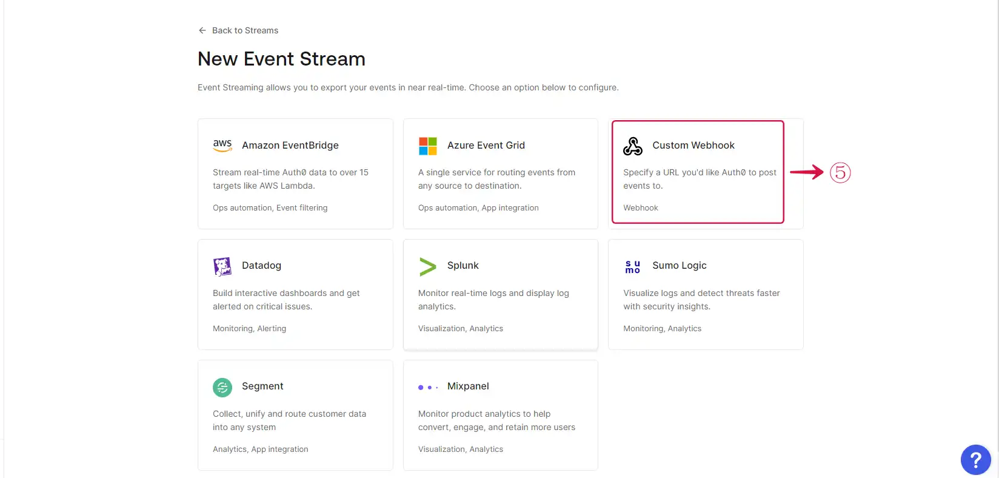

# Auth0

This guide contains information to set up a Auth0 Source in Vanus Connect.

## Introduction

Auth0 is an authentication and authorization platform that provides security solutions for applications, websites, and APIs. It offers features such as single sign-on, multi-factor authentication, and social logins, among others.

The Auth0 Source is a webhook server that enables you to establish an endpoint for receiving events from your Auth0 application. To achieve this, it is necessary to establish a connection within Auth0.

## Prerequisites

Before obtaining Auth0 events, you must have:

- An Auth0 account with administrative privileges
- A [Vanus Cloud account](https://cloud.vanus.ai)

## Getting Started

### Create your connection in Vanus Connect

1. Write a **Name**① for your connection.

    Select the **Events**② you want to receive.

    Click on the **copy**③ icon to copy the Webhook URL. Use the Webhook URL to receive events.

2. Log in to your [Auth0 account](https://auth0.com/api/auth/login).

3. Navigate to the **Monitoring**④ menu and select **Streams**⑤.

4. Click on the **Create Log Stream**⑥ button.

5. Select the **Custom Webhook**⑦ option.

6. Write a **Name**⑧ for your webhook stream and click on the **Create**⑨ button.

7. Provide the **Payload URL**⑩ of your Auth0 source connector in Vanus Connect, and select **Json Lines**⑪ under **Content Format**.

8. **Select**⑫ the event you want to receive notifications for and click the **Apply**⑬ button. Save your settings.

**Caution**

At this time you can only select one event. 

9. Go back to Vanus Connect and click **Next**⑭ to continue the configuration.

Learn more about Vanus and Vanus Connect in our [documentation](https://docs.vanus.ai).
