# Amazon Billing

This guide contains information to set up a Amazon Billing Source in Vanus Connect.

## Introduction

AWS Billing is an AWS service for monitoring and managing your cloud usage and costs. It provides comprehensive usage and expense data to help you optimize resources and control spending.

Amazon Billing Source is a connector provided by Vanus that retrieves daily or hourly spending information from Amazon Cloud Services and converts it into CloudEvents. To use cloud billing, you need to provide a user access key and secret key, which are required to authenticate and authorize access to your AWS account. By providing these keys, the Amazon Billing Source connector can access your billing information and retrieve the spending data from your AWS account.

## Prerequisites

- A [**Vanus Cloud account**](https://cloud.vanus.ai).
- AWS IAM Access Key.
- AWS permissions ce:GetCostAndUsage for the IAM user.

## Getting Started

### Step 1: Create a new AWS user

1. Log in to the AWS [**Management Console**](https://aws.amazon.com) using your root account credentials.

2. Navigate to the [**IAM**](https://console.aws.amazon.com/iam/) service by searching for **IAM**① and click the **IAM**② service.

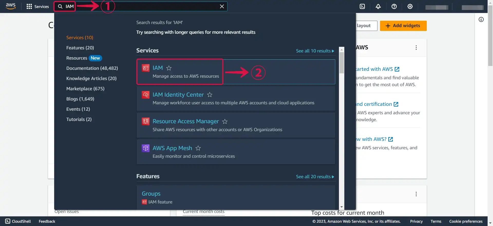

3. Click on the **Users**③ tab in the left navigation menu, and then click the **Create user**④ button.

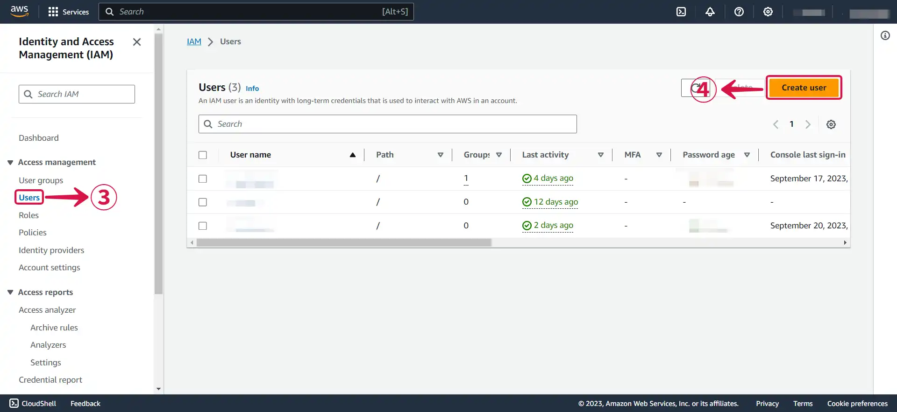

4. Write your **User name**⑤ and click **Next**⑥.

5. Select **Attach policies directly**⑦, and click on **Create policy**⑧.

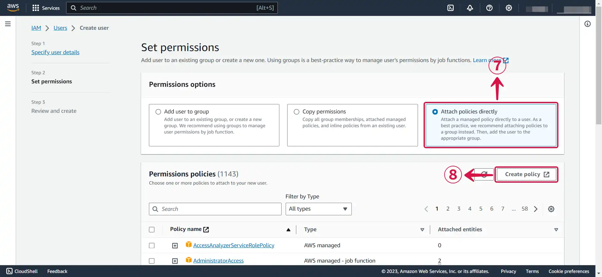

6. Click on **Choose a service**⑨ to open the dropdown menu.

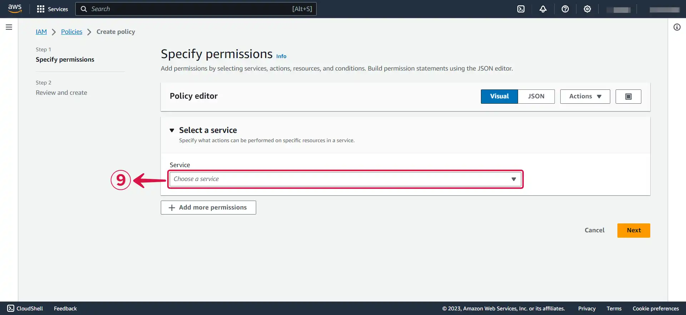

7. Select **Cost Explorer Service**⑩.

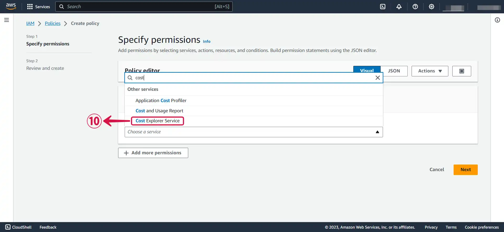

8. Search for the following policy: **GetCostAndUsage**⑪, **tick the box**⑫ to select it, and then press **Next**⑬ to proceed to the next page.

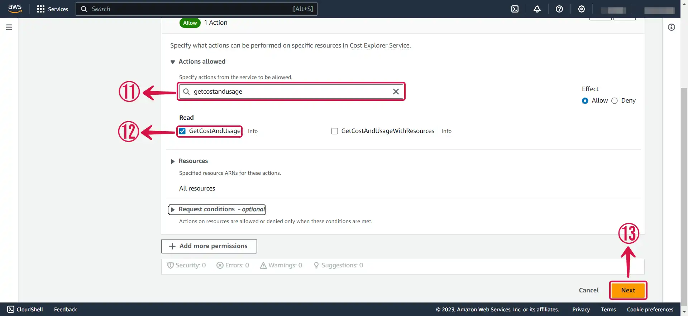

9. **Name**⑭ your policy.

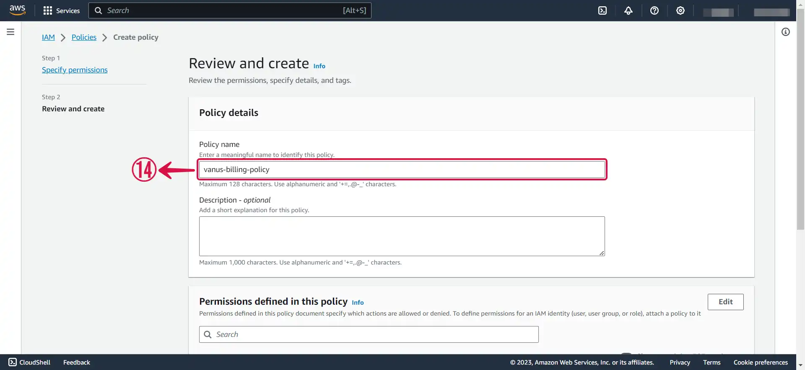

10. Click **Create policy**⑮.

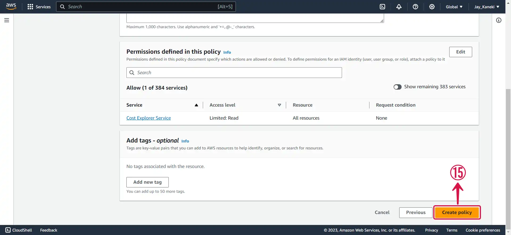

11. Return back to your **previous `TAB`⑯**.

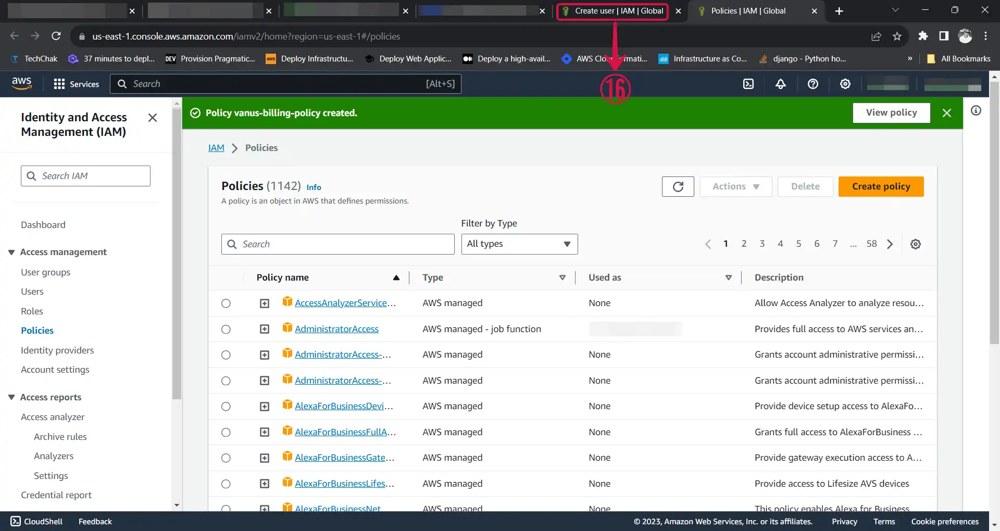

12. **Refresh**⑰ the policy list, **search**⑱ for your custom policy, **check the box**⑲  next to it to add it to your account, and then click on **Next**⑳.

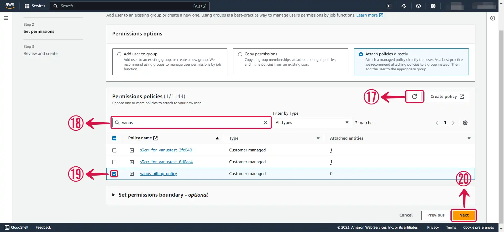

13. Review and press **Create user**㉑.

### Step 2: Create an Access Key and Secret Access Key

1. Now click on the **user**① you just created.

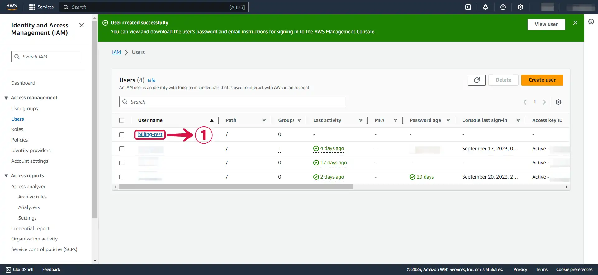

2. Under **Security credentials**② scroll down the page to `Access Keys`, and Click **Create access key**③.

3. Select **Command line interface (CLI)④**, tick the **confirmation box**⑤ and click **Next**⑥.

4. Click **Create access key**⑦.

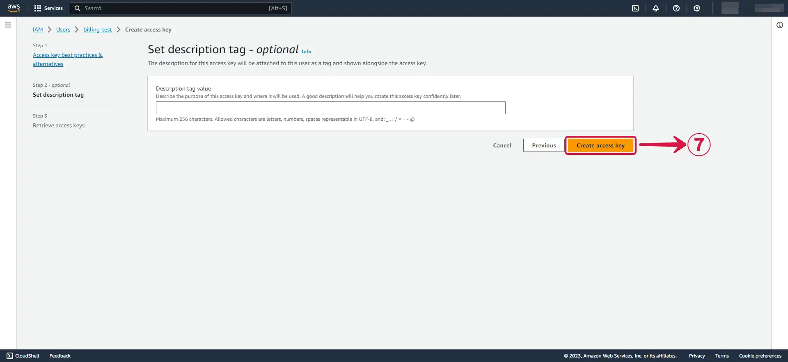

5. Download your **`Access key`** and **`Secret access key`** by clicking the **Download .csv file**⑧ button, and then click **Done**⑨.

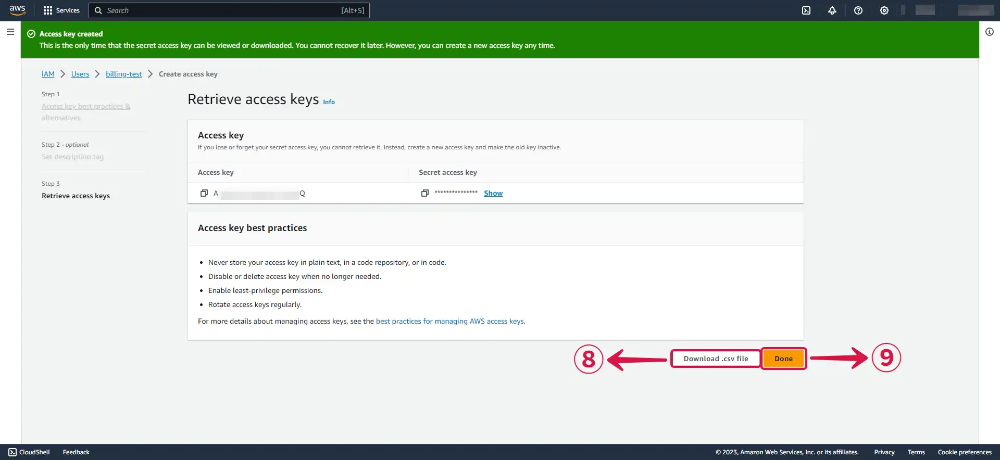

### Step 3: Config your connection

1. Write a **Name**① for your connection.

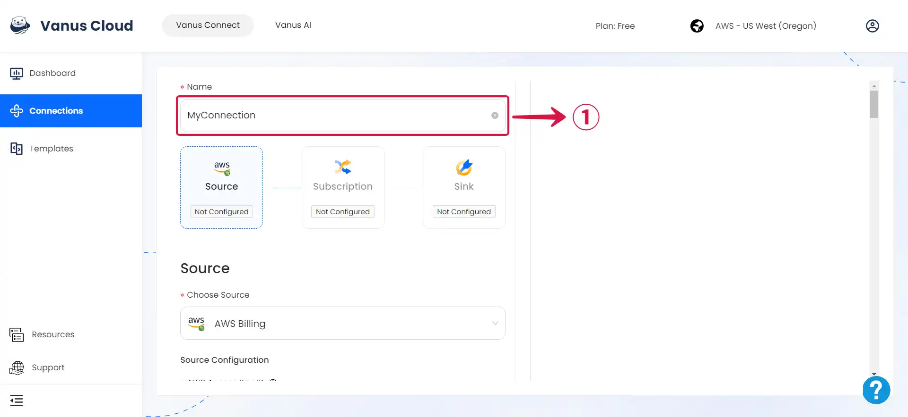

2. Enter your **Access Key ID**② and **Secret Access Key**③, specify the preferred event **Fetching Time**④, and then proceed by clicking on **Next**⑤.

Learn more about Vanus and Vanus Connect in our [**documentation**](https://docs.vanus.ai)
