# Amazon S3

This guide contains information to set up a S3 Source in Vanus Connect.

## Introduction

S3 is Amazon's cloud storage service that offers scalable and durable storage for various data types. It provides easy management and retrieval of data from anywhere with high availability and low latency.

Vanus Connect provides the Amazon S3 Source connector, which retrieves S3 events from a designated bucket and converts them into CloudEvents. With this connector, users can also set up an SQS queue to receive S3 event notifications. If a queue isn't specified, the connector will create one automatically.

## Prerequisites

Before obtaining S3 events, you must have:

- An [**Amazon Web Services**](https://aws.amazon.com) account.
- A [**Vanus Cloud Account**](https://cloud.vanus.ai).

## Getting Started

### Step 1: Create a new AWS user

1. Log in to the AWS [**Management Console**](https://aws.amazon.com) using your root account credentials.

2. Navigate to the [**IAM**](https://console.aws.amazon.com/iam/) service by searching for **IAM**① and click the **IAM**② service.

3. Click on the **Users**③ tab in the left navigation menu, and then click the **Create user**④ button.

4. Write your **User name**⑤ and click **Next**⑥.

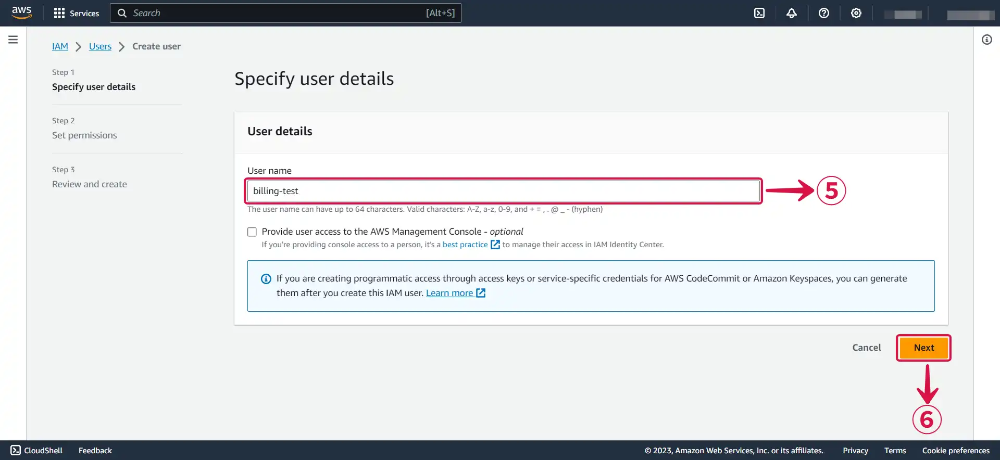

5. Select **Attach policies directly**⑦, and click on **Create policy**⑧.

6. Click on **Choose a service**⑨ to open the dropdown menu.

7. **Search**⑩ for s3 and **click on it**⑪.

8. Search for the following policy: **PutBucketNotification**⑫, and **tick the box**⑬ to select it.

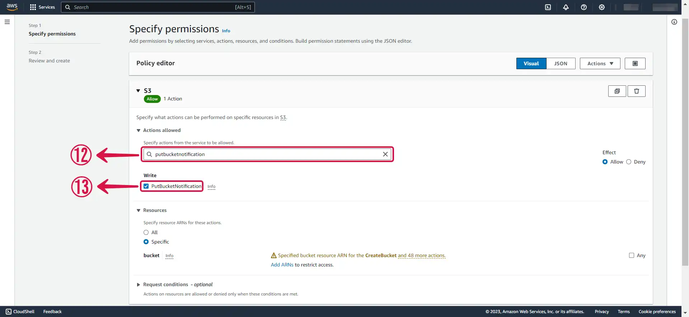

9. Click **Add more permissions**⑭.

10. Now **search for SQS**⑮ and **click on it**⑯.

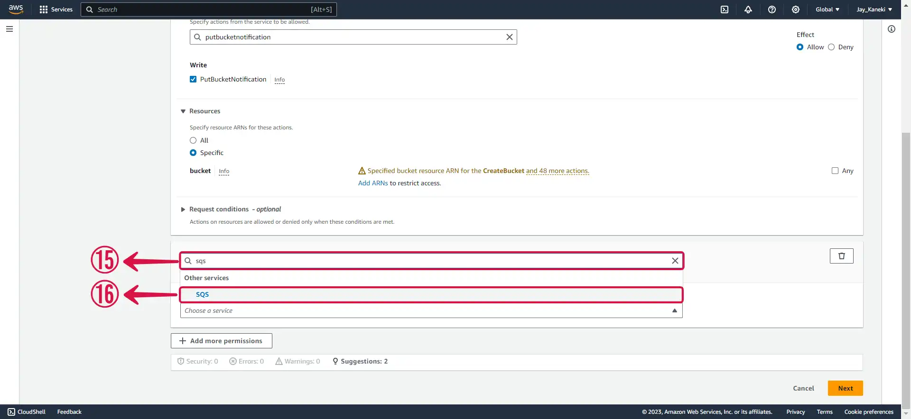

11. **Search**⑰ for the following policies.

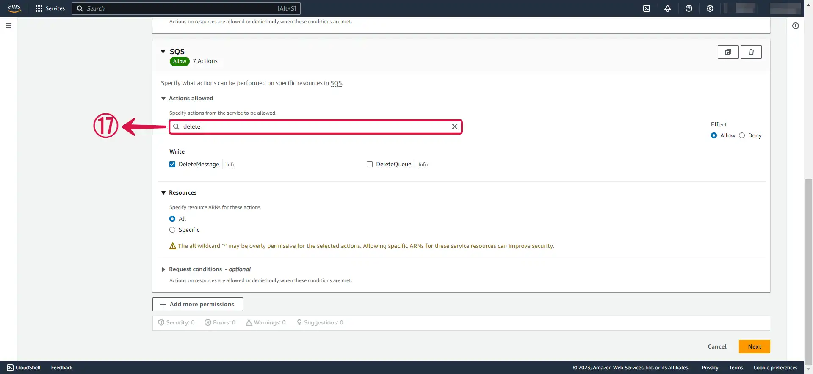

- ListQueues
- GetQueueUrl
- ReceiveMessage
- GetQueueAttributes
- CreateQueue
- SetQueueAttributes
- DeleteMessage

12. Press **Next**⑱ and proceed to the next page.

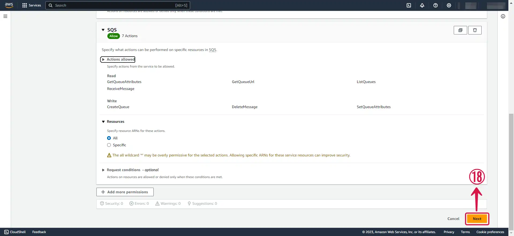

13. **Name**⑲ your policy.

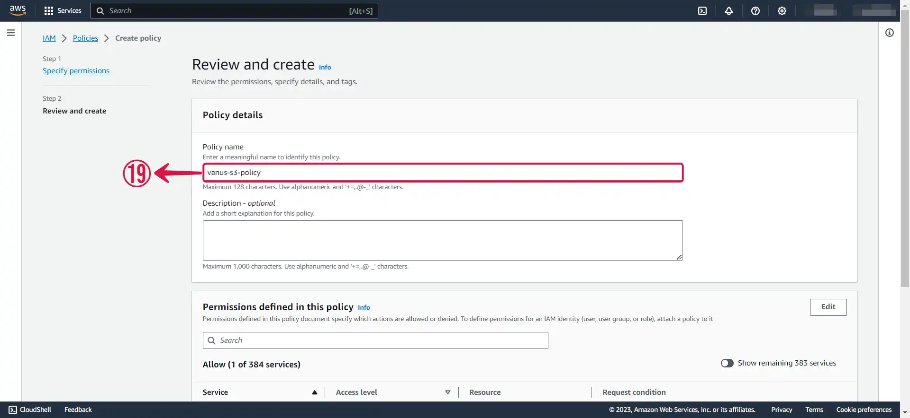

14. Click **Create policy**⑳.

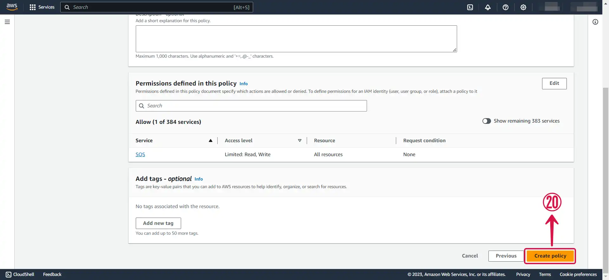

15. Return back to your **previous `TAB`㉑**.

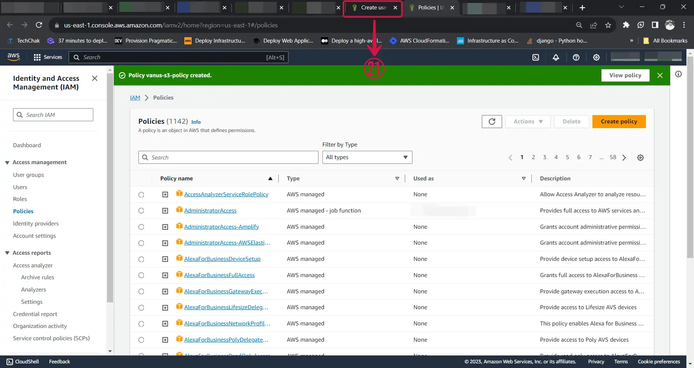

16. **Refresh**㉒ the policy list, **search**㉓ for your custom policy, **check the box**㉔ next to it to add it to your account, and then click on **Next**㉕.

17. Review and press **Create user**㉖.

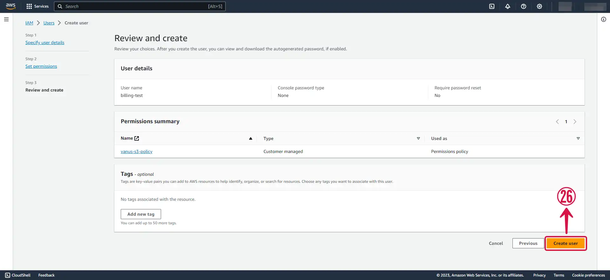

---

### Step 2: Create an Access key and Secret access Key

1. Now click on the **user**① you just created.

2. Under **Security credentials**② scroll down the page to `Access Keys`, and Click **Create access key**③.

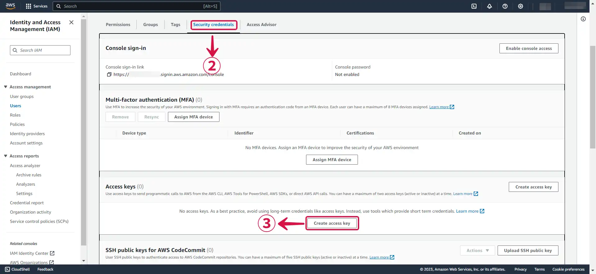

3. Select **Command line interface (CLI)④**, tick the **confirmation box**⑤ and click **Next**⑥.

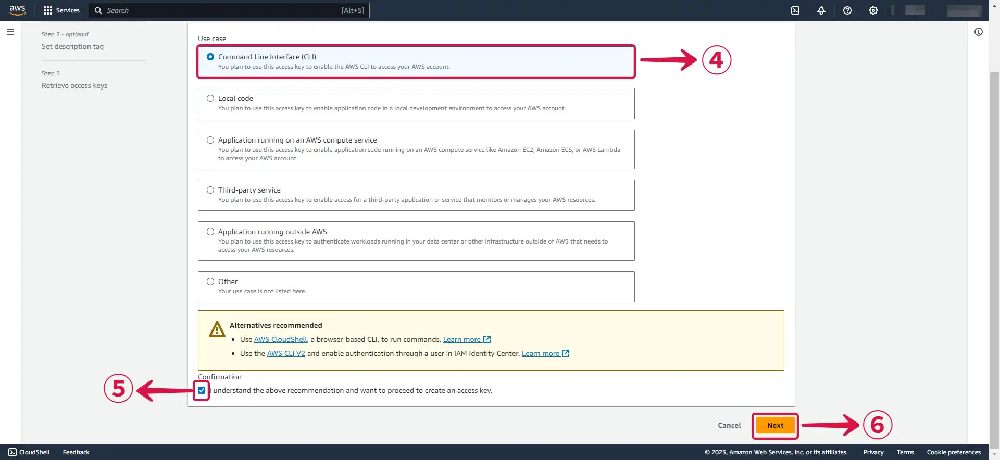

4. Click **Create access key**⑦.

5. Download your **`Access key`** and **`Secret access key`** by clicking the **Download .csv file**⑧ button, and then click **Done**⑨.

---

### Step 3: Amazon S3 Connection Settings

1. Write a **Name**① for your connection in Vanus Connect.

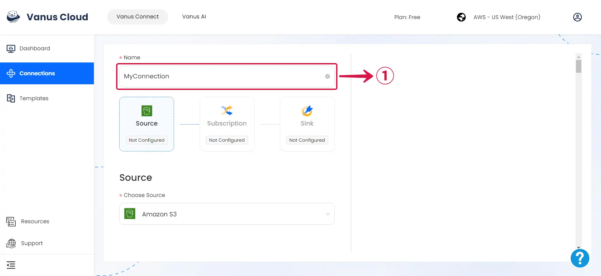

2. Enter your **`Access Key`②** and **`Secret access Key`③** in Vanus Connect.

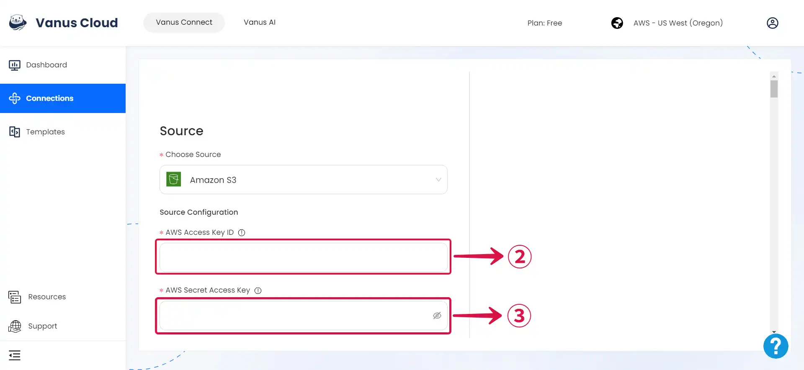

3. Navigate to the [**Amazon S3 service**](https://s3.console.aws.amazon.com/s3/buckets).

:::Note
At this point, you can either Create a new bucket or select an existing bucket.
:::

4. Create a new bucket by clicking the **Create bucket**④ button.

5. Specify a **Bucket name**⑤ and select your desired **AWS Region**⑥.

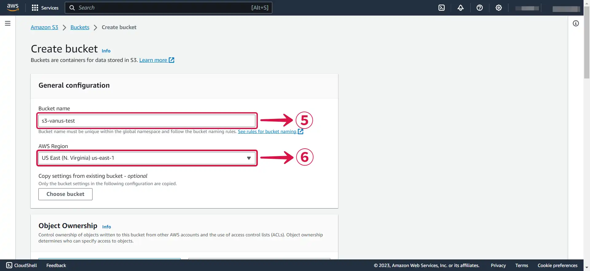

6. Click on **Create bucket**⑦ to finish creating your bucket.

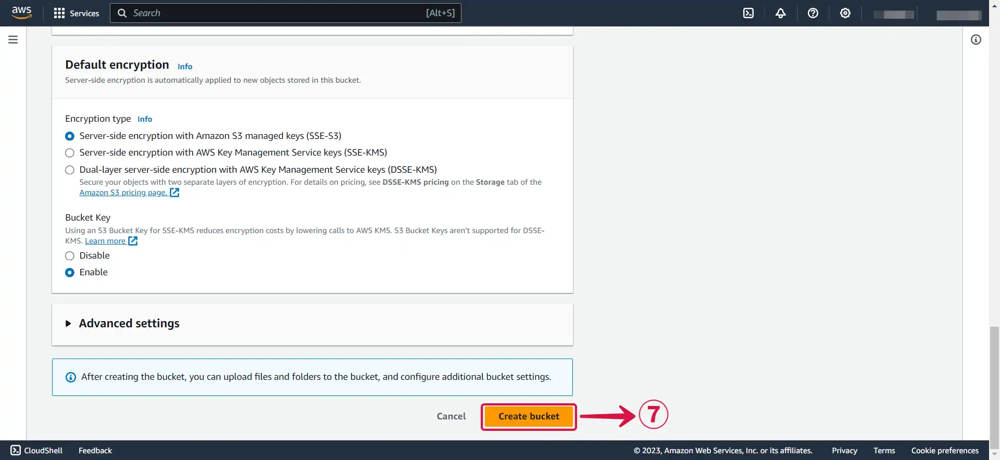

7. Once selected or created, click on the **bucket name**⑧.

8. Go to your bucket **Properties**⑨ and copy the **ARN**⑩.

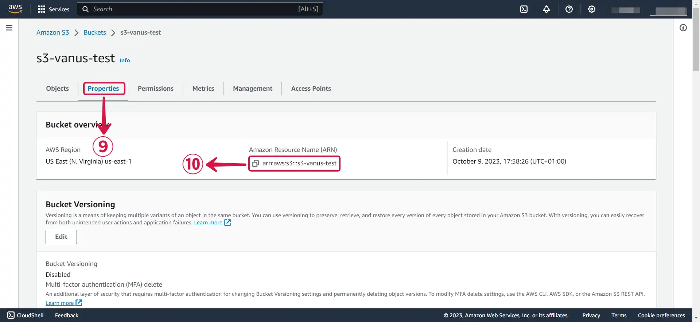

9. Paste your **Bucket ARN**⑪ into vanus connect, Specify the kind of **Events**⑫ you want to receive from the list.

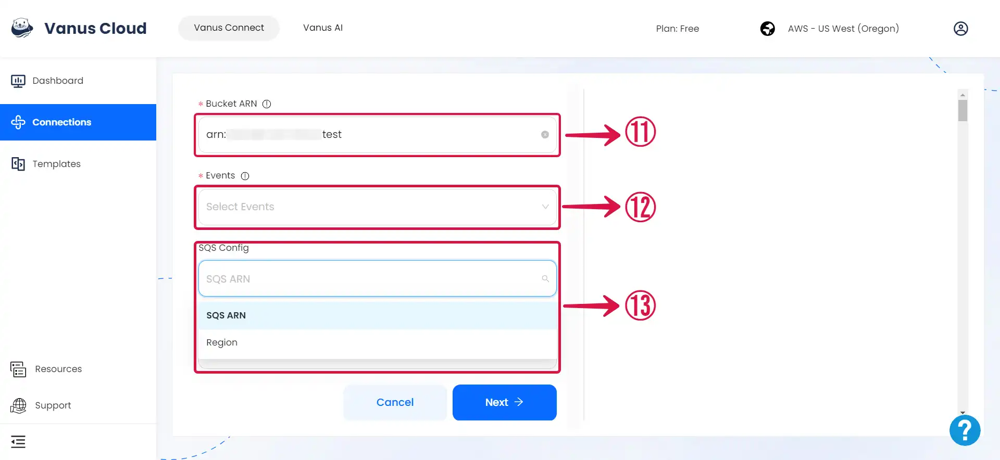

:::Note
Under **SQS config**⑬, you can choose to create a new SQS by selecting region, or if you already have an SQS, provide the ARN.
:::

10. Set your desired **SQS Region**⑭ and click **Next**⑮ to continue the configuration.

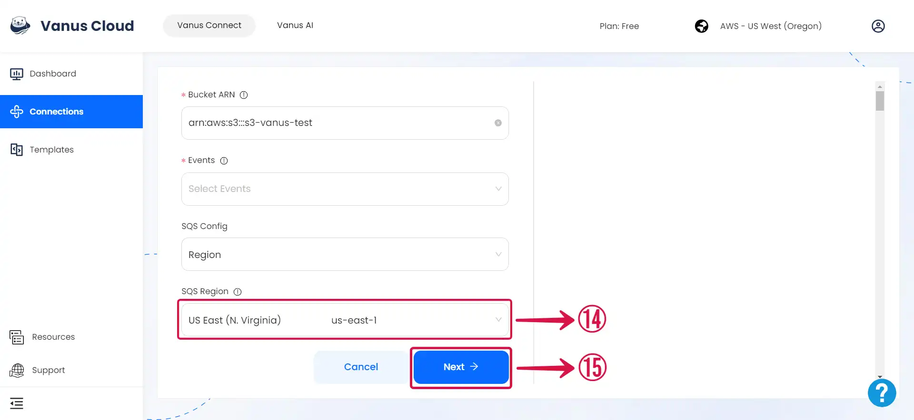

---

Learn more about Vanus and Vanus Connect in our [**documentation**](https://docs.vanus.ai).
