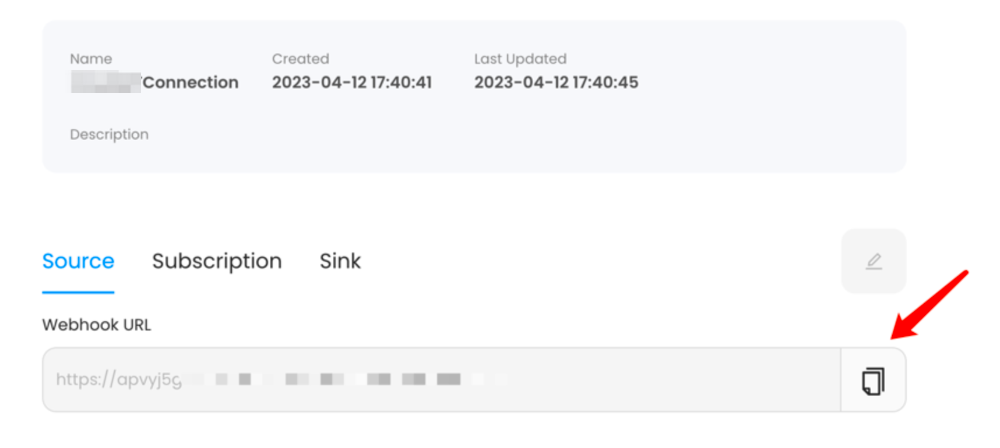

# **Configuring JavaScript to Send Webhook Events**

1. Click the copy icon and save your Webhook URL.
   
2. Installation:
   - Navigate to your project directory using the command line.
   - Run the command `npm install vanus-source-js-package` or `yarn add vanus-source-js-package` to install the package and its dependencies.
3. Importing the Package:
   - In your JavaScript file where you want to use the package, you need to import it using the import statement.
```javascript
import sendHttpRequest from "vanus-source-js-package";
```

# Example
Here is an example of how to use `vanus-source-js-package` to send a message whenever someone click the button with the Id `myButton`.

**JavaScript**
```javascript
import sendHttpRequest from "vanus-source-js-package";

const handleButtonClick = () => {
   const requestDetails = {
      method: 'POST',
      body: { message: 'button was clicked' },
      headers: { 'Content-Type': 'application/json' }
   };

   const endpoint = '<The Webhook URL from Vanus>';

   sendHttpRequest(requestDetails, endpoint)
           .then(() => {
              console.log('HTTP request sent successfully.');
           })
           .catch((error) => {
              console.error('Failed to send HTTP request:', error);
           });
};

const button = document.getElementById('myButton');
button.addEventListener('click', handleButtonClick);
```
**HTML**
```html
<button id="myButton">Click Me</button>
```

:::note
The import statement cannot be used without a module bundler. Consider using a module bundler like Webpack or a framework like React.
:::
