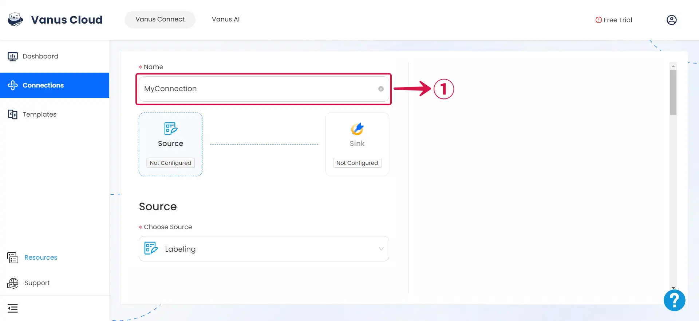
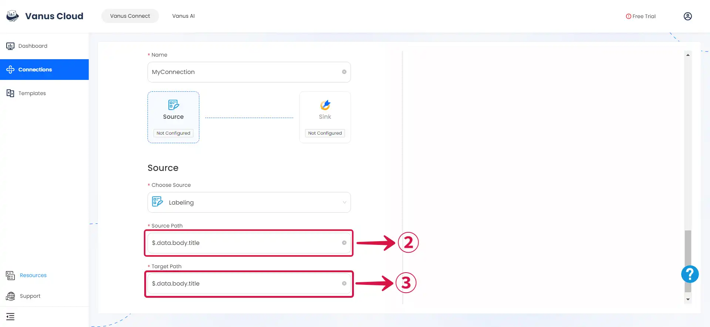

# Labeling

This guide contains information about setting up a Labeling Source in Vanus Connect.

## Introduction

Labeling (also known as tagging) is a method used to organize and categorize resources in a cloud environment. Labeling is done by attaching metadata (key-value pairs) to cloud resources such as virtual machines, storage buckets, or database instances. Labeling cloud events is an essential part of managing cloud-based applications and services efficiently. Labels can be used to categorize and organize cloud events, making it easier to monitor performance, troubleshoot issues, easier automation, increased efficiency and identify trends.

The Labeling Source is a webhook that receives HTTP requests containing JSON data in the body and assigns labels to the appropriate keys.

## Prerequisites

- A [**Vanus Cloud account**](https://cloud.vanus.ai)

## Getting Started

### Create your connection in Vanus Connect

1. Write a **Name**① for your connection in Vanus Connect.



2. Insert the following:

- **Source Path②:** A Source path refers to a field in the body for labeling.
- **Target Path③:** A Target path refers to a field in the body where the output, which is a list of labels, is placed.



**Example of a Path**

A JSON path is structured in this format: `$.data.body.title`.

In this example, the JSON path designates the location of the title attribute within the body object of a CloudEvent's data attribute. The path comprises multiple components, which are separated by the dot (.) operator:

- `$`: Represents the root object of the JSON document.
- `data`: Refers to the key of a property within the root object.
- `body`: Signifies the key of a property within the data object.
- `title`: Indicates the key of a property within the body object.

By following this path, you can retrieve the value of the title attribute within the body object of a CloudEvent's data attribute.

- Label: The label configuration is defined as shown in the example below:

```json
{
    "label1": {
        "keys": ["key1", "key2"]
    },
    "label2": {
        "keys": ["key3", "key4", "key5"]
    }
}
```

If either "key1" or "key2" is found in the field specified by the `Source Path`, the `Target Path` will be set to "label1." Similarly, if "key3," "key4," or "key5" is detected in the `Source Path` field, the `Target Path` will be assigned the value "label2."

3. Input your **Label**④  and then click **Next**⑤ to complete the setup.


Learn more about Vanus and Vanus Connect in our [**documentation**](https://docs.vanus.ai).
