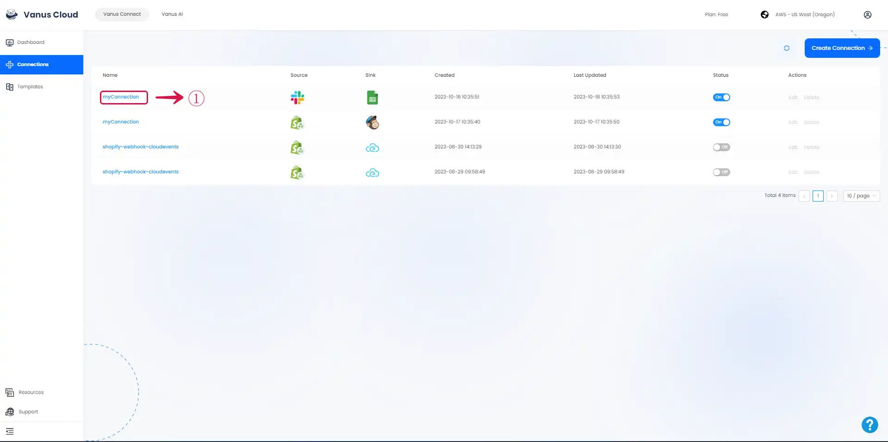
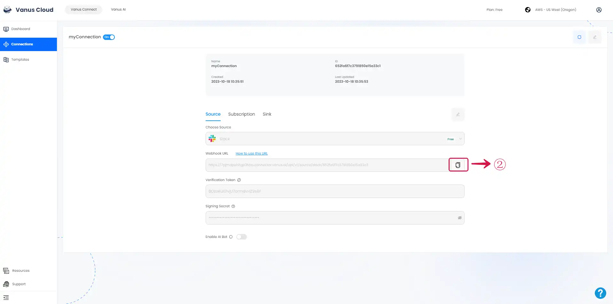
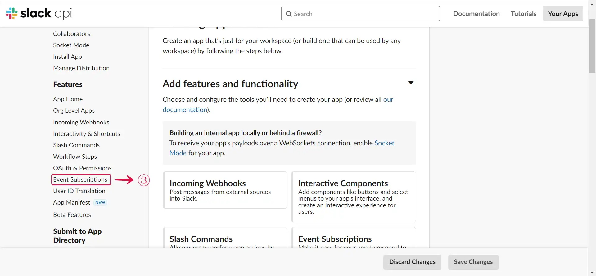
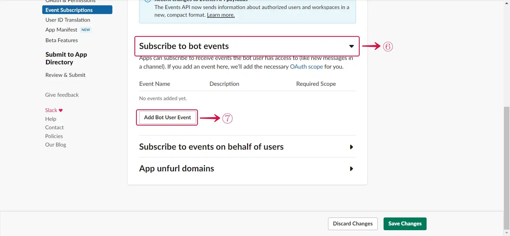
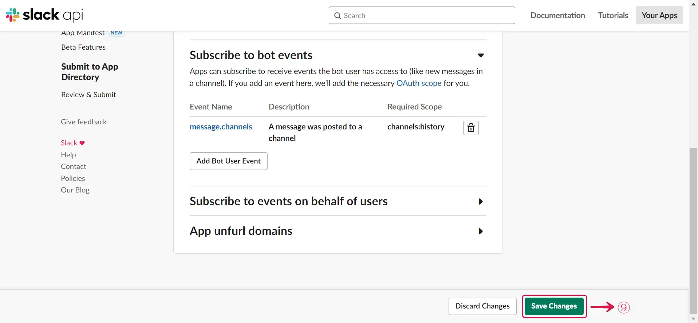
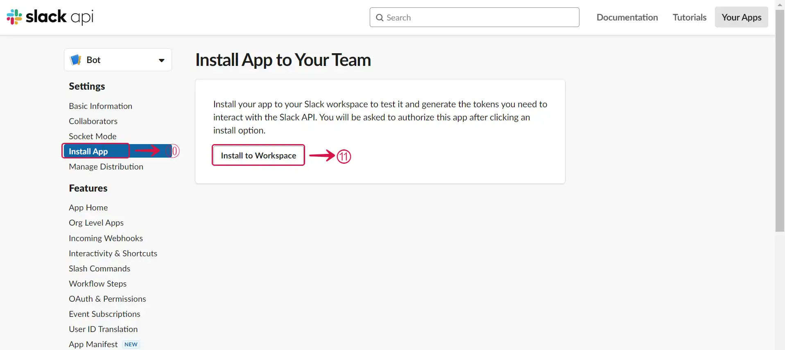
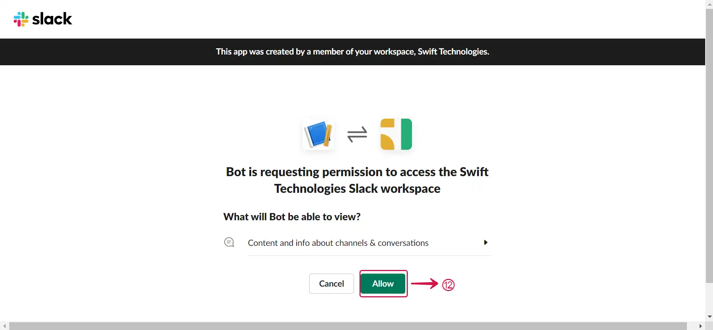
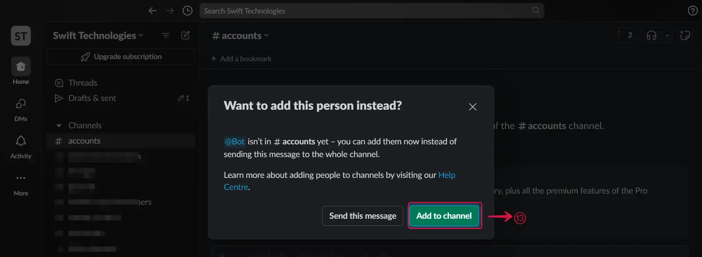

# How to use the webhook URL of a slack source

## Configure Event Subscription

1. Click on the **Connection Name**①.

2. Click the **copy icon**② to copy the webhook URL.

3. Go back to your Slack App, and click on **Event Subscriptions**③ in the side menu.

4. **Enable Events**④ by turning on the switch, and use the URL we've previously copied and paste it into **Request URL**⑤. You should see a green `Verified`, indicating our Source is verified by Slack.

5. Scroll down, click **Subscribe to bot events**⑥ and after, you will be able to click **Add Bot User Event**⑦.

6. Select the event **message.channels**⑧.

7. Click on **Save Changes**⑨ to complete your configuration.

8. Go to **Install App**⑩ from the side menu and click **Install to Workspace**⑪.

9. Click on **Allow**⑫.

10. Go to your Slack workspace, invite the bot to the channel by clicking **Add to Channel**⑬ button.

---

Learn more about Vanus and Vanus Connect in our [documentation](https://docs.vanus.ai).
