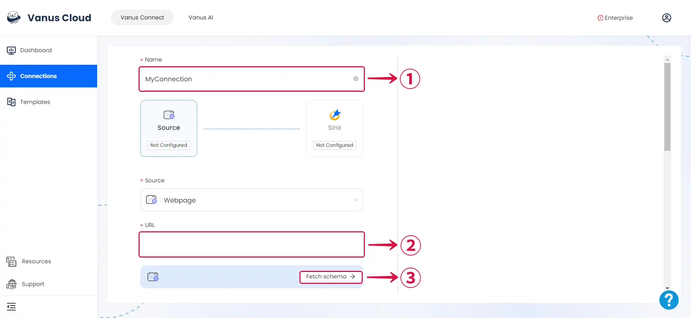

# Webpage

This guide contains information about setting up a Webpage Source in Vanus Connect.

## Introduction

Web pages are individual documents or files that make up the content of websites on the internet, which can be accessed through web browsers. These pages can include various types of content, including text, images, links, videos, and interactive elements. Each web page has its unique web address (URL) and may include navigation, styling, interactivity, and links to other pages.
Collectively, web pages form websites, providing information and services to users on the World Wide Web.

The Webpage Source connector enables you to fetch events or content from websites using their respective URLs.

## Prerequisites

- A [**Vanus Cloud account**](https://cloud.vanus.ai)

## Getting Started

### Webpage Connection Settings

1. Write a **Name**① for your connection in Vanus Connect, enter the **URL**② from which you'd like to retrieve content, and then click on **Fetch schema**③.

:::note
Clicking the **Fetch schema** button guarantees receiving a sample event to complete the connection with your chosen sink connector. You won't receive any sample events if you forget to click **Fetch Schema**.
:::

2. Set your **Time Interval**④ to specify the exact times at which you want to receive events, and then proceed by clicking **Next**⑤.

---

Learn more about Vanus and Vanus Connect in our [**documentation**](https://docs.vanus.ai).
