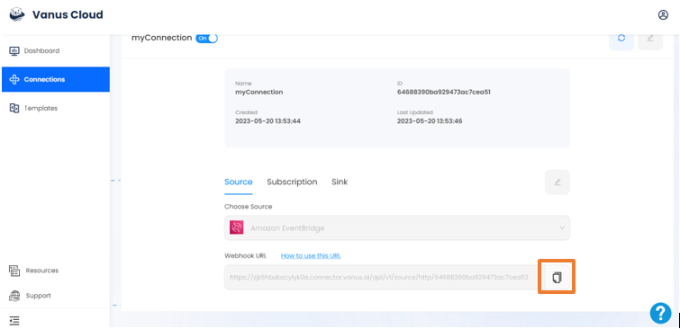
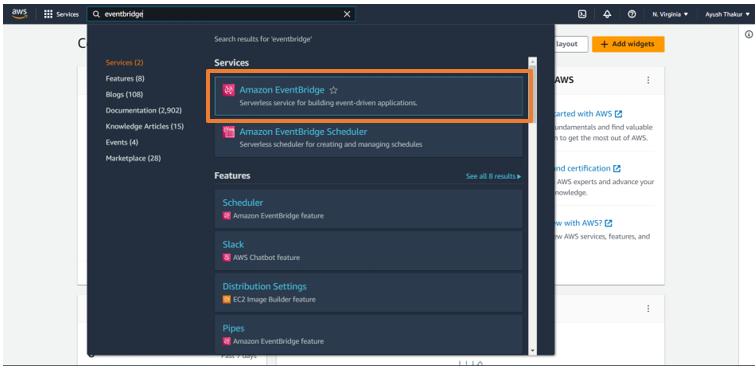
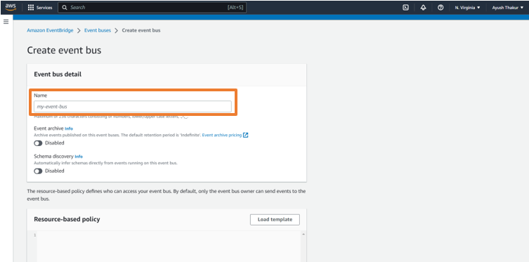
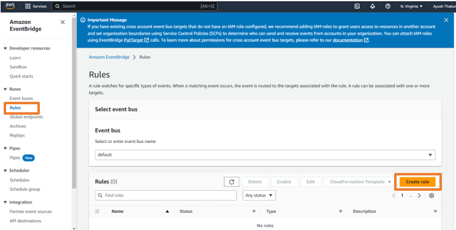
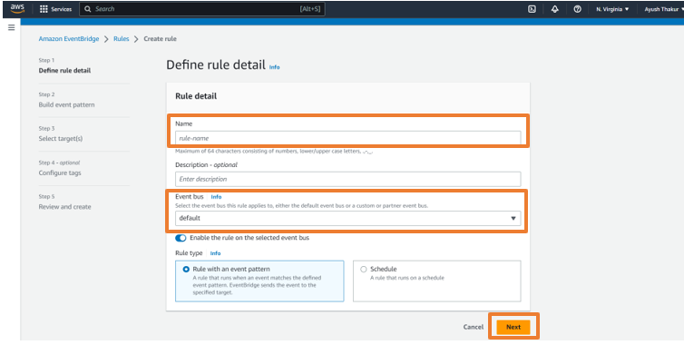
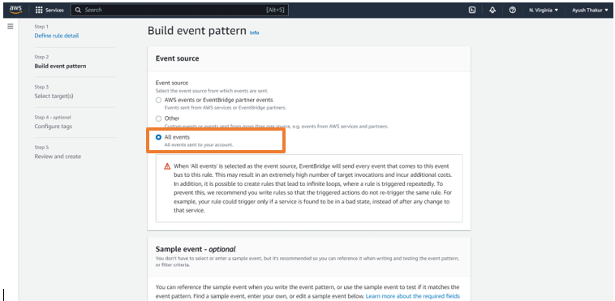
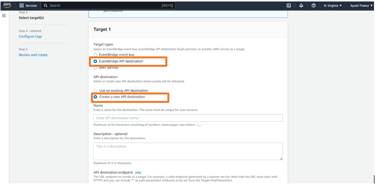
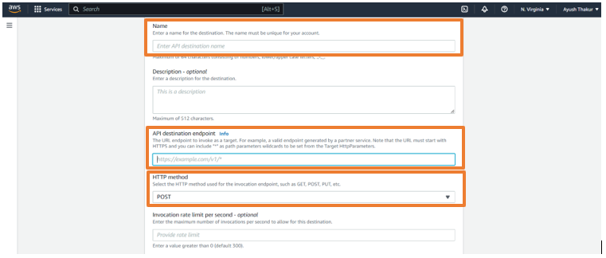
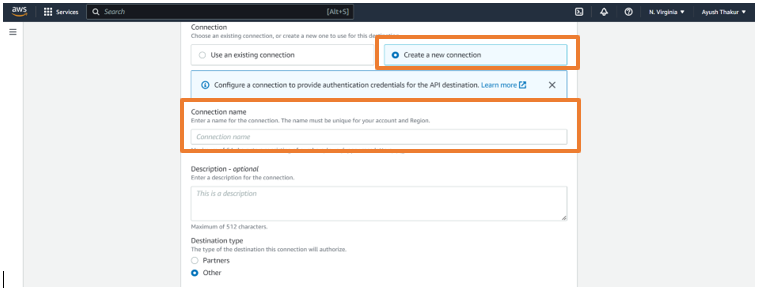
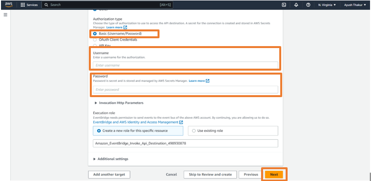

# Amazon EventBridge CreateBucket | DeleteBucket event triggers a Discord message

GitHub is the largest web-based platform that provides developers with a place to host and manage their software projects.

You can receive notifications when specific events occur in a repository by adding a GitHub Source on Vanus Connect.

This guide will help you get a Discord notification whenever someone opens a new pull request in your repository.

<iframe width="800" height="450" src="https://www.youtube.com/embed/JE9kcxfN9EQ" title="YouTube video player" frameBorder="0" allowFullScreen={true} allow="accelerometer; autoplay; clipboard-write; encrypted-media; gyroscope; picture-in-picture; web-share"></iframe>

## Get Started

### Step 1: Configure the Source

- Log in to [Vanus Connect](https://cloud.vanus.ai/) and choose the **Amazon EventBridge CreateBucket | DeleteBucket event triggers a Discord message** template.

### Step 2: Configure Sink - Get the Discord Webhook URL

- Open Discord in your browser and go to your desired Discord Server.

- Go to the Server settings and click on **Integrations**.

- Click on **New Webhook**.

- Open the newly created Webhook and Copy the Webhook URL.

- Paste the URL you copied into the **"Webhook URL"** field within the Sink Configuration and click Submit.

- Your connection has been successfully set up.

### Step 3: Create an Event in AWS

- Open the newly created connection and copy the webhook URL.

- Go to [AWS Console](https://console.aws.amazon.com/events/home) and log in with your root account.

- Search for the EventBridge service and open it.

- Click on **Event Buses** on the left sidebar and click on **Create event bus**.

- Give a name to the event bus and click **Create**.

- Now, click on **Rules** on the left sidebar and click on **Create Rule**.

- Give a name to the rule, select the event bus we have created in the Event bus option and click on **Next**.

- Select All events and click Next.

- Select **EventBridge API destination** in Target 1

- Select **Create a new API destination**.

- Provide a name for the connection, then paste the copied URL into the **API destination endpoint** field, and finally, select **"POST"** from the HTTP Method option.

- In Connection, select **Create a new connection** and give a name to the connection.

- Select **Basic (Username/Password)** from the Authorization type option.

- Add your desired username and password and click Next.

- Again, click Next in the **Configure Tags** section.

- Review the whole rule and click **Create rule**.

- Your connection will now work perfectly.
