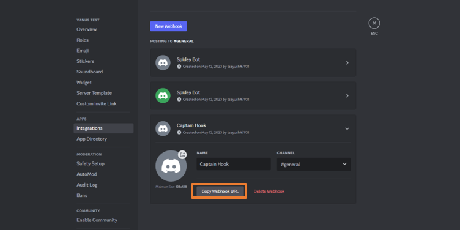
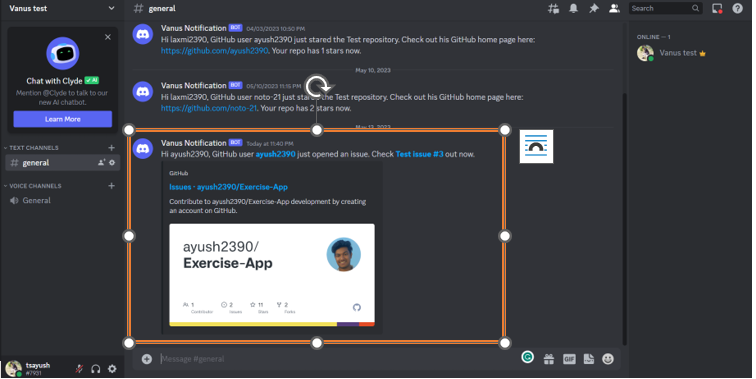

# GitHub issue event triggers a Discord message

GitHub is the largest web-based platform that provides developers with a place to host and manage their software projects.

You can receive notifications when specific events occur in a repository by adding a GitHub Source on Vanus Connect.

This guide will help you get a Discord notification whenever an issue is opened in your repository.

<iframe width="800" height="450" src="https://www.youtube.com/embed/QPOJfz08E1E" title="YouTube video player" frameBorder="0" allowFullScreen={true} allow="accelerometer; autoplay; clipboard-write; encrypted-media; gyroscope; picture-in-picture; web-share"></iframe>

## Get Started

### Step 1: Configure the Source - Authorize GitHub and select a GitHub repo

- Log in to [Vanus Connect](https://cloud.vanus.ai/) and choose the **GitHub issue event triggers a Discord message** template.

- Find the **Sign in with GitHub** button and authorize GitHub. Then, select the repo you want to configure.

### Step 2: Configure Sink - Get the Discord Webhook URL

- Open Discord in your browser and go to your desired Discord Server

- Go to the Server settings and click on Integrations

- Click on New Webhook. Open the newly created Webhook and Copy the Webhook URL

### Step 3: Configure Subscription

- Go back to Vanus Connect website and scroll down to Sink Configuration

- Paste the copied URL in the Webhook URL section and click Submit

- Your connection has been successfully created

Note: You can customize the display format and content of the notifications by configuring the **Subscription**.

- After submission, the status will show as **running**. Now you can create a new issue in the repo you selected to test the notification system you just set up.

### Result Display

- When a new issue is created, you will receive a real-time GitHub Issue Notify in Discord.

